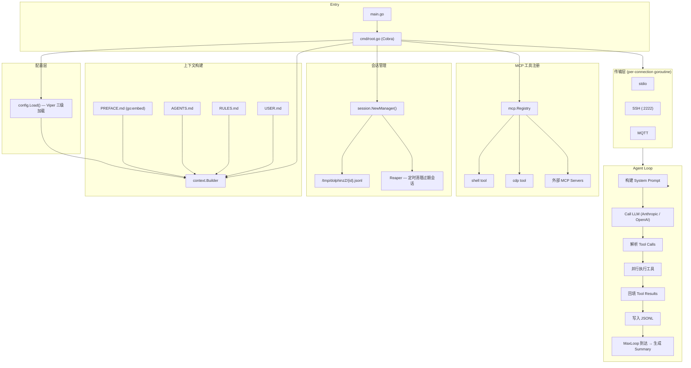
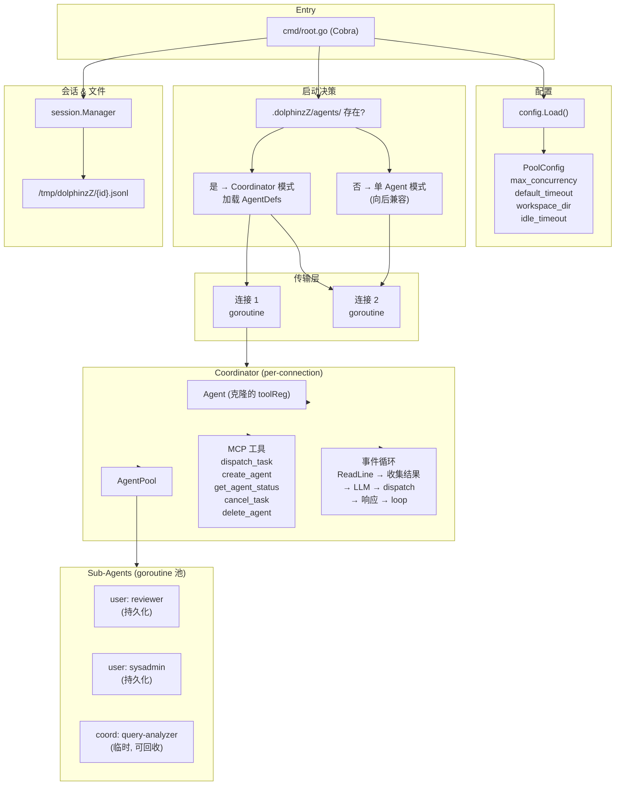
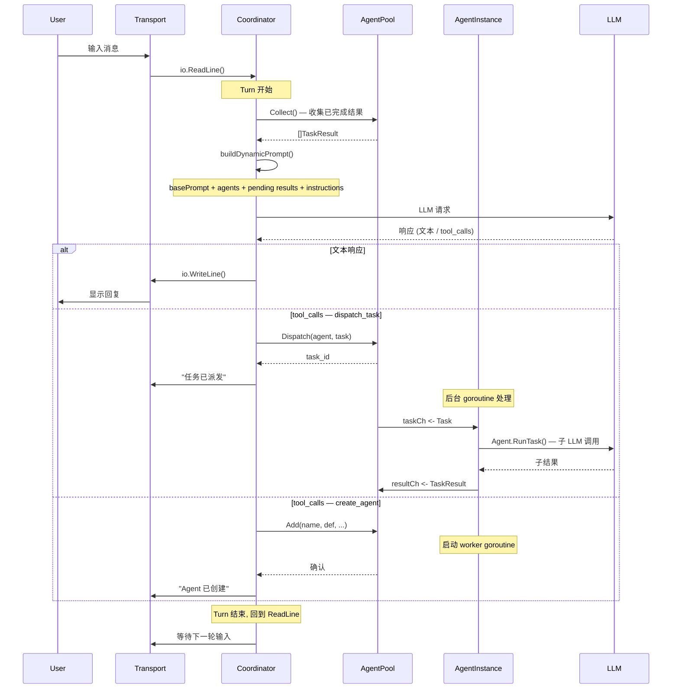
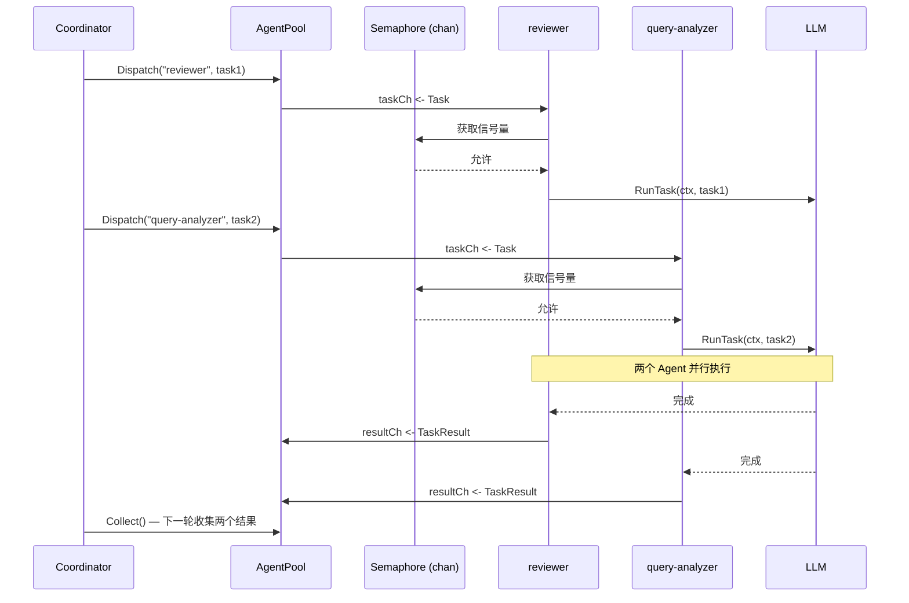
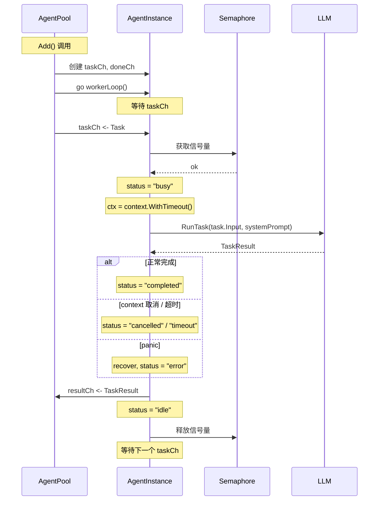
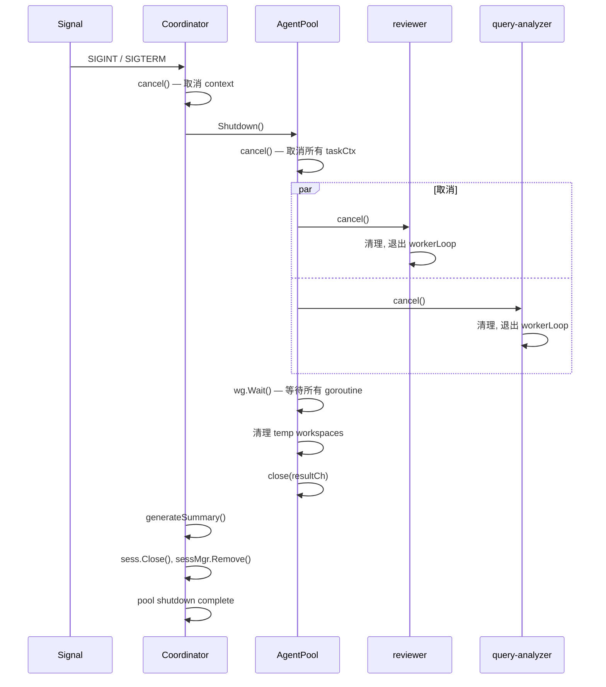
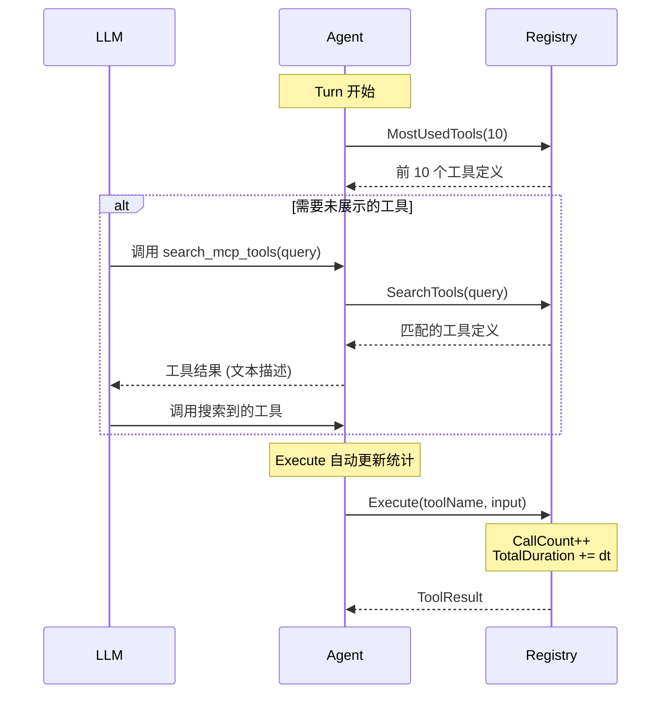
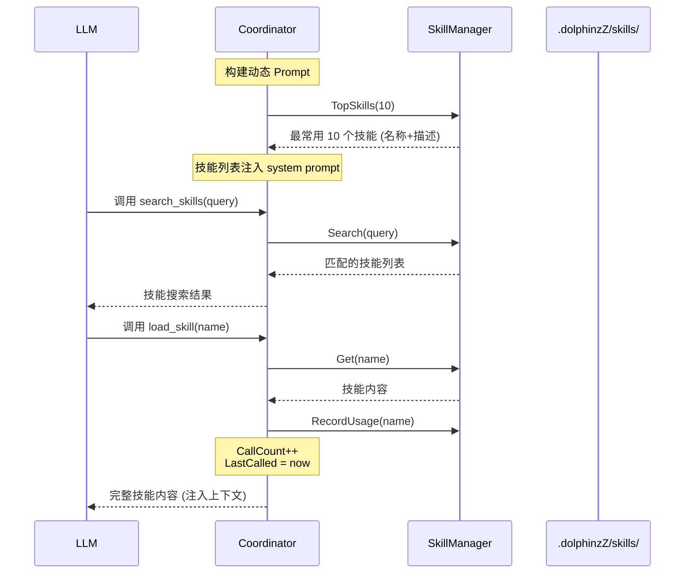

# DolphinzZ Agent Code 架构设计方案

## Context

设计一个 Go 语言实现的 AI 编码代理系统，支持通过 stdio、SSH、MQTT 三种传输层与用户交互，具备完整的 Agent Loop、多层级配置管理（Viper）、MCP 协议支持（Shell + CDP 工具）、会话管理能力，以及 v0.2 引入的多 Agent 协同系统。

---

## 一、整体架构

### v0.1 — 单 Agent 架构



### v0.2 — 多 Agent 协同架构



---

## 二、核心模块设计

### 1. 配置管理 (`internal/config/`)

- **三级路径**: `/etc/dolphinzZ/` (系统) → `~/.dolphinzZ/` (用户) → `./.dolphinzZ/` (项目)
- Viper 按优先级顺序 AddConfigPath，后加载的覆盖先加载的
- 环境变量前缀 `DZ`，如 `DZ_LLM_MODEL` 覆盖 `llm.model`
- Config struct 含 LLM、Session、Transport、MCP 四个子配置

### 2. 传输层 (`internal/transport/`)

```
Transport interface {
    Name() string
    Start(ctx) error    // 阻塞直到会话结束
    Close() error
}
```

- **stdio**: 直接包装 stdin/stdout，最简单，本地 CLI 模式
- **SSH**: 用 `charmbracelet/ssh` (gliderlabs/ssh 的活跃 fork)，每个 SSH session 启动一个 Agent goroutine
- **MQTT**: 用 `eclipse/paho.mqtt.golang`，订阅命令 topic，发布响应 topic

每个 Transport 绑定一个独立的 Agent 会话，goroutine 隔离。

### 3. Agent Loop (`internal/agent/`)

核心循环逻辑：

```
for turn < MaxLoop {
    1. 构建上下文: System Prompt + 对话历史 + Tool 定义
    2. Call LLM (streaming or non-streaming)
    3. if 响应含 tool_calls:
         - 并行执行工具 (shell / cdp)
         - 工具结果作为 tool_result 回填消息
         - 继续循环 (再次调 LLM 处理结果)
    4. if 纯文本响应:
         - 发送给用户
         - 等待下一轮输入 (或 loop 继续)
    5. turn++
}

到达 MaxLoop → 生成 Summary → 结束
```

**LLM Provider 抽象**:

```go
type Provider interface {
    Complete(ctx, ProviderRequest) (*ProviderResponse, error)
    CompleteStream(ctx, ProviderRequest) (<-chan StreamChunk, error)
}
```

- **当前仅实现 OpenAI 兼容 API** (使用 `openai-go`)，可对接 DeepSeek、Ollama、OpenAI 等
- Provider 接口保留，后续可按需扩展其他后端

### 4. 上下文构建 (`internal/context/`)

- **PREFACE.md**: `//go:embed` 硬编码进二进制，系统身份定义
- **AGENTS.md**: 按 project → user → system 顺序查找，描述可用代理角色
- **RULES.md**: 行为规则，如「所有变更需要测试」「不允许删除文件」
- **USER.md**: 用户偏好、知识背景

Builder 按顺序拼接成最终的 System Prompt。

### 5. 会话管理 (`internal/session/`)

- 每 session 一个文件: `/tmp/dolphinzZ/{uuid}.jsonl`
- **JSONL 格式**，每行一个 JSON Event:
  - `message` — 用户/助手消息
  - `tool_call` — LLM 请求的工具调用
  - `tool_result` — 工具执行结果
  - `system` — 系统事件（turn start/end, 错误）
  - `summary` — 会话摘要
- Session Manager 带后台 Reaper 协程清理过期会话

### 6. MCP 工具 (`internal/mcp/`)

使用官方 SDK `modelcontextprotocol/go-sdk` v1.5.0：

- **Shell MCP**: 执行 shell 命令，返回 stdout/stderr，支持命令白名单（空 = 全部允许）、超时控制、路径安全检查
- **CDP MCP**: 使用 `chromedp/chromedp` 实现浏览器自动化的 Navigate / Click / Screenshot / Evaluate / GetText 等操作

MCP Server 通过 transport 连接，LLM 通过协议发现和调用工具。

### 7. 多 Agent 协同系统 (`internal/agent/` — v0.2)

Coordinator 是调度中枢，持有 Agent（LLM 交互能力）+ AgentPool（子 Agent 管理），每个 Transport 连接创建独立的 Coordinator 实例。



#### 并发派发流程



#### Agent goroutine 生命周期



#### 优雅关闭流程



---

### 8. MCP Progressive Disclosure (`internal/mcp/` — v0.3)

为避免 LLM 上下文被过多工具定义占用，系统默认只展示使用频率最高的 10 个 MCP 工具（按调用次数排序），同时始终暴露 `search_mcp_tools` 允许 LLM 按需发现更多工具。



每个工具调用自动记录统计（调用次数、错误次数、最后调用时间、总耗时），`MostUsedTools()` 按调用次数降序排列。

### 9. Skills 系统 (`internal/skill/` — v0.3)

Skills 是命名的专项能力定义，以 Markdown 文件形式存储在 `.dolphinzZ/skills/` 目录下。与 MCP 工具不同，Skills 不是可执行代码，而是可注入上下文的指令/知识。

```
.dolphinzZ/skills/
├── code-review.md       # YAML frontmatter + Markdown 内容
└── data-analysis.md
```



与 MCP 工具相同的渐进式披露策略：默认展示 Top 10 技能列表，LLM 可通过 `search_skills` / `load_skill` 发现和加载更多。

---

| 决策 | 选择 | 理由 |
|------|------|------|
| SSH 库 | `charmbracelet/ssh` | gliderlabs/ssh 已停维，Charm 活跃维护 |
| MQTT 库 | `eclipse/paho.mqtt.golang` v1.5 | Go 生态事实标准 |
| CDP 库 | `chromedp/chromedp` | 纯 Go 实现，无外部依赖 |
| LLM SDK | provider_anthropic.go + provider_openai.go | 覆盖主流模型，支持接入自定义端点 |
| 会话格式 | JSONL 逐行追加 | O(1) 写入，支持 tail/jq 实时查看，局部损坏不影响整体 |
| Tool 注册 | MCP SDK 的 AddTool + JSON Schema 推断 | 不重复造轮子 |
| 并发模型 | per-connection goroutine + 独立 LoopState | 无共享可变状态 |
| [v0.2] 子 Agent 通信 | 异步 Channel (taskCh / resultCh) | Coordinator 永不阻塞，支持并发派发 |
| [v0.2] 子 Agent 隔离 | 独立 Agent 实例 + 过滤后的 toolReg | 每个子 Agent 只能看到授权工具 |
| [v0.2] Registry 隔离 | Clone() 复制 tools map | 避免跨连接 Coordinator 工具注册覆盖 |
| [v0.2] 工作区隔离 | 每个 Agent 独立 Workspace 目录 | Shell 命令在限定目录内执行 |
| [v0.3] MCP 渐进披露 | MostUsedTools(10) + search_mcp_tools | 减少 LLM 上下文占用，只有最常用工具自动展示 |
| [v0.3] MCP 统计 | ToolStats (CallCount, ErrorCount, Duration) | 支撑渐进披露的排序依据 |
| [v0.3] Skills 系统 | .dolphinzZ/skills/ Markdown + 渐进披露 | 可扩展的专项指令注入，不增加 LLM 默认上下文 |
| [v0.3] Stats 隔离 | Clone() 复制 stats map | 避免跨连接统计干扰 |

---

## 四、目录结构

```
/Users/jzx/Desktop/DolphinzZ/
├── main.go                        # 入口
├── cmd/root.go                    # Cobra 根命令
├── internal/
│   ├── config/config.go           # Viper 三级加载 (含 PoolConfig)
│   ├── transport/
│   │   ├── transport.go           # Transport 接口
│   │   ├── stdio.go
│   │   ├── ssh.go
│   │   └── mqtt.go
│   ├── agent/
│   │   ├── loop.go                # 核心 Agent Loop + RunTask()
│   │   ├── context.go             # 上下文构建器
│   │   ├── llm.go                 # Provider 接口 + 类型定义
│   │   ├── provider_anthropic.go  # Anthropic 实现
│   │   ├── provider_openai.go     # OpenAI 兼容实现
│   │   ├── coordinator.go         # [v0.2] Coordinator + MCP 工具注册
│   │   ├── agent_pool.go          # [v0.2] AgentPool + AgentInstance
│   │   ├── agent_def.go           # [v0.2] AgentDef YAML 加载
│   │   ├── agent_types.go         # [v0.2] 共享类型 (AgentKind, TaskResult)
│   │   └── channel_io.go          # [v0.2] 子 Agent 内存 UserIO
│   ├── session/
│   │   ├── session.go             # Session + SessionManager + JSONL
│   │   └── summary.go             # Summary 生成
│   ├── mcp/
│   │   ├── registry.go            # MCP Server 初始化 + Tool 注册 (含 Clone/FilteredView/MostUsedTools/SearchTools)
│   │   ├── shell.go               # Shell MCP Tool
│   │   └── cdp.go                 # CDP MCP Tool
│   ├── skill/
│   │   └── skill.go               # [v0.3] Skills Manager, parsing, stats, search
│   └── context/
│       ├── preface.go             # go:embed PREFACE.md
│       ├── agents.go              # AGENTS.md 加载
│       ├── rules.go               # RULES.md 加载
│       └── user.go                # USER.md 加载
├── .dolphinzZ/
│   ├── config.yaml                # 项目级配置示例 (含 agent_pool 段)
│   ├── AGENTS.md
│   ├── RULES.md
│   ├── USER.md
│   ├── skills/
│   │   ├── code-review.md         # [v0.3] 示例 Skill
│   │   └── data-analysis.md       # [v0.3] 示例 Skill
│   └── agents/
│       └── reviewer/
│           └── agent.yaml         # [v0.2] 用户创建 Agent 定义示例
├── DESIGN.md
├── AGENTS.md
├── Makefile
└── go.mod
```

---

## 五、设计遗漏项分析

针对「看还缺什么？」的回答：

1. **LLM Provider 抽象** — 这是最大的遗漏。Agent 不连接 LLM 只是空壳，需要 Provider 接口 + 具体实现（至少 Anthropic）
2. **Tool Registry + MCP Server 初始化** — 工具需要注册到 MCP Server 并暴露给 LLM
3. **安全与沙箱** — Shell 执行需要命令白名单/黑名单、超时控制、路径安全检查
4. **会话并发管理** — SSH/MQTT 多连接需要线程安全的 Session Manager + Reaper 清理
5. **日志** — 建议使用 `log/slog` 结构化日志，便于调试
6. **信号处理** — SIGINT/SIGTERM 优雅关闭，清理会话文件

---

## 六、实现顺序

| 阶段 | 内容 | 说明 |
|------|------|------|
| 1 | config + main.go + cmd | 基础架子 |
| 2 | session (Manager + JSONL) | 所有后续依赖日志 |
| 3 | transport interface + stdio | 最简单传输，快速迭代 |
| 4 | agent/llm.go + provider | LLM 通信能力 |
| 5 | mcp/registry + shell | 第一个可用工具 |
| 6 | agent/loop (基础版) | 端到端跑通 |
| 7 | context builder (全部 loader) | 提升 LLM 质量 |
| 8 | mcp/cdp | 第二个工具 |
| 9 | transport/ssh | 网络传输 |
| 10 | transport/mqtt | IoT 传输 |
| 11 | session/summary + reaper | 生产加固 |
| 12 | provider_openai | 多后端支持 |
| 13 | [v0.2] agent_pool + coordinator | 多 Agent 协同系统 |
| 14 | [v0.2] agent_def + channel_io | 子 Agent 定义 + 内存通信 |
| 15 | [v0.2] registry Clone + FilteredView | 工具隔离 |
| 16 | [v0.2] config PoolConfig | 池化配置 |
| 17 | [v0.3] MCP stats + progressive disclosure | 工具调用统计 + Top 10 渐进披露 |
| 18 | [v0.3] skill package + manager | Skills 系统 (加载/搜索/统计/渐进披露) |
| 19 | [v0.3] coordinator skills integration | search_skills / load_skill 工具 |

---

## 七、验证方式

1. **stdio 模式**: `go run .` → 标准输入输出交互
2. **Shell 工具测试**: 在 agent loop 中调用 shell 执行命令，验证输出回填
3. **Session 文件验证**: 检查 `/tmp/dolphinzZ/` 下生成的 JSONL
4. **Summary 验证**: MaxLoop 触发后检查 summary 文件
5. **配置合并验证**: 分别在不同层级放配置，验证优先级

---

## 八、依赖清单

```
github.com/spf13/cobra                       # CLI
github.com/spf13/viper                       # 配置
github.com/modelcontextprotocol/go-sdk       # MCP
github.com/charmbracelet/ssh                 # SSH 服务端
github.com/eclipse/paho.mqtt.golang          # MQTT
github.com/chromedp/chromedp                 # CDP 浏览器自动化
github.com/anthropics/anthropic-sdk-go       # Anthropic LLM
github.com/openai/openai-go                  # OpenAI 兼容 LLM
github.com/google/uuid                       # UUID
golang.org/x/crypto                          # SSH 底层
golang.org/x/time                            # Rate Limiter
```
