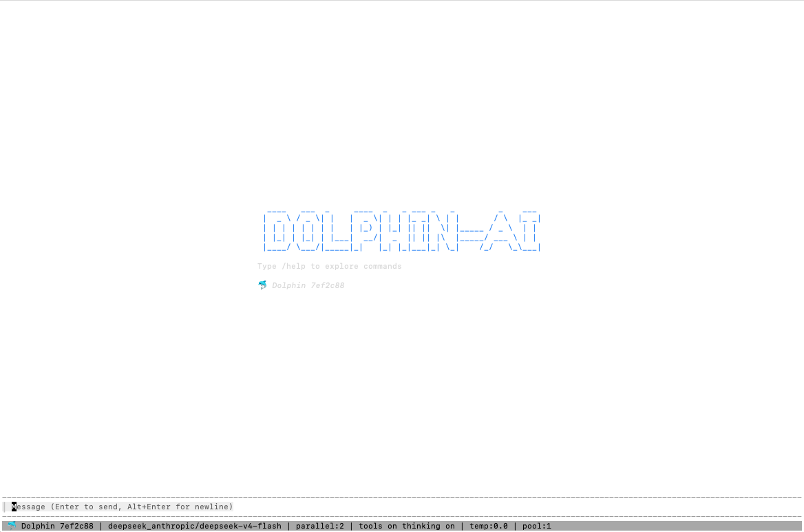

# Dolphin-AI

[](https://github.com/dolphinZzv/dolphin-ai/actions/workflows/ci.yml)
[](https://codecov.io/gh/dolphinZzv/dolphin-ai)

你卓尔不凡


**Dolphin** 是一个拥有自我进化能力的终端 AI 伙伴。它维护一个 git 版本化的知识库（Brain），在后台分析对话模式并**自动改进自己的指令和知识**，越用越聪明。

## 特性

### 🧠 Brain — Git 版本化知识库
对话中积累的知识、偏好、命令和技能持久化在一个 git 仓库中。支持 push/pull 在设备间同步，LLM 在每次对话中自动加载。越用越有「你」的风格。

### 🌙 Dream — 离线自我编辑
你离开 20 分钟后，Dream 自动启动：扫描所有新对话 → 发现纠正信号和重复模式 → 调用 LLM 精炼 Brain 内容 → git 分支提交 → 等你审核或自动合并。修错、去重、淘汰，全自动。

### 🖥️ TUI — 功能完整的终端界面
Bubble Tea 构建的原生 TUI。实时流式输出、思考链折叠、工具调用可视化、鼠标文本选择 + 复制、滑动日志、队列面板、快捷切换侧栏。全键盘操作，零鼠标依赖。

### 🔗 多传输通道
一个 agent 实例可同时服务多个通道：**TUI**（终端交互）、**WeWork** / **DingTalk**（企业 IM）、**Email**（SMTP/IMAP）、**Panda**（自定义协议）、**A2A**（Agent-to-Agent）。每条消息自动绑定对应会话。

### 🔧 MCP 生态
原生支持 Model Context Protocol。HTTP/SSE 和 Stdio 两种传输，所有 MCP 服务异步加载不阻塞启动。内置 `mcp_search` 和 `mcp_load` 工具，运行时可动态接入新 MCP 服务。

### 📦 完整工具链
Shell 命令、文件读写、Brain CRUD、技能管理、工作流引擎、定时任务、订阅推送——全部以工具形式暴露给 LLM。权限系统支持按工具粒度的 always/once/deny，内置危险命令拦截。

### 🌍 多模型 / 多语言
支持 OpenAI、Anthropic、DeepSeek 等多厂商。按模型粒度配置 temperature、reasoning_effort、thinking、自定义 HTTP headers。界面支持中英文双语，一键切换。

### 🔄 会话管理
多会话独立上下文。自动 compaction 在接近上下文窗口时触发，用 LLM 生成摘要替代旧消息。支持 dump 导出、switch 切换、pause/continue 暂停恢复。

---

## 快速开始

一键安装：

```shell
curl -fsSL https://raw.githubusercontent.com/dolphinZzv/dolphin-ai/main/install.sh | bash
```

或通过 Go 安装：

```shell
go install github.com/dolphinZzv/dolphin-ai/cmd/dolphin@latest
```

创建 `config.yaml`：

```yaml
llm:
  deepseek_anthropic:
    provider: deepseek
    api_type: anthropic
    api_key: "sk-xxx"
    base_url: "https://api.deepseek.com/anthropic"
    models:
      - name: deepseek-v4-pro
      - name: deepseek-v4-flash
```

启动：

```shell
dolphin
```

如需加载自定义配置文件：

```shell
dolphin --config /path/to/config.yaml
```

配置完整说明见 [`config.schema.json`](config.schema.json)。

---

## 配置

### llm — 模型与接入

#### 模型支持矩阵

| 供应商 | 协议 | 支持级别 | 说明 |
|--------|------|----------|------|
| DeepSeek | Chat / Anthropic | base | 内置 `defaultBaseURL`，开箱即用 |
| Mimo   | Chat / Responses / Anthropic | base | 内置 `defaultBaseURL`，三协议全通 |
| LongCat | Chat | base | 内置 `defaultBaseURL` |
| OpenAI  | Chat | base | - |
| Anthropic | Anthropic | base | - |
| OpenRouter | Chat | base | 内置 `defaultBaseURL` + 自动 Referer/Title header |

> **支持级别说明：** `base` — 基本可用，协议适配通过，可直接配置使用。

| 配置项 | 类型 | 默认 | 说明 |
|--------|------|------|------|
| `llm.use` | string | - | 当前使用的模型名称 |
| `llm.max_tokens` | int | 4096 | 每次 LLM 调用最大输出 token |
| `llm.max_retries` | int | 3 | LLM 调用失败重试次数 |
| `llm.timeout` | duration | - | 请求超时（如 `30s`, `5m`） |
| `llm.limit.*` | object | - | 全局用量限制（requests/tokens 硬+软限制） |

每个 provider 作为 `llm` 的子节点，命名任意：

```yaml
llm:
  <provider_name>:
    provider: deepseek|openai|anthropic|...
    api_type: anthropic|openai
    api_key: "sk-xxx"
    base_url: "https://..."
    model_discover: true       # 自动发现模型
    models:
      - name: deepseek-v4-pro
        thinking: true
        reasoning_effort: max
        max_tokens: 8192
        temperature: 0.7
        timeout: 60s
        limit.max_concurrency: 3
        headers:                # 自定义 HTTP headers
          X-Custom-Header: value
```

### agent — Agent 行为

| 配置项 | 类型 | 默认 | 说明 |
|--------|------|------|------|
| `agent.name` | string | Dolphin | Agent 名称，显示在欢迎语和状态栏 |
| `agent.workmode` | string | default | 工作模式（default/yolo/safe） |
| `agent.workspace` | string | . | 工作目录 |
| `agent.pool_size` | int | 1 | 并发 worker 数 |
| `agent.tool_parallelism` | int | 1 | 每轮最大并行工具调用数 |
| `agent.max_rounds` | int | 100 | 单次对话最大轮数 |
| `agent.turn_timeout` | duration | 120s | 每轮 LLM+工具硬超时 |
| `agent.bin` | string | - | CLI 工具搜索目录（加到 PATH） |
| `agent.buffer_size` | int | 1024 | 消息缓冲区大小 |
| `agent.feed_min_interval` | duration | 100ms | 看门狗 feed 节流间隔 |
| `agent.llm_idle_timeout` | duration | 60s | 看门狗空闲超时 |

### dream — 离线自我编辑

| 配置项 | 类型 | 默认 | 说明 |
|--------|------|------|------|
| `dream.enabled` | bool | true | 是否启用 dream |
| `dream.idle_minutes` | int | 20 | 用户空闲多少分钟后触发。0=关闭定时触发 |
| `dream.auto_apply` | bool | true | 是否自动合并编辑。false=创建分支等待审核 |
| `dream.exit_idle_minutes` | int | 2 | `/exit` 后的加速空闲窗口 |
| `dream.min_sessions` | int | 2 | Phase 0：最少新 session 数 |
| `dream.min_user_messages` | int | 8 | Phase 0：最少用户消息数 |
| `dream.max_consecutive_empty` | int | 3 | 连续空跑多少次后提高触发门槛 |
| `dream.min_impact_threshold` | float | 0.5 | 低于此影响力的编辑跳过 LLM |
| `dream.file_cooldown_dreams` | int | 5 | 同文件在多少次 dream 内不可重复编辑 |
| `dream.max_edits_per_dream` | int | 10 | 单次 dream 最大编辑数 |
| `dream.calibration_window` | int | 10 | Phase 4 采纳率滑动窗口大小 |
| `dream.calibration_min_step` | float | 0.05 | 阈值最小调整步长 |
| `dream.calibration_confidence_floor` | float | 0.3 | 置信度下界 |
| `dream.calibration_confidence_ceiling` | float | 0.95 | 置信度上界 |
| `dream.reflect_model` | string | - | Phase 2 专用模型。空=当前 active model |
| `dream.max_reflect_tokens` | int | 2048 | Phase 2 LLM 最大输出 token |

### compaction — 上下文压缩

| 配置项 | 类型 | 默认 | 说明 |
|--------|------|------|------|
| `compaction.enabled` | bool | true | 是否启用自动压缩 |
| `compaction.max_tokens` | int | 60000 | 触发压缩的 token 阈值 |
| `compaction.keep_rounds` | int | 6 | 压缩时保留的最近轮数 |
| `compaction.model` | string | - | 压缩用模型。空=当前 active model |
| `compaction.summary_max_tokens` | int | 512 | 摘要最大输出 token |
| `compaction.token_ratio` | int | 4 | token 估算比率（字符/token） |

### session — 会话存储

| 配置项 | 类型 | 默认 | 说明 |
|--------|------|------|------|
| `session.dir` | string | .dolphin/sessions | 会话数据目录 |
| `session.dump_dir` | string | .dolphin/dumps | /dump 导出目录 |
| `session.window` | int | 40 | 保留的最大消息数 |
| `session.expire_after` | duration | 1h | 空闲超时（开启新会话）。0=永不 |

### brain — 知识库

| 配置项 | 类型 | 默认 | 说明 |
|--------|------|------|------|
| `brain.dir` | string | .dolphin/brain | Brain git 仓库目录 |

### mcp_servers — MCP 服务器

数组结构，每个元素：

| 配置项 | 类型 | 默认 | 说明 |
|--------|------|------|------|
| `name` | string | - | 服务名称 |
| `type` | string | - | `url`/`http`/`stdio`/`builtin` |
| `enabled` | bool | true | 是否启用 |
| `url` | string | - | HTTP/SSE 端点（type=url 时） |
| `command` | string | - | 可执行文件路径（type=stdio 时） |
| `args` | string[] | - | 命令行参数 |

### 传输通道

每类传输通过 `<transport>.enabled` 控制：

| 配置项 | 类型 | 默认 | 说明 |
|--------|------|------|------|
| `tui.enabled` | bool | true | 终端 TUI |
| `tui.theme` | string | - | TUI 主题 |
| `tui.show_tools` | bool | false | 默认展示工具调用 |
| `tui.show_thinking` | bool | false | 默认展示思考链 |
| `dingtalk.enabled` | bool | false | 钉钉机器人 |
| `dingtalk.client_id/secret/webhook_url` | string | - | 钉钉凭证 |
| `wework.enabled` | bool | false | 企业微信 |
| `wework.bot_id/bot_secret` | string | - | 企业微信凭证 |
| `email.enabled` | bool | false | 邮件通道 |
| `email.address/password` | string | - | 邮箱凭证 |
| `email.imap_server/imap_port` | string | - | 收件配置 |
| `email.smtp_server/smtp_port` | string | - | 发件配置 |
| `panda.enabled` | bool | false | Panda 协议 |
| `panda.server/account/password` | string | - | Panda 凭证 |
| `a2a.enabled` | bool | false | Agent-to-Agent |
| `a2a.addr/url/name/description/version` | string | - | A2A 配置 |

### log — 日志

| 配置项 | 类型 | 默认 | 说明 |
|--------|------|------|------|
| `log.level` | string | info | 日志级别（debug/info/warn/error） |
| `log.file` | string | - | 日志文件路径。空=仅标准输出 |
| `log.compress` | bool | true | 是否压缩轮转后的日志 |
| `log.max_size` | int | 100 | 单文件最大 MB |
| `log.max_backups` | int | 30 | 保留的备份文件数 |
| `log.max_age` | int | 30 | 日志最长保留天数 |
| `log.rotate_interval` | duration | - | 轮转间隔 |

### 其他

| 配置项 | 类型 | 默认 | 说明 |
|--------|------|------|------|
| `lang` | string | - | 界面语言（en/zh，默认从系统检测） |
| `otel.enabled` | bool | false | 是否启用 OpenTelemetry |
| `memory.dir` | string | .dolphin/memory | 内存/历史存储目录 |

---

## 命令

所有命令以 `/` 开头，在 TUI 输入框中输入。

### 会话管理

| 命令 | 说明 |
|------|------|
| `/session status` | 当前会话统计（轮数、token、工具调用） |
| `/session switch <id>` | 切换活跃会话 |
| `/session new` | 创建新会话 |
| `/session dump [id]` | 导出会话最后轮次的 LLM 请求/响应 JSON |
| `/session compaction` | 手动压缩当前会话上下文 |
| `/session pause` | 暂停当前轮次 |
| `/session continue` | 继续暂停的轮次 |
| `/session stop` | 停止当前轮次 |
| `/dump` | `/session dump` 的别名 |
| `/compaction` | `/session compaction` 的别名 |

### AI 自改进

| 命令 | 说明 |
|------|------|
| `/dream now` | 立即触发一次 self-edit 扫描 |
| `/dream status` | 查看 dream 运行统计和效果 |
| `/dream preview` | 预览将要编辑的内容（不写入） |
| `/dream review` | 审核待处理的 dream 分支 |
| `/dream accept [N]` | 接受 dream 编辑（cherry-pick 或全部） |
| `/dream reject [N]` | 拒绝 dream 编辑 |
| `/dream diff [N]` | 查看单条 dream commit 的 diff |
| `/dream revert <id>` | 回滚指定 dream 的 merge commit |

### 模型与配置

| 命令 | 说明 |
|------|------|
| `/models` | 列出所有可用模型 |
| `/models use <model>` | 切换当前使用的模型 |
| `/config [key]` | 查看或搜索当前配置 |
| `/limit` | 查看 LLM 用量和限制状态 |
| `/limit reset [target]` | 重置 LLM 用量计数器 |
| `/lang list` | 列出可用语言 |
| `/lang use <code>` | 切换界面语言 |
| `/context [all\|name]` | 查看系统 prompt 上下文模块 |
| `/version` | 显示版本信息 |

### Brain（知识库）

| 命令 | 说明 |
|------|------|
| `/brain push` | 将 brain 提交推送到远程 |
| `/brain pull` | 从远程拉取 brain 更新 |
| `/brain set url <url>` | 设置 brain 远程仓库地址 |
| `/push` | `/brain push` 的别名 |
| `/pull` | `/brain pull` 的别名 |
| `/commands` | 列出 brain 中的自定义命令 |
| `/commands list` | 格式化的命令清单 |
| `/commands show <name>` | 查看命令详情和内容 |
| `/script` | 管理 brain 脚本（list/show/create/delete） |
| `/subscription` | 管理 brain 订阅（list/show/enable/disable） |
| `/scheduler` | 查看定时任务状态 |
| `/skills` | 管理技能（list/search/upsert/delete/load） |

### MCP 与工具

| 命令 | 说明 |
|------|------|
| `/mcp` | 列出所有注册的 MCP 服务器和工具 |
| `/mcp search <query>` | 搜索 MCP 服务目录 |
| `/mcp enable <source>` | 启用工具源 |
| `/mcp disable <source>` | 禁用工具源 |

### 队列

| 命令 | 说明 |
|------|------|
| `/queue` | 查看当前任务队列 |
| `/queue pop [index]` | 移除队列中的指定任务 |

### TUI 快捷命令

| 命令 | 说明 |
|------|------|
| `/tools` | 切换工具调用显示 |
| `/thinking` | 切换思考链显示 |
| `/windows` | 切换侧边状态面板 |
| `/exit` | 退出程序 |
