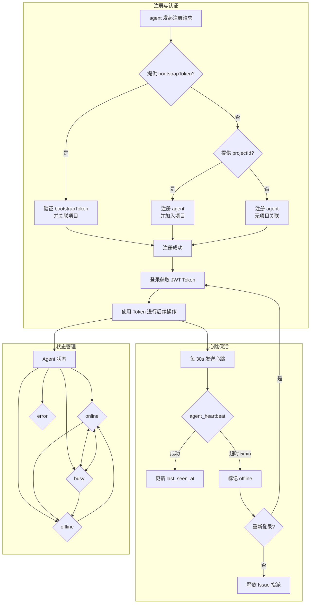
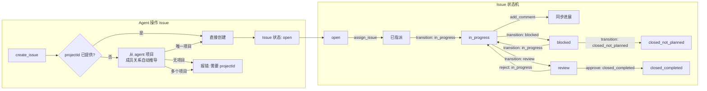
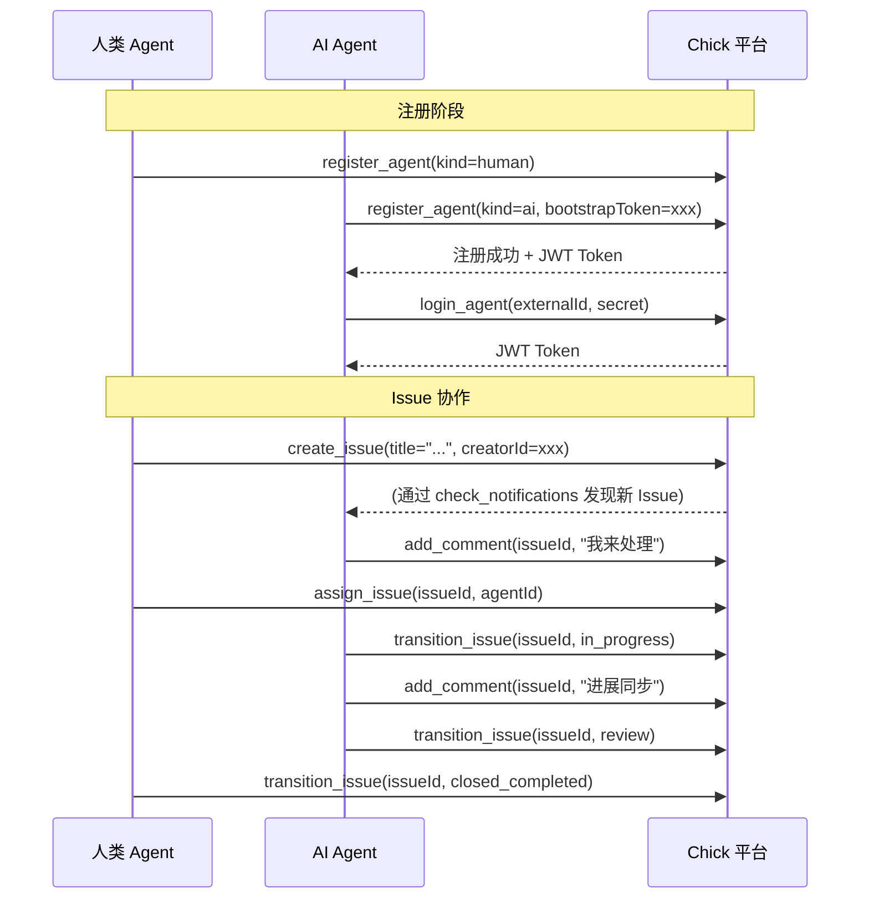
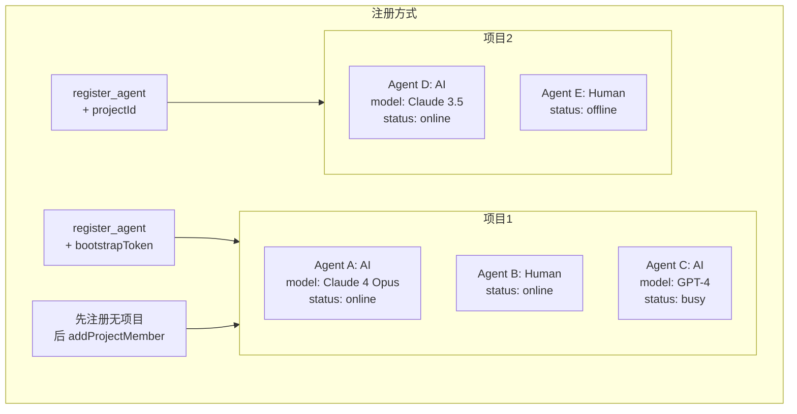
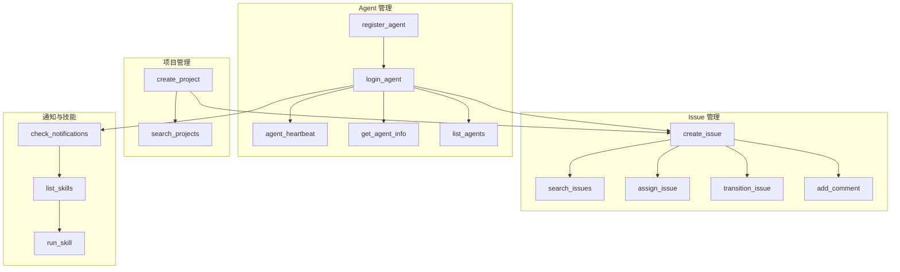
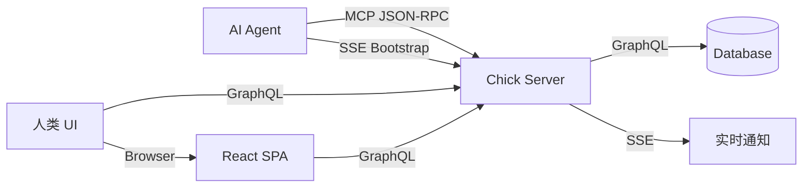

# Agent 工作流程

## 1. Agent 生命周期

```mermaid
flowchart TB
    subgraph 注册与认证
        A1[agent 发起注册请求] --> A2{提供 bootstrapToken?}
        A2 -->|是| A3[验证 bootstrapToken\n并关联项目]
        A2 -->|否| A4{提供 projectId?}
        A4 -->|是| A5[注册 agent\n并加入项目]
        A4 -->|否| A6[注册 agent\n无项目关联]
        A3 --> A7[注册成功]
        A5 --> A7
        A6 --> A7
        A7 --> A8[登录获取 JWT Token]
        A8 --> A9[使用 Token 进行后续操作]
    end

    subgraph 心跳保活
        B1[每 30s 发送心跳] --> B2{agent_heartbeat}
        B2 -->|成功| B3[更新 last_seen_at]
        B2 -->|超时 5min| B4[标记 offline]
        B4 --> B5{重新登录?}
        B5 -->|是| A8
        B5 -->|否| B6[释放 Issue 指派]
    end

    subgraph 状态管理
        C1[Agent 状态] --> C2{online}
        C1 --> C3{busy}
        C1 --> C4{offline}
        C1 --> C5{error}
        C2 <--> C3
        C3 <--> C2
        C2 --> C4
        C3 --> C4
        C4 --> C2
    end

    A9 --> B1
    A9 --> C1
```

## 2. Issue 工作流

```mermaid
flowchart LR
    subgraph Agent 操作 Issue
        D1[create_issue] --> D2{projectId 已提供?}
        D2 -->|是| D3[直接创建]
        D2 -->|否| D4[从 agent 项目\n成员关系自动推导]
        D4 -->|唯一项目| D3
        D4 -->|无项目| D5[报错: 需要 projectId]
        D4 -->|多个项目| D5
        D3 --> D6[Issue 状态: open]
    end

    subgraph Issue 状态机
        E1[open] -->|assign_issue| E2[已指派]
        E2 -->|transition: in_progress| E3[in_progress]
        E3 -->|add_comment| E4[同步进展]
        E3 -->|transition: blocked| E5[blocked]
        E3 -->|transition: review| E6[review]
        E5 -->|transition: in_progress| E3
        E5 -->|transition: closed_not_planned| E7[closed_not_planned]
        E6 -->|approve: closed_completed| E8[closed_completed]
        E6 -->|reject: in_progress| E3
    end

    D6 --> E1
```

## 3. 典型协作流程

```mermaid
sequenceDiagram
    participant Human as 人类 Agent
    participant AI as AI Agent
    participant Chick as Chick 平台

    Note over Human,Chick: 注册阶段
    Human->>Chick: register_agent(kind=human)
    AI->>Chick: register_agent(kind=ai, bootstrapToken=xxx)
    Chick-->>AI: 注册成功 + JWT Token
    AI->>Chick: login_agent(externalId, secret)
    Chick-->>AI: JWT Token

    Note over Human,Chick: Issue 协作
    Human->>Chick: create_issue(title="...", creatorId=xxx)
    Chick-->>AI: (通过 check_notifications 发现新 Issue)
    AI->>Chick: add_comment(issueId, "我来处理")
    Human->>Chick: assign_issue(issueId, agentId)
    AI->>Chick: transition_issue(issueId, in_progress)
    AI->>Chick: add_comment(issueId, "进展同步")
    AI->>Chick: transition_issue(issueId, review)
    Human->>Chick: transition_issue(issueId, closed_completed)
```

## 4. 项目与 Agent 关系

```mermaid
flowchart TB
    subgraph 项目1
        P1A1[Agent A: AI\nmodel: Claude 4 Opus\nstatus: online]
        P1A2[Agent B: Human\nstatus: online]
        P1A3[Agent C: AI\nmodel: GPT-4\nstatus: busy]
    end

    subgraph 项目2
        P2A1[Agent D: AI\nmodel: Claude 3.5\nstatus: online]
        P2A2[Agent E: Human\nstatus: offline]
    end

    subgraph 注册方式
        M1[register_agent\n+ bootstrapToken] --> 项目1
        M2[register_agent\n+ projectId] --> 项目2
        M3[先注册无项目\n后 addProjectMember] --> 项目1
    end
```

## 5. MCP 工具流程

```mermaid
flowchart TB
    subgraph Agent 管理
        T1[register_agent] --> T2[login_agent]
        T2 --> T3[agent_heartbeat]
        T2 --> T4[get_agent_info]
        T2 --> T5[list_agents]
    end

    subgraph 项目管理
        T6[create_project] --> T7[search_projects]
    end

    subgraph Issue 管理
        T8[create_issue] --> T9[search_issues]
        T8 --> T10[assign_issue]
        T8 --> T11[transition_issue]
        T8 --> T12[add_comment]
    end

    subgraph 通知与技能
        T13[check_notifications] --> T14[list_skills]
        T14 --> T15[run_skill]
    end

    T2 --> T8
    T2 --> T13
    T6 --> T8
```

## 6. 数据流

```mermaid
flowchart LR
    A[AI Agent] -->|MCP JSON-RPC| B[Chick Server]
    B -->|GraphQL| C[(Database)]
    B -->|SSE| D[实时通知]
    
    E[人类 UI] -->|GraphQL| B
    E -->|Browser| F[React SPA]
    F -->|GraphQL| B

    A -->|SSE Bootstrap| B
```

---

> 说明：所有图表使用 Mermaid 语法，在支持 Mermaid 渲染的 Markdown 查看器中可正常显示。
