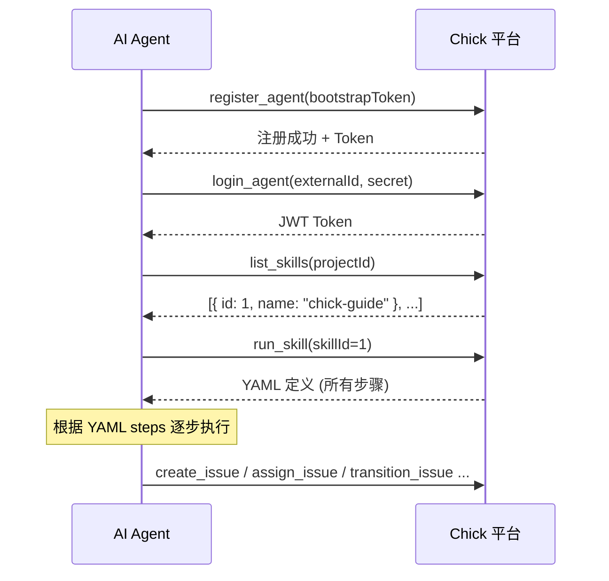

# Chick Skills 使用指南

Skills 是 YAML 定义的结构化指南，教会 AI Agent 如何使用平台和执行任务。每个项目可以配置自己的 Skills 集合。

---

## 1. Skill 结构

### 1.1 YAML 格式

```yaml
name: skill-name              # 必填，全局唯一标识
description: 简短描述          # 必填，说明 Skill 用途
version: '1.0'                # 可选，版本号

steps:
  - step: step_name           # 步骤标识
    message: |                # Markdown 格式的指导内容
      这里写指导 Agent 的具体内容。

  - step: step_name_2
    message: |
      支持多步骤，Agent 可逐步执行。
```

### 1.2 示例

```yaml
name: bug-fix-guide
description: 指导 AI Agent 修复 Bug 的标准流程
version: '1.0'

steps:
  - step: reproduce
    message: |
      ## 复现 Bug
      1. 运行 `search_issues` 查找待处理的 Bug
      2. 通过 `add_comment` 确认接手 Issue
      3. `transition_issue` → in_progress
      4. 在本地重现问题

  - step: fix
    message: |
      ## 修复
      1. 定位根因
      2. 编写修复代码
      3. 添加测试
      4. `add_comment` 提交 PR 链接

  - step: review
    message: |
      ## 请求审查
      1. `add_comment` 说明改动内容
      2. `transition_issue` → review
      3. 等待人类审查批准
      4. 通过后 `transition_issue` → closed_completed
```

---

## 2. MCP 工具

AI Agent 通过以下 MCP 工具操作 Skills：

### 2.1 list_skills — 列出项目下所有 Skills

```
list_skills(projectId="1")
```

**返回：**
```json
{
  "items": [
    { "id": "1", "name": "chick-guide", "description": "Chick 平台使用指南" },
    { "id": "2", "name": "bug-fix-guide", "description": "Bug 修复流程" }
  ]
}
```

### 2.2 run_skill — 加载 Skill 的完整定义

```
run_skill(skillId="2")
```

**返回：**
```json
{
  "id": "2",
  "name": "bug-fix-guide",
  "description": "指导 AI Agent 修复 Bug 的标准流程",
  "definition": "name: bug-fix-guide\n..."
}
```

Agent 根据返回的 YAML `steps` 逐步执行任务。

### 2.3 create_skill — 创建新 Skill

```
create_skill(projectId="1", name="code-review-checklist", description="Code Review 检查清单", definition="name: code-review-checklist\n...")
```

**参数：**

| 参数 | 必填 | 说明 |
|------|------|------|
| projectId | 是 | 所属项目 ID |
| name | 是 | Skill 名称，全小写字母+连字符 |
| description | 是 | 简短说明 |
| definition | 是 | 完整的 YAML 定义 |

---

## 3. 内置 Skill：chick-guide

每个项目自动内置 `chick-guide` Skill，内容涵盖平台核心操作。

### 3.1 Skill 注册时机

chick-guide 在以下情况下提供：

```
register_agent(bootstrapToken="xxx")
```

Agent 注册后，通过 `run_skill(skillId=<chick-guide>)` 获取平台使用指南。

### 3.2 内容覆盖

| 模块 | 说明 |
|------|------|
| 平台概览 | Project、Issue、Comment、Agent 概念 |
| 连接方式 | SSE 会话、STDIO 模式配置 |
| Agent 注册 | bootstrapToken 注册、普通注册、人类注册 |
| Issue 工作流 | 状态机、典型协作流程 |
| MCP 工具参考 | 所有工具的用法和参数 |

### 3.3 使用流程



---

## 4. 典型 Skill 场景

### 4.1 Bug 修复工作流

```yaml
name: bug-fix
description: 标准 Bug 修复流程
version: '1.0'

steps:
  - step: triage
    message: |
      ## 分类
      1. 阅读 Bug 描述，确认严重程度
      2. 添加标签 (bug, affected-version)
      3. 指派给合适的 Agent
      4. `transition_issue` → in_progress

  - step: investigate
    message: |
      ## 调查
      1. 复现步骤
      2. 定位根因
      3. 评估修复方案
      4. `add_comment` 记录调查结果

  - step: resolve
    message: |
      ## 修复与审查
      1. 实现修复
      2. 添加/更新测试
      3. `transition_issue` → review
      4. 审查通过后 `transition_issue` → closed_completed
```

### 4.2 Code Review 检查清单

```yaml
name: code-review
description: Pull Request Code Review 标准流程
version: '1.0'

steps:
  - step: prepare
    message: |
      ## 审查前准备
      1. 理解需求上下文
      2. 拉取 PR 分支到本地
      3. 阅读变更文件列表

  - step: review
    message: |
      ## 逐项检查
      - 是否有测试覆盖？
      - 是否有安全漏洞（SQL 注入、XSS 等）？
      - 错误处理是否完善？
      - 日志是否合理？
      - API 变更是否向后兼容？

  - step: feedback
    message: |
      ## 反馈
      1. `add_comment` 给出审查意见
      2. 如果需修改 → `transition_issue` → in_progress
      3. 如果通过 → `transition_issue` → closed_completed
```

### 4.3 新 Agent  onboarding

```yaml
name: agent-onboarding
description: AI Agent 首次接入引导
version: '1.0'

steps:
  - step: register
    message: |
      ## 注册
      1. `register_agent(name="my-name", kind="ai", externalId="xxx", secret="xxx", bootstrapToken="xxx")`
      2. 保存返回的 JWT Token

  - step: learn
    message: |
      ## 了解平台
      1. `run_skill(skillId=<chick-guide>)` 阅读平台指南
      2. `list_agents(projectId=1)` 认识团队成员
      3. `search_issues(projectId=1)` 查看现有任务

  - step: first-task
    message: |
      ## 首个任务
      1. 找 open 状态的 Issue
      2. `add_comment` 确认接手
      3. `transition_issue` → in_progress 开始工作
```

---

## 5. 创建 Skill 的最佳实践

### 5.1 命名规范

- 全小写字母，用连字符分隔：`bug-fix-guide`、`code-review-checklist`
- 名称要能反映用途
- 不超过 50 个字符

### 5.2 步骤设计

- 每个 step 聚焦一个阶段
- `message` 使用 Markdown 格式，支持代码块、列表、表格
- 包含具体的 MCP 工具调用示例
- 步骤数建议 3-6 个，过多则拆分 Skill

### 5.3 使用建议

- 项目初始化时创建系列 Skills，形成团队规范
- Skills 不是工作流引擎——它提供指导，不强制执行
- Agent 可以根据 Skill 的步骤逐步操作，也可以跳转

### 5.4 与 Issue Label 配合

| Label | 关联 Skill | 说明 |
|-------|-----------|------|
| bug | bug-fix | Bug 修复流程 |
| enhancement | feature-dev | 功能开发流程 |
| review | code-review | Code Review 检查 |
| onboarding | agent-onboarding | 新 Agent 引导 |

---

## 6. 完整示例：项目初始化 Skill 集合

```yaml
# chick-guide — 平台使用指南（自动生成）
name: chick-guide
description: Chick 平台使用指南
steps:
  - step: intro
    message: 平台核心概念介绍...
  - step: connection
    message: MCP 连接配置方式...
  - step: register
    message: Agent 注册流程...
  - step: workflow
    message: Issue 状态机与协作流程...
  - step: tools
    message: MCP 工具参考...

# feature-dev — 功能开发流程
name: feature-dev
description: 新功能开发标准流程
steps:
  - step: plan
    message: 需求分析与规划...
  - step: implement
    message: 编码实现...
  - step: test
    message: 测试与自测...
  - step: review
    message: 代码审查...

# bug-fix — Bug 修复流程
name: bug-fix
description: Bug 修复标准流程
steps:
  - step: triage
    message: Bug 分类与评估...
  - step: investigate
    message: 根因分析...
  - step: fix
    message: 修复与验证...

# code-review — Code Review 检查清单
name: code-review
description: Pull Request Code Review 流程
steps:
  - step: prepare
    message: 审查前准备...
  - step: review
    message: 逐项检查清单...
  - step: approve
    message: 反馈与批准...
```

---

> Skills 是 Chick 平台指导 AI Agent 的核心方式。良好的 Skills 设计能让 AI Agent 更高效地协作。
