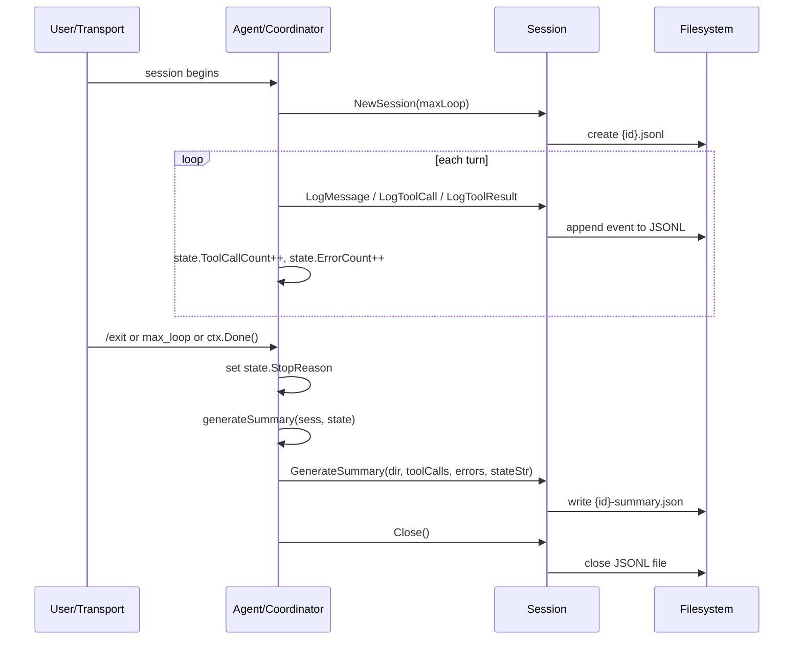
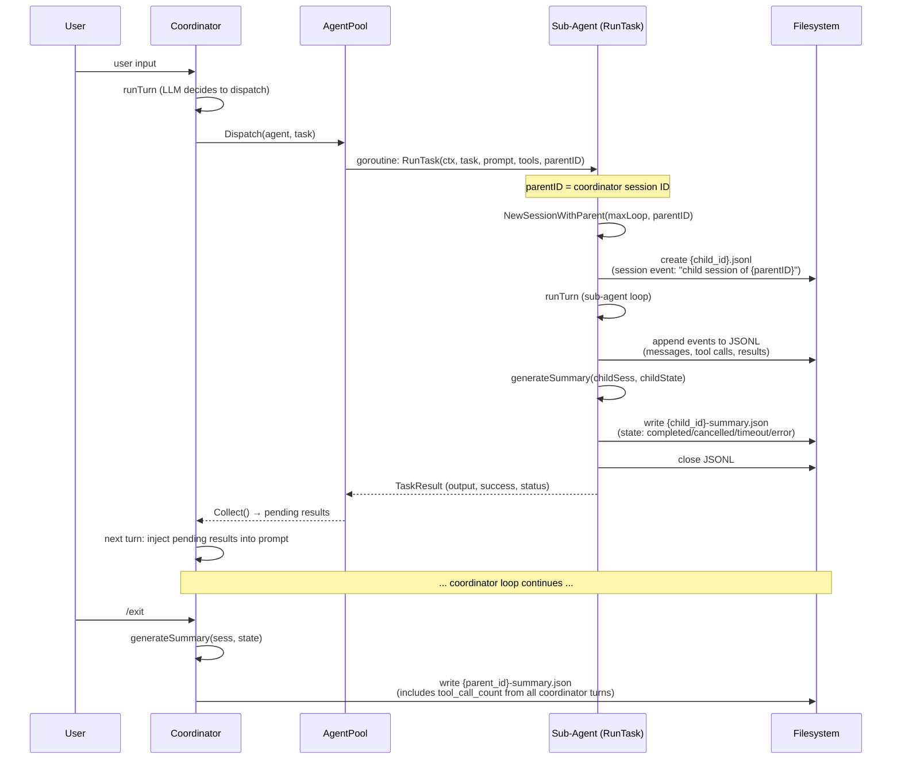

# 摘要系统设计 (Session Summary System)

## 概述

摘要系统在会话结束时自动生成结构化 JSON 文件 (`<session_id>-summary.json`)，记录会话的关键统计数据：轮次、工具调用次数、错误数、终止原因等。用于事后审计、使用分析、问题排查。

## 数据模型

### Summary 结构体 (`internal/session/summary.go`)

```go
type Summary struct {
    SessionID     SessionID `json:"session_id"`
    Transport     string    `json:"transport,omitempty"`   // 预留，当前未填充
    StartedAt     time.Time `json:"started_at"`
    EndedAt       time.Time `json:"ended_at"`
    Turns         int       `json:"turns"`
    MaxLoop       int       `json:"max_loop"`
    ToolCallCount int       `json:"tool_call_count"`
    ErrorCount    int       `json:"error_count"`
    State         string    `json:"state"`                // completed | interrupted | user_exit | max_loop | transport_error
}
```

### 文件格式

摘要输出为 pretty-printed JSON，存储路径：`<session.dir>/<session_id>-summary.json`

```json
{
  "session_id": "d807q8a66sh7ljr07oi0",
  "started_at": "2026-05-10T12:00:00Z",
  "ended_at": "2026-05-10T12:05:00Z",
  "turns": 5,
  "max_loop": 50,
  "tool_call_count": 12,
  "error_count": 1,
  "state": "completed"
}
```

## 架构



## 生命周期

### 触发时机

| 时机 | StopReason | 调用位置 |
|------|-----------|---------|
| 用户输入 `/exit` 或 `/quit` | `"user_exit"` | `loop.go:134`, `coordinator.go:162` |
| `ctx.Done()` (SIGINT/SIGTERM) | `"interrupted"` | `loop.go:113`, `coordinator.go:140` |
| 达到 `max_loop` 轮次 | `"max_loop"` | `loop.go:120`, `coordinator.go:147` |
| `ReadLine` 返回 error (连接断开等) | `"transport_error"` | `loop.go:130`, `coordinator.go:157` |
| 子任务结束 (`RunTask`) | `"completed"` (默认) | `loop.go:592` |

### 生成流程

```
generateSummary(sess, state)
├── 检查 cfg.Session.Summary (false 则跳过)
├── 映射 StopReason → state string
│   ├── "interrupted" → "interrupted"
│   ├── "user_exit"    → "user_exit"
│   └── default         → "completed"
└── sess.GenerateSummary(dir, toolCalls, errors, state)
    ├── 创建 Summary 结构体
    ├── json.MarshalIndent
    ├── os.WriteFile → {id}-summary.json
    └── zap log "session summary written"
```

### 零轮次场景

用户连接后立即退出（0 轮对话），摘要仍然生成：
- `turns: 0`, `tool_call_count: 0`, `error_count: 0`, `state: "user_exit"`
- 这对于审计和问题排查同样有价值

## 配置

```yaml
session:
  dir: "./sessions"      # 摘要文件输出目录（与 JSONL 同目录）
  summary: true           # 是否生成摘要（默认 true）
  max_loop: 50            # 超过此轮次时生成 checkpoint 摘要并继续
```

`summary: false` 时 `generateSummary()` 直接 return，不写文件。

## 多 Agent (Sub-Agent) 摘要流程

当 Coordinator 通过 `dispatch_task` 或 `create_agent` 创建子任务时，每个子任务在独立的 `RunTask` goroutine 中运行，拥有独立的 session 和摘要。



### 父子关系

- **父会话** (Coordinator session): `{parent_id}.jsonl` + `{parent_id}-summary.json`
- **子会话** (每个 Sub-Agent): `{child_id}.jsonl` + `{child_id}-summary.json`
- 子会话在 JSONL 第一条写入 system event: `"child session of {parent_id}"`
- 子会话的 `SessionEvent.ParentID` 字段指向父会话 ID

### 子任务状态映射

`RunTask` 中根据 taskErr 类型映射 Status：

| 错误类型 | Status | Summary.State |
|---------|--------|---------------|
| 无错误 | `"completed"` | `"completed"` |
| 含 "cancel" | `"cancelled"` | `"completed"` (摘要仍生成) |
| 含 "deadline"/"timeout" | `"timeout"` | `"completed"` |
| 其他错误 | `"error"` | `"completed"` |

注意：子任务即使出错，也始终生成摘要（`generateSummary` 在 defer 区域执行）。

### 摘要文件示例

会话目录在 Coordinator 运行后的完整文件列表：

```
sessions/
├── d807q8a66sh7ljr07oi0.jsonl          # coordinator session events
├── d807q8a66sh7ljr07oi0-summary.json    # coordinator summary (turns: 5, tool_call_count: 15)
├── d807q8a66shb2kp0rgf0.jsonl          # sub-agent 1 session events
├── d807q8a66shb2kp0rgf0-summary.json    # sub-agent 1 summary (turns: 1, state: completed)
├── d807q8a66shr9nf1uyh0.jsonl          # sub-agent 2 session events
└── d807q8a66shr9nf1uyh0-summary.json    # sub-agent 2 summary (turns: 1, state: timeout)
```

## 与 Session Reaper 的关系

Reaper (`reapOldSessions`) 清理过期文件时同时匹配 `*.jsonl` 和 `*-summary.json`，不会遗漏摘要文件：

```go
if !strings.HasSuffix(name, ".jsonl") && !strings.HasSuffix(name, "-summary.json") {
    continue
}
```

活跃会话的摘要文件会被跳过（通过 `activeFiles` 集合保护），防止误删。

## 边界情况

| 场景 | 行为 |
|------|------|
| `summary: false` | 不生成文件，`generateSummary` 直接返回 |
| 目录不存在/无写权限 | `os.WriteFile` 返回 error，上层忽略（非致命） |
| 0 轮对话 | 正常生成，turns=0 |
| 子任务 (`RunTask`) | 自带 session 生命周期，独立生成摘要 |
| 会话恢复 | 子会话链接到父会话 (`parent_id`)，各自生成独立摘要 |
| Reaper 竞态 | activeFiles 集合在锁内构建，活跃会话摘要不被删除 |

<!-- last-modified: 2026-05-11 -->
