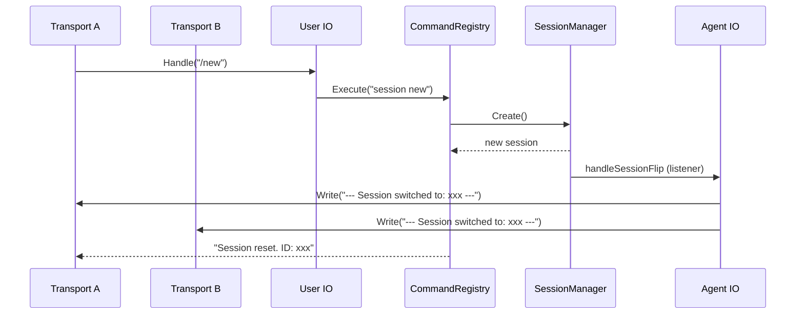
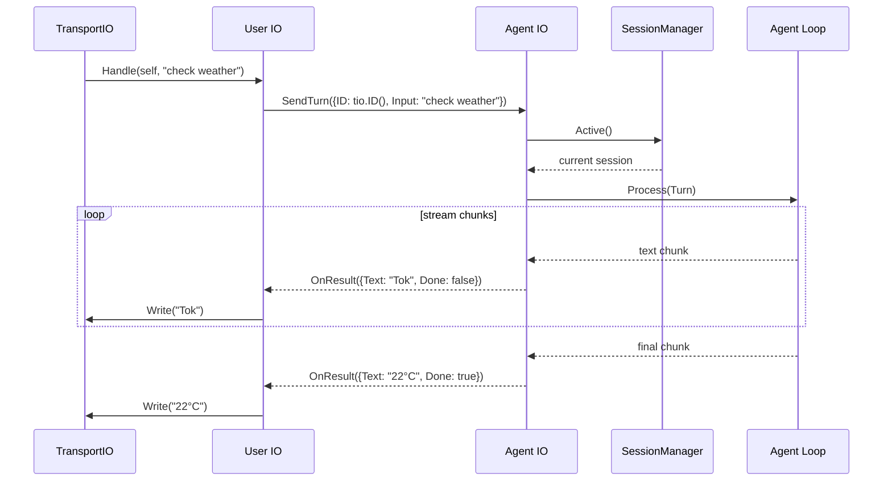
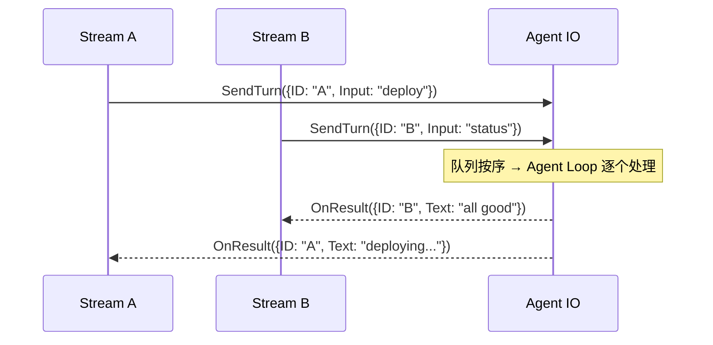

# Agent IO

Agent IO 是异步队列，接收 UserIO 发出的 Turn，路由到对应的 Agent Loop 实例，处理完成后回调 UserIO。

Context 沿 TransportIO → UserIO → AgentIO 链路传播，AgentIO 从中提取 TransportInfo 并绑定 Session。

## 接口

```go
type AgentIO struct {
    queue      chan *Turn             // buffered channel, 满时反压到 TransportIO
    agents     map[string]*AgentLoop  // TransportID → Agent Loop
    routes     map[string]TransportIO  // TransportID → TransportIO (用于写回)
    sessionMgr *SessionManager
    signalBus  *SignalBus
}

// 创建 AgentIO
func NewAgentIO(bufferSize int) *AgentIO {
    return &AgentIO{
        queue:  make(chan *Turn, bufferSize),  // 默认 1024
        agents: make(map[string]*AgentLoop),
        routes: make(map[string]TransportIO),
    }
}

// 满队列阻塞 → UserIO.Handle 阻塞 → TransportIO.Read 阻塞 → 天然反压

// RegisterTransport 注册 TransportIO 到路由表
func (a *AgentIO) RegisterTransport(id string, tio TransportIO) {
    a.routes[id] = tio
}

// SendTurn 接收 UserIO 的 Turn，context 透传
func (a *AgentIO) SendTurn(ctx context.Context, turn *Turn) {
    if info := GetTransportInfo(ctx); info != nil {
        turn.TransportID = info.ID
    }
    session := a.sessionMgr.Active()
    if session == nil {
        session = a.sessionMgr.Create(ctx)  // 首次自动创建
    }
    turn.SessionID = session.ID
    a.queue <- turn
}
```

## Context 传播

```
TransportIO                          UserIO                           AgentIO
  │                                  │                                │
  ├─ context.WithValue(              ├─ ctx 透传                      ├─ 提取 TransportInfo
  │    TransportInfo{                │   (不修改)                     ├─ 绑定 SessionID
  │      ID: "stdio-1",             │                                │
  │      Type: "stdio"              │                                │
  │    })                            │                                │
  │                                  │                                │
  v                                  v                                v
ctx ────────────────────────────── ctx ──────────────────────────── ctx
     (含 TransportInfo)                 (含 TransportInfo)              (含 TransportInfo + SessionID)
```

## Session 翻转通知

任意 Transport 触发 `/new` 时，所有 Transport 收到广播通知：

```go
// SessionManager 创建新 Session 时回调
type SessionListener func(ctx context.Context, session *Session)

type SessionManager struct {
    listeners []SessionListener
    // ...
}

func (m *SessionManager) OnSessionCreated(fn SessionListener) {
    m.listeners = append(m.listeners, fn)
}
```

AgentIO 注册监听，Session 翻转时向所有 Transport 广播：

```go
func (a *AgentIO) handleSessionFlip(ctx context.Context, session *Session) {
    msg := "\n--- Session switched to: " + session.ID + " ---\n"
    for id, tio := range a.routes {
        tio.Write(ctx, msg)
    }
    a.logger.Info("session flipped",
        zap.String("new_session_id", session.ID),
        zap.Int("transports_notified", len(a.routes)),
    )
}
```



func (a *AgentIO) OnResult(result *TurnResult) {
    tio, ok := a.routes[result.TransportID]
    if !ok {
        a.logger.Warn("OnResult: unknown transport", zap.String("transport_id", result.TransportID))
        return
    }
    tio.Write(context.Background(), result.Text)
    if result.Done {
        tio.Flush()
    }
}

func (a *AgentIO) OnError(err error) {
    a.logger.Error("agent io error", zap.Error(err))
}
```

## Turn 和 TurnResult

```go
type Turn struct {
    TransportID string
    SessionID   string   // 由 Agent IO 在路由时填充
    Input       string
}

type TurnResult struct {
    TransportID string
    SessionID   string   // 透传当前 Session ID
    Text        string   // 文本片段，流式推送
    Done        bool     // 最后一帧
    Error       error
}
```

## 路由流程





<!-- last-modified: 2026-05-28 -->
