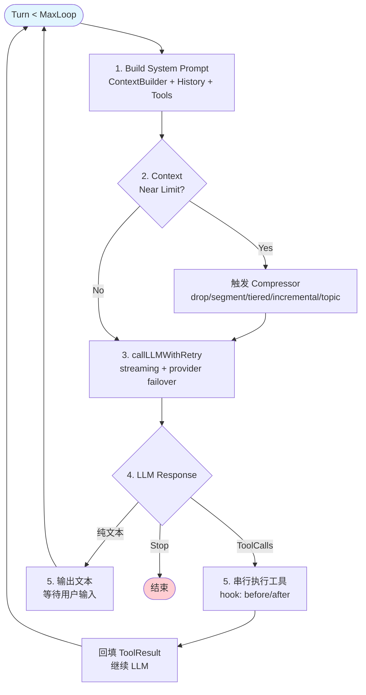
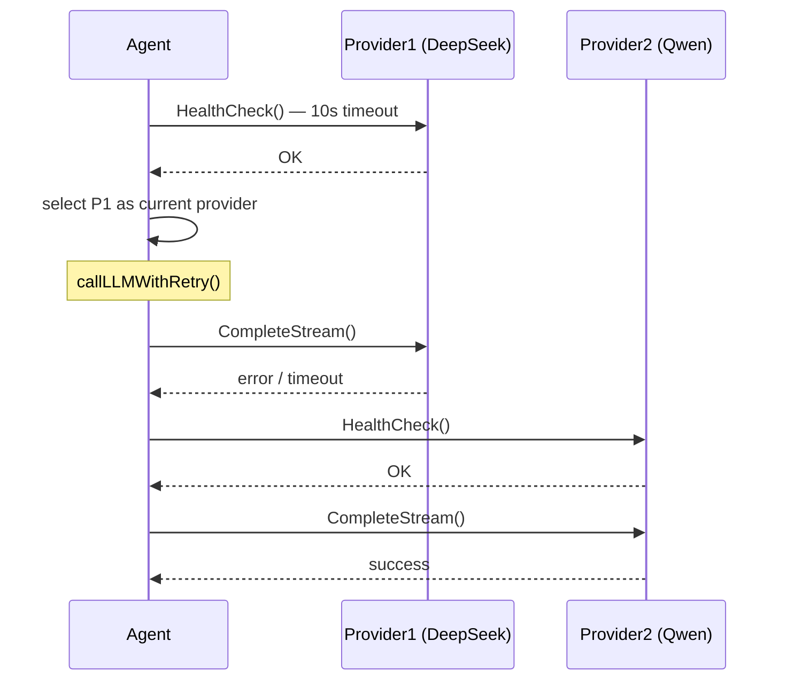

# Agent Loop & Provider (`internal/agent/`)

## Agent Loop



### 伪代码流程

```
for turn < MaxLoop {
    1. 构建 System Prompt: ContextBuilder + 对话历史 + Tools (Top 10 + search)
    2. 压缩检测: 接近 ContextLimit → 触发 Compressor
    3. callLLMWithRetry() — streaming, 指数退避 3 次, provider 故障切换
    4. if ToolCalls → 串行执行 (hook: tool:before/after) → 回填 → 子循环
    5. if 纯文本 → 输出 → 等待输入
    6. checkpoint: MaxLoop → Summary
}
```

## Provider Interface

```go
type Provider interface {
    Type() ProviderType
    Name() string
    Complete(ctx, ProviderRequest) (*ProviderResponse, error)
    CompleteStream(ctx, ProviderRequest) (<-chan StreamChunk, error)
    HealthCheck(ctx) error
}
```

- **OpenAIProvider**: `sashabaranov/go-openai` — 兼容 DeepSeek, Ollama, OpenAI
- **AnthropicProvider**: 直接 HTTP 实现 Anthropic Messages API

启动时对所有配置 provider 并发健康检查，选第一个可用；`callLLMWithRetry` 支持故障切换到下一个。

## Provider Failover Flow



## Context Compression

| Strategy | Class | Behavior |
|----------|-------|----------|
| `drop` | `DropCompressor` | 丢弃最旧的完整 turn 组 (默认) |
| `segment` | `SegmentCompressor` | 分段后分别摘要 |
| `tiered` | `TieredCompressor` | 多层循环摘要 |
| `incremental` | `IncrementalCompressor` | 增量单层摘要 |
| `topic` | `TopicCompressor` | 按主题聚类摘要 |

## Compression Flow

```mermaid
flowchart LR
    subgraph Before Compression
        M1["Turn 1 (user/assistant/tool)"]
        M2["Turn 2 (user/assistant/tool)"]
        M3["Turn 3 ...".  ..."]
        Mn["Turn N-1"]
    end

    subgraph Compression
        Comp["Compressor"]
    end

    subgraph After Compression
        C1["Compressed Turn 1"]
        C2["Compressed Turn 2"]
        C3["Compressed Turn 3"]
    end

    M1 --> M2 --> M3 --> Mn --> Comp
    Comp --> C1 --> C2 --> C3
```
