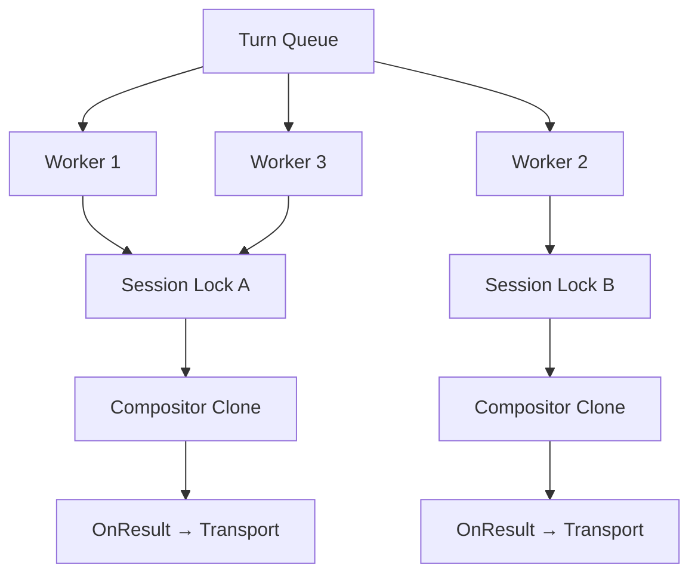
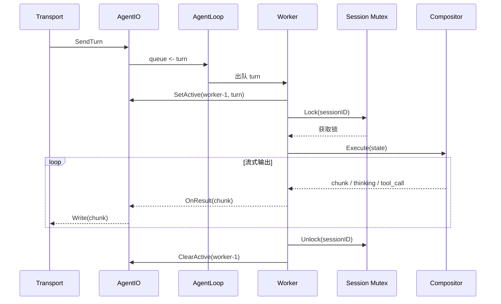

# Agent Loop

Agent Loop 从 turn 队列消费用户输入，通过 Compositor 管线（MemoryRead → ContextBuilder → LLM → Tool → MemoryWrite）处理后，将结果流式写回 Transport。

支持配置 `agent.pool_size` 启动多个 worker goroutine 并行消费队列，不同 session 的 turn 可同时处理。

## 接口

```go
type AgentLoop struct {
    queue        chan *agentio.Turn
    onResult     func(agentio.TurnResult)
    compositor   *Compositor                    // 模板 compositor，每个 worker Clone 一份
    logger       *zap.Logger
    eventBus     *event.Bus
    agentIO      *agentio.AgentIO
    poolSize     int                            // worker 数量，默认 1
    sessionMu    sync.Mutex                     // 保护 sessionLocks map
    sessionLocks map[string]*sync.Mutex         // per-session 串行锁
}

func NewAgentLoop(
    queue chan *agentio.Turn,
    compositor *Compositor,
    logger *zap.Logger,
    eventBus *event.Bus,
    agentIO *agentio.AgentIO,
    poolSize int,
) *AgentLoop
```

## Worker 模型



每个 worker：
- 从同一个 `chan *Turn` 出队
- 持有独立的 Compositor Clone（stage 有 per-turn 可变字段，不可共享）
- 处理前获取 session 锁，同时只有一个 worker 处理同一 session
- 不同 session 完全并行

## Per-Session 锁

同一 session 的 turn 必须按入队顺序处理——turn N+1 的 LLM 请求依赖 turn N 的回复，并行处理会导致对话历史错乱。

```go
func (a *AgentLoop) sessionLock(sessionID string) *sync.Mutex {
    a.sessionMu.Lock()
    defer a.sessionMu.Unlock()
    if mu, ok := a.sessionLocks[sessionID]; ok {
        return mu
    }
    mu := &sync.Mutex{}
    a.sessionLocks[sessionID] = mu
    return mu
}
```

`processTurn` 中：

```go
mu := a.sessionLock(turn.SessionID)
mu.Lock()
defer mu.Unlock()
// ... 正常处理
```

效果：同 session 排队串行，不同 session 无锁并行。

## Compositor Clone

Stage 有 per-turn 可变状态（`ContextBuilderStage.transportCtx`、`MemoryWriteStage.writeIdx`），跨 worker 共享会导致竞态。每个 worker 通过 Clone 获得独立副本：

```go
func (c *Compositor) Clone() *Compositor {
    initCopy := make([]Stage, len(c.initStages))
    for i, s := range c.initStages {
        initCopy[i] = s.Clone()
    }
    loopCopy := make([]Stage, len(c.loopStages))
    for i, s := range c.loopStages {
        loopCopy[i] = s.Clone()
    }
    return &Compositor{
        initStages:  initCopy,
        loopStages:  loopCopy,
        maxRounds:   c.maxRounds,
        turnTimeout: c.turnTimeout,
    }
}
```

Stage Clone 为浅拷贝——共享的外部资源（Memory、ToolRegistry、EventBus、Logger）自身都是 goroutine-safe 的，无需深拷贝。

## 配置

```yaml
# config.yaml
agent:
  pool_size: 1   # worker 数量，默认 1（串行），按活跃 session 数量调整
```

## Worker 可见性

`/queue` 命令展示每个 worker 正在处理的 turn：

```
Agent Queue: 2 workers active, 3 pending / 1024 capacity

Active:
  worker-1: [panda] 帮我查下今天天气... — elapsed 12s
  worker-2: [dingtalk] 跑一下测试... — elapsed 3s

Pending:
  1. [wework] 发送邮件... — waiting 45s
```

AgentIO 通过 `SetActive(workerID, turn)` / `ClearActive(workerID)` 跟踪活跃 worker，`/queue` 调用 `ActiveSnapshot()` 获取快照。

## Worker 可追踪性

### 日志

每个 worker 创建时获取带 worker_id 的 logger：

```go
func (a *AgentLoop) worker(ctx context.Context, id string) {
    wLogger := a.logger.With(zap.String("worker_id", id))
    compositor := a.compositor.Clone()

    for {
        select {
        case <-ctx.Done():
            wLogger.Info("worker stopped")
            return
        case turn := <-a.queue:
            // ...
            a.processTurn(ctx, turn, compositor, id, wLogger)
        }
    }
}
```

所有日志行自动带上 `worker_id` 字段，排查问题时可直接按 worker 过滤。

### OpenTelemetry

`processTurn` 已有的 turn span 上追加 worker_id：

```go
ctx, span := otel.Tracer("dolphin").Start(ctx, "turn."+turn.SessionID)
span.SetAttributes(
    attribute.String("turnid", turn.TurnID),
    attribute.String("sessionid", sid),
    attribute.String("input", turn.Input),
    attribute.String("worker_id", workerID),  // 新增
)
```

在 trace 中可区分哪个 worker 处理了哪个 turn，便于分析并行度和 worker 负载分布。

### `/queue` 实时视图

```
Agent Queue: 2 workers active, 3 pending / 1024 capacity

Active:
  worker-1: [panda] 帮我查下今天天气... — elapsed 12s
  worker-2: [dingtalk] 跑一下测试... — elapsed 3s

Pending:
  1. [wework] 发送邮件... — waiting 45s
```

## 处理流程



## Worker 容错

worker 内发生 panic 时，recover 并自动重启，避免处理能力静默降级：

```go
func (a *AgentLoop) Run(ctx context.Context) {
    var wg sync.WaitGroup
    for i := 0; i < a.poolSize; i++ {
        wg.Add(1)
        go func(id int) {
            defer wg.Done()
            workerID := fmt.Sprintf("worker-%d", id+1)
            for {
                a.runWorker(ctx, workerID)
                // ctx 未取消则重启，避免 worker 消失后总处理能力下降
                select {
                case <-ctx.Done():
                    return
                default:
                    a.logger.Warn("worker panicked, restarting", zap.String("worker_id", workerID))
                }
            }
        }(i)
    }
    wg.Wait()
}

func (a *AgentLoop) runWorker(ctx context.Context, id string) {
    wLogger := a.logger.With(zap.String("worker_id", id))
    defer func() {
        if r := recover(); r != nil {
            wLogger.Error("worker panic recovered", zap.Any("panic", r))
        }
    }()
    compositor := a.compositor.Clone()
    for {
        select {
        case <-ctx.Done():
            wLogger.Info("worker stopped")
            return
        case turn := <-a.queue:
            // ...
            a.processTurn(ctx, turn, compositor, id, wLogger)
        }
    }
}
```

`runWorker` 包装了真正的 worker 循环，一旦 panic 被 recover，外层 `Run` 的 for 循环立即重启一个新 worker，保持 `poolSize` 个 worker 始终在线。

## Session Lock 淘汰

`sessionLocks` map 只增不减，长期运行会积累已不再使用的 session 锁对象。通过 sync.Pool 或定时清理控制内存：

```go
func (a *AgentLoop) sessionLock(sessionID string) *sync.Mutex {
    a.sessionMu.Lock()
    defer a.sessionMu.Unlock()
    if mu, ok := a.sessionLocks[sessionID]; ok {
        return mu
    }
    mu := &sync.Mutex{}
    a.sessionLocks[sessionID] = mu
    return mu
}

// 定时清理：移除没有 goroutine 等待的锁（TryLock 快速探测）
func (a *AgentLoop) startSessionLockGC(ctx context.Context) {
    go func() {
        ticker := time.NewTicker(5 * time.Minute)
        defer ticker.Stop()
        for {
            select {
            case <-ctx.Done():
                return
            case <-ticker.C:
                a.sessionMu.Lock()
                for id, mu := range a.sessionLocks {
                    if mu.TryLock() {
                        mu.Unlock()
                        delete(a.sessionLocks, id)
                    }
                }
                a.sessionMu.Unlock()
            }
        }
    }()
}
```

- 每 5 分钟尝试清理无竞争的锁（`TryLock` 成功说明当前无 worker 持有）
- Session 锁本身只是 `sync.Mutex`（8 字节），几百个闲置锁也只有几 KB
- 仅在 `pool_size > 1` 时启动 GC goroutine

## Worker Metrics

通过 Prometheus 暴露 worker 级别的指标，不做额外轮询：

```go
// internal/observability/metrics.go
var (
    workerTurnTotal = promauto.NewCounterVec(
        prometheus.CounterOpts{Name: "dolphin_worker_turns_total"},
        []string{"worker_id"},
    )
    workerTurnDuration = promauto.NewHistogramVec(
        prometheus.HistogramOpts{
            Name:    "dolphin_worker_turn_duration_seconds",
            Buckets: []float64{1, 5, 15, 30, 60, 120, 300},
        },
        []string{"worker_id"},
    )
)
```

`processTurn` 完成时上报：

```go
workerTurnTotal.WithLabelValues(workerID).Inc()
workerTurnDuration.WithLabelValues(workerID).Observe(time.Since(start).Seconds())
```

不需要额外的 metrics 收集器或 channel——Prometheus client 内部已处理并发安全。Grafana 面板可按 worker 展开，直观看到负载是否均匀。

## 与单 Worker 的兼容性

`agent.pool_size: 1`（默认）时行为与当前完全一致：单个 goroutine 消费队列，无 session 锁开销（同一个 worker 天然串行）。仅当 `pool_size > 1` 时启用多 worker 路径。

<!-- last-modified: 2026-06-14 -->
