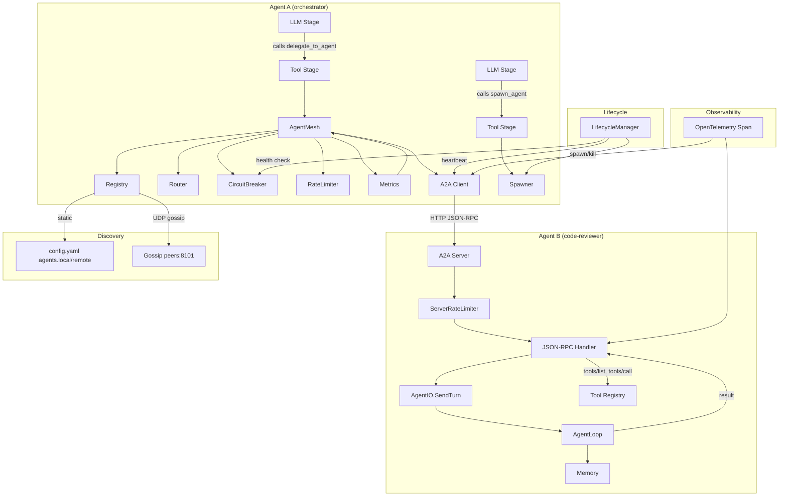

# Agent Mesh

Agent Mesh 是 Dolphin 的多 agent 协作层。每个 agent 是一个 Dolphin 进程，通过扩展的 A2A (Agent-to-Agent) JSON-RPC 协议相互通信。支持本地 agent（同机进程）和远程 agent（跨网络）。

## 概念模型

```
┌──────────────────────────────────────────────────────────────────┐
│                         Agent Mesh                                │
│                                                                  │
│  ┌──────────────┐   ┌──────────────┐   ┌──────────────┐         │
│  │   Agent A    │   │   Agent B    │   │   Agent C    │         │
│  │ orchestrator │   │ code-review  │   │   security   │         │
│  │   :8100      │   │   :8102      │   │   :8103      │         │
│  │              │   │              │   │              │         │
│  │ Registry     │   │ Tool Reg     │   │ Tool Reg     │         │
│  │ Router       │   │ A2A Server   │   │ A2A Server   │         │
│  │ RateLimiter  │   │ RateLimiter  │   │ RateLimiter  │         │
│  │ CB           │   │              │   │              │         │
│  │ Spawner      │   │              │   │              │         │
│  └──────┬───────┘   └──────┬───────┘   └──────┬───────┘         │
│         │                  │                  │                  │
│         └──────────────────┼──────────────────┘                  │
│                            │                                     │
│                  A2A JSON-RPC over HTTP                           │
│                  tasks/send, tasks/sendSubscribe,                 │
│                  agents/discover, agents/ping,                    │
│                  tools/list, tools/call                           │
│                                                                  │
│   Session:     parent-child tree, selective ctx inheritance       │
│   Observability: OpenTelemetry trace across delegates             │
│   Version:     protocol negotiation on first connect              │
└──────────────────────────────────────────────────────────────────┘
```

## 核心类型

### AgentCard —— Agent 身份与能力

```go
type AgentCard struct {
    Name         string        `json:"name"`          // 逻辑名称
    Addr         string        `json:"addr"`          // agent://name@host:port
    Capabilities []string      `json:"capabilities"`  // ["code-review", "golang"]
    Status       AgentStatus   `json:"status"`        // starting | running | paused | stopped | error
    Load         int           `json:"load"`          // 当前并发任务数
    MaxLoad      int           `json:"max_load"`      // 最大并发
    Model        string        `json:"model"`         // 使用的 LLM 模型
    Version      string        `json:"version"`       // dolphin 版本
}

type AgentStatus string
const (
    AgentStarting AgentStatus = "starting"
    AgentRunning  AgentStatus = "running"
    AgentPaused   AgentStatus = "paused"
    AgentStopped  AgentStatus = "stopped"
    AgentError    AgentStatus = "error"
)
```

### AgentMessage —— 消息信封

```go
type AgentMessage struct {
    ID        string          `json:"id"`         // xid 唯一消息 ID
    From      string          `json:"from"`       // 发送方 agent URI
    To        string          `json:"to"`         // 接收方 agent URI（空 = 广播）
    ReplyTo   string          `json:"reply_to"`   // 关联 ID（请求/回复配对）
    Type      MessageType     `json:"type"`
    Payload   json.RawMessage `json:"payload"`
    Timestamp time.Time       `json:"timestamp"`
    TTL       int             `json:"ttl"`        // gossip 跳数，初始 3
}

type MessageType string
const (
    MsgDelegate  MessageType = "delegate"   // 委托任务
    MsgQuery     MessageType = "query"      // 查询信息
    MsgBroadcast MessageType = "broadcast"  // 广播通知
    MsgResult    MessageType = "result"     // 返回结果
    MsgHeartbeat MessageType = "heartbeat"  // 心跳
    MsgContext   MessageType = "context"    // 共享上下文
    MsgCancel    MessageType = "cancel"     // 取消正在执行的任务
)
```

---

## 委托协议（Delegate Protocol）

这是 agent 间通信的核心——agent A 委托 agent B 执行一个任务时需要传递什么。

### DelegatePayload —— 委托请求体

```go
type DelegatePayload struct {
    // ── 任务定义 ──
    Task         string `json:"task"`                    // 自然语言任务描述（必填）
    SystemPrompt string `json:"system_prompt,omitempty"` // 覆盖接收方的 system prompt（可选）
    MaxRounds    int    `json:"max_rounds"`              // 最大 LLM 轮数，默认 50，防止失控
    Timeout      string `json:"timeout"`                 // "30s" / "5m" / "1h"，默认 "10m"

    // ── 会话关联 ──
    ParentSessionID string `json:"parent_session_id"` // 父 agent 的 session ID（必填）
    ChildSessionID  string `json:"child_session_id"`  // 建议的子 session ID 前缀，接收方生成最终 ID
    DelegationDepth int    `json:"delegation_depth"`  // 当前委托深度，每委托一次 +1

    // ── 上下文 ──
    Context DelegateContext `json:"context"`

    // ── 工具控制 ──
    AllowedTools []string `json:"allowed_tools,omitempty"` // 允许使用的工具列表（空 = 使用接收方默认）
    DeniedTools  []string `json:"denied_tools,omitempty"`  // 禁止使用的工具

    // ── 结果格式 ──
    ReplyMode    ReplyMode        `json:"reply_mode"`              // sync | async | stream
    ResultSchema *json.RawMessage `json:"result_schema,omitempty"` // 要求结果符合此 JSON Schema（可选）

    // ── 路由提示 ──
    RequiredCapabilities []string `json:"required_capabilities,omitempty"` // 要求目标 agent 具备的能力
    PreferredAgent       string   `json:"preferred_agent,omitempty"`       // 优先选择特定 agent

    // ── 优先级 ──
    Priority Priority `json:"priority"` // normal | high | background
}

type ReplyMode string
const (
    ReplySync    ReplyMode = "sync"    // 同步：阻塞等待完整结果
    ReplyAsync   ReplyMode = "async"   // 异步：立即返回 task ID，调用方轮询
    ReplyStream  ReplyMode = "stream"  // 流式：SSE 实时推送中间结果
)

type Priority string
const (
    PriorityNormal     Priority = "normal"
    PriorityHigh       Priority = "high"
    PriorityBackground Priority = "background"
)
```

### DelegateResult —— 委托响应体

```go
type DelegateResult struct {
    TaskID    string           `json:"task_id"`              // 子 agent 侧的任务 ID
    Status    DelegateStatus   `json:"status"`               // completed | failed | timeout | cancelled | partial
    Content   string           `json:"content"`              // 最终文本结果
    Rounds    int              `json:"rounds"`               // 实际用了多少轮
    ToolCalls []ToolCallSummary `json:"tool_calls,omitempty"` // 工具调用摘要
    Error     *DelegateError   `json:"error,omitempty"`      // 失败时填充
    Events    []StreamEvent    `json:"events,omitempty"`     // stream 模式下的中间事件
}

type DelegateStatus string
const (
    DelegateCompleted DelegateStatus = "completed"
    DelegateFailed    DelegateStatus = "failed"
    DelegateTimeout   DelegateStatus = "timeout"
    DelegateCancelled DelegateStatus = "cancelled"
    DelegatePartial   DelegateStatus = "partial"    // 部分完成（执行中被中断但有结果）
)

type ToolCallSummary struct {
    Name    string `json:"name"`
    Success bool   `json:"success"`
    Summary string `json:"summary"` // 一句话描述结果
}

type StreamEvent struct {
    Type    string `json:"type"`    // thinking | tool_call | text | progress
    Content string `json:"content"`
    Time    time.Time `json:"time"`
}
```

### 端到端委托流程

```
Agent A (orchestrator)                        Agent B (code-reviewer)
─────────────────────                          ─────────────────────────

1. LLM 调用 delegate_to_agent
   ├─ Tool Stage 构建 DelegatePayload
   │   task: "Review this PR diff..."
   │   parent_session_id: "user-abc-20250625"
   │   context: { files: [{path:"/tmp/pr.diff", mode:"inline", content:"..."}] }
   │   reply_mode: sync
   │   max_rounds: 20
   │   delegation_depth: 1
   │
2. AgentMesh.Delegate()
   ├─ Router.Route(payload) → AgentCard B
   ├─ Check delegation_depth < max_delegation_depth (5)
   ├─ Marshal → AgentMessage{Type: "delegate", Payload: ...}
   │
3. A2A Client: HTTP POST /jsonrpc ──────────▶ 4. A2A Server: handleJSONRPC
   {                                203 Created    method="tasks/send"
     "method": "tasks/send",                         ├─ 反序列化 DelegatePayload
     "params": {                                     ├─ 创建子 session: "user-abc-20250625.dlg.001"
       "message": {...}                              ├─ AgentIO.SendTurn(childSession, delegateTurn)
     }                                               │    turn 的内容 = Task + Context 拼接
   }                                                 ├─ AgentLoop 处理（多轮 LLM + Tool）
                                                     │    memory.Read(childSessionID) 读取历史
                                                     │    memory.Write(childSessionID, msg) 追加
                                                     ├─ 子 session 完成
                                                     └─ 返回 DelegateResult
                                                          status: "completed"
                                                          content: "Found 3 issues: ..."
                                                          rounds: 8
                                                          tool_calls: [{"name":"read","success":true,"summary":"Read PR diff"}]

5. A2A Client 收到响应 ◀────────────────────────────────────┘
   ├─ AgentMesh 解析 DelegateResult
   ├─ 如果 status=failed → 检查 RetryPolicy → 可能重试或 fallback
   ├─ AgentMesh → Tool Stage 返回结果
   └─ Tool Stage 将 DelegateResult.Content 写入 state
      下一轮 LLM 看到 tool result，继续处理
```

---

## 跨 Agent Session 模型

### Session 树

委托产生父子 session 关系。每个子 agent 在自己的 memory 目录中独立管理 session。

```
agent://orchestrator@:8100
  memory.dir: data/sessions/
    user-abc-20250625.md          ← 用户对话的主 session
      ├─ Turn 1: user "review my PR and check security"
      ├─ Turn 2: assistant 调用 delegate_to_agent(code-reviewer)
      │          │
      │          └─────────────────────────────────────────┐
      │                                                    │
      │   agent://code-reviewer@:8102                       │
      │     memory.dir: data/sessions/                      │
      │       user-abc-20250625.dlg.001.md  ← 子 session    │
      │         ├─ Turn 1: [delegate task as user message]   │
      │         ├─ Turn 2..N: LLM + tool 执行               │
      │         └─ result → DelegateResult                   │
      │                                                    │
      │   agent://security-scanner@:8103                    │
      │     memory.dir: data/sessions/                      │
      │       user-abc-20250625.dlg.002.md  ← 另一个子 session │
      │         └─ ...                                      │
      │                                                    │
      ├─ Turn 3: assistant 收到两个 DelegateResult            │
      └─ Turn 4: assistant 综合结果回答用户                    │
```

### Session 命名与关联

```go
// SessionLink 记录父子关系，存在父 agent 侧
type SessionLink struct {
    ChildSessionID  string        `json:"child_session_id"`   // "user-abc-20250625.dlg.001"
    ParentSessionID string        `json:"parent_session_id"`  // "user-abc-20250625"
    ChildAgent      string        `json:"child_agent"`        // "agent://code-reviewer@:8102"
    Status          DelegateStatus `json:"status"`
    CreatedAt       time.Time     `json:"created_at"`
    CompletedAt     *time.Time    `json:"completed_at,omitempty"`
}
```

命名规则：`{parent_session_id}.dlg.{seq}`

- `seq` 是父 agent 侧单调递增计数器，per parent session
- 子 agent 收到 `child_session_id` 前缀，在其后追加本地唯一后缀（避免跨 agent session ID 碰撞）
- 最终子 session ID 形如：`user-abc-20250625.dlg.001.xid123`

### 上下文继承

子 agent **不继承**父 agent 的完整对话历史。委托方 LLM 在调用 `delegate_to_agent` 时必须选择性地传递相关上下文：

```go
type DelegateContext struct {
    // 父 agent 精选的历史消息片段（不是全部），由委托方 LLM 决定传什么
    Messages []ContextMessage `json:"messages,omitempty"`

    // 文件共享
    Files []SharedFile `json:"files,omitempty"`

    // 结构化状态传递
    State map[string]any `json:"state,omitempty"`
}

type ContextMessage struct {
    Role    string `json:"role"`    // user | assistant
    Content string `json:"content"`
}

type SharedFile struct {
    Path    string `json:"path"`
    Content string `json:"content,omitempty"` // 小文件直接传内容（inline 模式）
    Hash    string `json:"hash,omitempty"`    // SHA256 校验
    Mode    FileMode `json:"mode"`            // inline | reference
}
```

**文件共享两种模式：**

| Mode | 适用场景 | 传输方式 |
|---|---|---|
| `inline` | 小文件（< 100KB） | 内容随 JSON payload 传输 |
| `reference` | 大文件、本地 agent | 只传路径，通过共享文件系统读取 |

- 本地 agent：`reference` 模式天然适用，因为同机共享文件系统
- 远程 agent：`reference` 模式需配合共享存储（NFS/S3）；**严禁对大文件静默退化为 `inline`**——大文件塞进 JSON payload 会撑爆单次请求（HTTP body 上限、JSON 解析内存、对端缓冲），可能导致 OOM 或连接重置

**远程 agent 大文件的明确退路**（按优先级）：

1. **共享存储引用**（首选）：`SharedFile{Mode: "reference", Path: "s3://bucket/xxx"}` 或 `nfs://host/path`，接收方按协议拉取。需配置 `agents.storage` 段。
2. **分块上传协议**（无共享存储时）：走独立 HTTP 端点 `POST /files/upload`（chunked），返回 `file_ref`，`DelegatePayload` 中只传 `file_ref`。详见下方「大文件传输协议」。
3. **拒绝并报错**：若上述均不可用且文件 > 100KB，返回 `DelegateError{Code: "bad_payload", Message: "file too large for inline, no shared storage configured"}`，由委托方 LLM 决定换策略（如只传文件片段、改用 `read` 工具远程读取）。

**大文件传输协议（分块，远程 agent 无共享存储时）**：

```
1. Client → POST /files/upload?name=pr.diff&size=2MB
   ← 200 {"upload_id":"up_xid","chunk_size":256KB}

2. Client → PUT /files/upload/up_xid/chunk/0   (256KB binary body)
   Client → PUT /files/upload/up_xid/chunk/1
   ... (并行，最多 4 并发)
   ← 200 {"ok":true}

3. Client → POST /files/upload/up_xid/complete
   ← 200 {"file_ref":"file_xid","hash":"sha256:..."}

4. DelegatePayload.context.files[].mode="reference"
                       .files[].path="file://file_xid"
   (接收方按 file_ref 在本地缓存或流式读取)

5. 任务完成后 → DELETE /files/upload/up_xid (GC)
```

校验：每个 chunk 带 `Content-MD5`，`complete` 时校验整体 SHA256 与 `SharedFile.Hash` 一致，不一致返回 `DelegateError{Code: "bad_payload"}`。

**设计理由**：不是自动共享全部 memory，而是由委托方 LLM 决定传什么，因为：
1. 完整对话历史可能很大（几千轮），传输开销高
2. 子 agent 通常只需要任务相关的片段
3. LLM 自己最清楚哪些上下文是相关的

---

## 错误处理

### 错误类型

```go
type DelegateError struct {
    Code      ErrorCode        `json:"code"`
    Message   string           `json:"message"`
    Agent     string           `json:"agent"`       // 出错的 agent URI
    Partial   *DelegateResult  `json:"partial"`     // 部分结果（如果执行中有产出）
    Cause     string           `json:"cause"`       // 底层错误描述
}

type ErrorCode string
const (
    ErrTimeout        ErrorCode = "timeout"          // 超时
    ErrAgentNotFound  ErrorCode = "agent_not_found"  // 注册表中找不到目标 agent
    ErrAgentUnavail   ErrorCode = "agent_unavailable" // 网络不可达
    ErrAgentBusy      ErrorCode = "agent_busy"        // agent 满载（load >= max_load）
    ErrCancelled      ErrorCode = "cancelled"         // 被父 agent 取消
    ErrDepthExceeded  ErrorCode = "depth_exceeded"    // 超过 max_delegation_depth
    ErrPermission     ErrorCode = "permission"        // 接收方拒绝（不在 allowlist）
    ErrInternal       ErrorCode = "internal"          // 接收方内部错误（panic、OOM 等）
    ErrBadPayload     ErrorCode = "bad_payload"       // 请求格式错误
)
```

### 重试策略

```go
type RetryPolicy struct {
    MaxRetries int           `json:"max_retries"` // 最大重试次数，默认 2
    Backoff    time.Duration `json:"backoff"`     // 初始退避，默认 1s
    MaxBackoff time.Duration `json:"max_backoff"` // 最大退避，默认 30s
    RetryOn    []ErrorCode   `json:"retry_on"`    // 哪些错误可重试
    // 默认：[ErrTimeout, ErrAgentUnavail, ErrAgentBusy]
    // 不重试：[ErrPermission, ErrDepthExceeded, ErrBadPayload]
}
```

重试时：
1. 等待 `backoff` → 重试 → 失败则 `backoff = min(backoff * 2, max_backoff)`
2. 到达 `max_retries` 后返回最后一次错误
3. 重试**不重新 spawn agent**——重发到同一个 agent，除非该 agent 标记为 `ErrAgentUnavail`

**与熔断器的交互（重要）**：重试和熔断器都在 `AgentMesh.Delegate` 内部，但职责不同、计数独立但联动：

- **重试计数**：单次 `Delegate` 调用内累计，调用结束即清零。只统计「可重试错误」(`ErrTimeout`/`ErrAgentUnavail`/`ErrAgentBusy`)。
- **熔断器计数**：per-agent，跨调用累计「连续失败」。**重试期间的每次失败都会递增熔断器计数**——因为每次重试都是一次真实的远程调用，应当反映对端健康度。
- **联动规则**：
  1. 若 `Delegate` 入口时熔断器已 OPEN → 直接返回 `DelegateError{Code: "agent_unavailable"}`，不发起调用、不重试。
  2. 重试过程中若熔断器刚好翻到 OPEN（连续失败达到 `failure_threshold`）→ 立即终止后续重试，返回熔断错误。
  3. 重试成功 → 重置该 agent 的熔断器计数为 0（连续失败清零）。
  4. 熔断器 OPEN 期间的 `Delegate` 调用不计入重试，但会触发 fallback（如果启用）。

这样设计避免「重试打满后才熔断」的窗口期：重试本身就在消耗对端，应同步反映到熔断器状态。

### 降级（Fallback）

```go
type FallbackConfig struct {
    Enabled     bool `json:"enabled"`      // 是否启用降级
    MaxFallback int  `json:"max_fallback"` // 最多尝试几个备选 agent，默认 2
}
```

降级流程：
1. 首选 agent 失败（不可重试的错误，或重试耗尽）
2. Router 从注册表找具有相同 `capabilities` 的其他 agent
3. 按负载从低到高排序，依次尝试
4. 全部失败则返回 `DelegateError{Code: "agent_unavailable", ...}`

### 熔断器（Circuit Breaker）

```go
type CircuitBreaker struct {
    FailureThreshold int           `json:"failure_threshold"` // 连续失败 N 次后熔断，默认 5
    CooldownPeriod   time.Duration `json:"cooldown_period"`   // 熔断冷却时间，默认 60s
    HalfOpenMax      int           `json:"half_open_max"`     // 半开状态最多允许的试探请求，默认 1
}
```

状态转换：
```
  CLOSED ──连续失败≥threshold──▶ OPEN
    ▲                              │
    │                              ▼
    └──试探成功── HALF_OPEN ◀── cooldown 到期
                    │
                    └──试探失败──▶ OPEN
```

熔断器 per-agent，存储在 `LifecycleManager` 中。

### 取消传播

父 agent 可以取消正在进行的委托。通过 `MsgCancel` 消息 + signal bus 的 Interrupt 信号：

```
Agent A                             Agent B
───────                             ───────
AgentMesh.Cancel(taskID)
  → AgentMessage{Type: "cancel", ReplyTo: taskID}
  → A2A Client POST /jsonrpc ──────▶ A2A Server
                                      → signalBus.Interrupt(sessionID)
                                      → AgentLoop 收到 Interrupt
                                      → 当前 LLM 调用被中断
                                      → 返回 DelegateResult{Status: "cancelled", Partial: ...}
```

### 超时处理

```
Agent A                                             Agent B
───────                                             ───────
ctx, cancel := context.WithTimeout(ctx, timeout)
defer cancel()

AgentMesh.Delegate(ctx, msg)
  ├─ 正常：B 在 timeout 前返回 → 正常处理
  ├─ 超时：ctx.Done()
  │   ├─ AgentMesh 发送 cancel 到 B
  │   ├─ B 返回 partial result（如果有）
  │   └─ AgentMesh 返回 DelegateError{Code: "timeout", Partial: partial}
  └─ B 崩溃：HTTP 连接断开
      ├─ AgentMesh 检测到连接错误
      └─ 检查 RetryPolicy → 重试或 fallback
```

---

## 跨 Agent 观测性

多 agent 委托链 A→B→C 的观测性需解决两个问题：**调用链回溯**（B 超时了，怎么在 A 的日志定位到 B 的哪一轮？）和**聚合视图**（一次委托涉及多个子 agent，如何关联？）。

### 分布式追踪：Trace Context 传播

利用 Dolphin 已有的 OpenTelemetry 基础设施。每次委托创建一个新的 span，通过 HTTP header 传递给子 agent。

```go
// AgentMesh.Delegate 中注入 trace context
func (m *AgentMesh) Delegate(ctx context.Context, payload DelegatePayload) (*DelegateResult, error) {
    tracer := otel.Tracer("agentmesh")
    ctx, span := tracer.Start(ctx,
        "agent.delegate",
        trace.WithAttributes(
            attribute.String("agentmesh.from", m.card.Addr),
            attribute.String("agentmesh.to", payload.PreferredAgent),
            attribute.String("agentmesh.capabilities", strings.Join(payload.RequiredCapabilities, ",")),
            attribute.String("agentmesh.depth", strconv.Itoa(payload.DelegationDepth)),
        ),
    )
    defer span.End()

    // 用 OTel 标准 propagator 注入 trace context 到 A2A HTTP header
    // 必须使用 propagator 而非手写 traceparent，以符合 W3C TraceContext 规范
    // （格式：00-<trace-id>-<span-id>-<flags>），子 agent 侧才能用同一 propagator 提取并恢复父 span。
    otel.GetTextMapPropagator().Inject(ctx, propagation.HeaderCarrier(req.Header))
    // parent_session_id 通过 tracestate 旁路传递，便于日志关联
    req.Header.Set("tracestate", "agentmesh="+payload.ParentSessionID)

    // ...执行委托
    result, err := m.sendDelegate(ctx, payload)

    if err != nil {
        span.RecordError(err)
        span.SetStatus(codes.Error, "delegate failed")
    } else {
        span.SetAttributes(
            attribute.String("agentmesh.result.status", string(result.Status)),
            attribute.Int("agentmesh.result.rounds", result.Rounds),
        )
    }
    return result, err
}
```

子 agent 侧在 A2A Server 的 JSON-RPC handler 中提取 trace context，恢复父 span 的关联：

```go
// internal/transport/a2a/a2a.go — 子 agent 接收方
func (t *A2A) handleTasksSend(ctx context.Context, req *a2a.JSONRPCRequest) *a2a.JSONRPCResponse {
    // 用 OTel 标准 propagator 从 HTTP header 恢复 trace context
    // 与发送方的 Inject 配对，恢复父 span 的 trace_id / span_id 关联
    ctx = otel.GetTextMapPropagator().Extract(ctx, propagation.HeaderCarrier(req.HTTPHeader))

    tracer := otel.Tracer("agentmesh")
    ctx, span := tracer.Start(ctx,
        "agent.receive_delegate",
        trace.WithAttributes(attribute.String("agentmesh.from", msg.From)),
    )
    defer span.End()

    // ...处理委托
}
```

### 委托链回溯

每条日志携带 `session_id` + `delegation_depth` + `trace_id`，通过 trace_id 串联整条委托链：

```
# Agent A 日志
[2026-06-25 15:30:00] INFO agent.delegate.sent
  trace_id=abc123  session=user-xyz  depth=1  to=code-reviewer  task="Review PR"

# Agent B 日志（可能在不同机器）
[2026-06-25 15:30:01] INFO agent.delegate.received
  trace_id=abc123  session=user-xyz.dlg.001  depth=1  from=orchestrator
[2026-06-25 15:30:05] INFO llm.round
  trace_id=abc123  session=user-xyz.dlg.001  round=3/20
[2026-06-25 15:30:12] INFO agent.delegate.completed
  trace_id=abc123  session=user-xyz.dlg.001  rounds=8  status=completed

# Agent A 日志
[2026-06-25 15:30:12] INFO agent.delegate.result
  trace_id=abc123  session=user-xyz  from=code-reviewer  rounds=8  status=completed
```

排查命令示例：

```bash
# 按 trace_id 查找完整委托链
grep "trace_id=abc123" agent-A.log agent-B.log agent-C.log \
  | sort -t'[' -k2 \
  | jq -s 'sort_by(.timestamp)'

# 按 session_id 查看某个用户请求的所有委托
grep "session=user-xyz" *.log | jq 'select(.msg | startswith("agent."))'
```

### 委托链可视化

在 Prometheus metrics 基础上，新增 agent mesh 专用 metrics：

```go
// internal/agentmesh/metrics.go
var (
    delegateTotal = promauto.NewCounterVec(
        prometheus.CounterOpts{Name: "agentmesh_delegate_total"},
        []string{"from", "to", "status"},  // status: completed, failed, timeout, cancelled
    )
    delegateDuration = promauto.NewHistogramVec(
        prometheus.HistogramOpts{Name: "agentmesh_delegate_duration_seconds", Buckets: []float64{1, 5, 10, 30, 60, 300, 600}},
        []string{"from", "to"},
    )
    delegateDepth = promauto.NewHistogram(
        prometheus.HistogramOpts{Name: "agentmesh_delegate_depth", Buckets: []float64{1, 2, 3, 4, 5}},
    )
    childAgentCount = promauto.NewGauge(
        prometheus.GaugeOpts{Name: "agentmesh_child_agents"},
    )
    delegateQueueDepth = promauto.NewGaugeVec(
        prometheus.GaugeOpts{Name: "agentmesh_queue_depth"},
        []string{"agent"},
    )
)
```

### 健康状态事件

LifecycleManager 周期检查并发布事件（已在事件类型中定义）：

```go
// 子 agent 状态变更 → 事件总线 → 父 agent 感知
EventAgentSpawned      // 子 agent 启动成功
EventAgentStopped      // 子 agent 正常退出
EventAgentDisconnected // 心跳丢失（连续 3 次）
EventAgentReconnected  // 心跳恢复
EventAgentCircuitOpen  // 熔断器打开
EventAgentCircuitClose // 熔断器关闭
```

---

## 工具联邦（Tool Federation）

父 agent 可以调用子 agent 注册的工具（包括子 agent 的 MCP 工具）。这是 agent 间除"任务委托"之外的另一种协作模式——不委托整个对话，而是**像调用本地工具一样调用远程 agent 的能力**。

### 两种协作模式的对比

| | 任务委托 (delegate) | 工具联邦 (tool federation) |
|---|---|---|
| **粒度** | 完整任务，多轮对话 | 单次调用，即时返回 |
| **交互** | 父 agent 等待，子 agent 自主执行 | 父 agent 主动调用，类似本地 tool call |
| **适用** | 复杂任务（代码审查、安全扫描） | 简单查询（查天气、翻译、计算） |
| **协议** | A2A `tasks/send` | A2A 新增 `tools/list` + `tools/call` |
| **LLM 视角** | 调用 `delegate_to_agent` 工具 | 子 agent 的工具直接出现在 `List()` 结果中 |

### A2A 新增方法

```go
func (t *A2A) handleJSONRPC(ctx context.Context, req *a2a.JSONRPCRequest) *a2a.JSONRPCResponse {
    switch req.Method {
    // ... 已有方法 ...

    case "tools/list":
        // 新增——返回该 agent 注册的所有工具定义（含 MCP 工具）
    case "tools/call":
        // 新增——调用该 agent 的某个工具并返回结果
    }
}
```

### ToolMount —— 将远程 agent 的工具挂载到本地

```go
// ToolMount 将远程 agent 的工具集作为一个 ToolExecutor 注册到本地 Registry
type ToolMount struct {
    agent  string         // agent URI
    client *A2AClient     // 与该 agent 的 A2A 连接
    cache  []ToolDef      // 缓存的工具列表，TTL 60s
    mu     sync.RWMutex
}

func (m *ToolMount) List(ctx context.Context) ([]ToolDef, error) {
    m.mu.RLock()
    if time.Since(m.cachedAt) < 60*time.Second && len(m.cache) > 0 {
        defer m.mu.RUnlock()
        return m.cache, nil
    }
    m.mu.RUnlock()

    // 调用远程 agent 的 tools/list
    resp, err := m.client.Call(ctx, "tools/list", nil)
    if err != nil {
        return nil, err
    }
    var tools []ToolDef
    json.Unmarshal(resp.Result, &tools)

    // 为每个工具名加上 agent 前缀，避免冲突
    for i := range tools {
        tools[i].Name = m.agentName + "/" + tools[i].Name
        tools[i].Description = fmt.Sprintf("[from %s] %s", m.agentName, tools[i].Description)
    }

    m.mu.Lock()
    m.cache = tools
    m.cachedAt = time.Now()
    m.mu.Unlock()

    return tools, nil
}

func (m *ToolMount) Execute(ctx context.Context, call ToolCall) (*ToolResult, error) {
    // 去掉前缀，发 tools/call 到远程 agent
    toolName := strings.TrimPrefix(call.Name, m.agentName+"/")
    resp, err := m.client.Call(ctx, "tools/call", map[string]any{
        "name":      toolName,
        "arguments": call.Arguments,
    })
    if err != nil {
        return &ToolResult{IsError: true, Content: err.Error()}, nil
    }
    var result ToolResult
    json.Unmarshal(resp.Result, &result)
    return &result, nil
}
```

### 挂载流程

```
Agent A (orchestrator)                          Agent B (code-reviewer)
─────────────────────                            ─────────────────────────

1. 启动时/手动：AgentMesh.MountTools("code-reviewer")
   ├─ A2A Client → tools/list ────────────────▶ 2. 返回该 agent 的所有工具
   │                                              [
   │                                                {name: "read", ...},
   │                                                {name: "write", ...},
   │                                                {name: "lint", ...},     ← 子 agent 的 MCP 工具
   │                                              ]
   │
3. ToolMount 注册到本地 Registry
   ├─ tools[0] = {name: "code-reviewer/read", executor: ToolMount, ...}
   ├─ tools[1] = {name: "code-reviewer/write", executor: ToolMount, ...}
   └─ tools[2] = {name: "code-reviewer/lint", executor: ToolMount, ...}

4. LLM 看到这些工具出现在 tool list 中
   ├─ 调用 code-reviewer/lint(path="/tmp/pr.diff")
   │
5. Tool Stage → ToolMount.Execute(code-reviewer/lint, {path:"/tmp/pr.diff"})
   ├─ A2A Client → tools/call ─────────────────▶ 6. 子 agent 的 Tool Executor 执行 lint
   │                                              → 返回 {issues: [...]}
   └─ 返回结果给 LLM
```

### 安全控制

工具联邦需要通过子 agent 的能力 allowlist 控制：

```yaml
# 子 agent 的 config.yaml
agents:
  capabilities: ["code-review", "golang"]
  expose_tools:                    # 对外暴露哪些工具
    mode: whitelist                # "whitelist" | "blacklist" | "all" | "none"
    whitelist:
      - "read"
      - "lint"
      - "format_check"
    # blacklist:
    #   - "sh"
    #   - "write"
```

父 agent 侧的挂载控制：

```yaml
# 父 agent 的 config.yaml
agents:
  mount:
    - agent: "code-reviewer"       # 挂载哪个 agent 的工具
      tools:                       # 只挂载这些工具（空 = 全部）
        - "lint"
        - "format_check"
```

---

## 上下文共享

### 共享粒度

上下文共享发生在三个层次：

| 层次 | 触发时机 | 传输内容 |
|---|---|---|
| **委托时** | `delegate_to_agent` 调用 | `DelegateContext`（精选消息 + 文件） |
| **执行中** | 子 agent 需要更多信息 | `MsgContext` 消息（增量上下文） |
| **完成后** | 委托返回 | `DelegateResult`（结果 + 摘要） |

### MsgContext —— 运行中上下文补充

子 agent 执行过程中可能需要父 agent 的额外上下文。通过 `MsgContext` 消息交互：

```go
// 子 agent 的 LLM 可以调用 request_context 工具
// 父 agent 收到后返回 MsgContext

// MsgContext payload
type ContextPayload struct {
    SessionID string           `json:"session_id"`  // 请求的 session
    Query     string           `json:"query"`        // "what was the user's original request?"
    Messages  []ContextMessage `json:"messages"`     // 相关消息
    Files     []SharedFile     `json:"files"`
    State     map[string]any   `json:"state"`
}
```

### 大文件传输策略

```
文件大小 ≤ 100KB   → inline 模式，内容直接放在 JSON payload 中
文件大小 > 100KB   → 本地 agent: reference 模式（共享文件系统）
                   → 远程 agent: 优先共享存储引用；无共享存储则走分块上传协议（/files/upload）；
                     绝不静默退化为 inline（会撑爆 JSON payload）
```

---

## 备选方案：In-Process Agent

除进程级 agent 外，还有一种轻量方案：同进程内启动额外的 AgentLoop + AgentIO 实例。

### 对比

| 维度 | 进程级（主方案） | In-Process（备选） |
|---|---|---|
| 隔离 | 强（独立进程，crash 不传播） | 弱（共享地址空间） |
| 通信 | HTTP JSON-RPC | Go channel（零拷贝） |
| 内存 | 独立内存空间，复制上下文 | 共享内存，指针传递 |
| LLM 配置 | 独立 model/api_key | 共用同一配置 |
| 远程支持 | ✅ 同一协议 | ❌ 仅本进程内 |
| 启动开销 | ~200ms（`os/exec`） | ~1ms（new goroutine） |
| 调试 | 独立日志、pprof | 共享日志 |
| 适用场景 | 生产环境、异构 agent | 测试、低延迟、同 model 并行 |

### 使用建议

- **默认使用进程级**：安全、统一、支持远程
- **In-Process 作为优化**：当 agent 间需要高频低延迟交互（如并行 tool execution 拆分到多个 AgentLoop），且共享 LLM 配置
- 两种模式对上层透明——都实现 `AgentMesh.Delegate()` 接口

### In-Process 实现

```go
// InProcessAgent 是一个同进程内的逻辑 agent
type InProcessAgent struct {
    name     string
    agentIO  *agentio.AgentIO
    loop     *agentloop.AgentLoop
    card     AgentCard         // 注册到 registry
}

// InProcessTransport 实现 transport.IO，但通过 channel 而非网络
type InProcessTransport struct {
    inbound  chan *AgentMessage
    outbound chan *AgentMessage
}
```

通过 `AgentMesh` 路由时，检测目标 agent 是否在 `inprocess` 列表中。如果是，通过 channel 直接投递消息，跳过 HTTP 序列化。

---

## UDP Gossip 协议（局域网发现）

### 消息格式

```go
type GossipMessage struct {
    Type      GossipType  `json:"type"`   // announce | ping | ack | bye
    Agent     AgentCard   `json:"agent"`  // 宣告方（或响应方）的 AgentCard
    Peers     []string    `json:"peers"`  // 已知的其他 peer 地址列表
    TTL       int         `json:"ttl"`    // 剩余跳数，初始 3
    Timestamp time.Time   `json:"ts"`
}

type GossipType string
const (
    GossipAnnounce GossipType = "announce" // 宣告自己上线
    GossipPing     GossipType = "ping"     // 主动查询："谁在线？"
    GossipAck      GossipType = "ack"      // 响应 ping："我在线，并且我还知道这些 peer"
    GossipBye      GossipType = "bye"      // 优雅退出："我要下线了"
)
```

### 工作流程

```
Agent A 启动                     Agent B 已在运行
───────────                      ────────────────

1. 绑定 UDP 端口 :8101
2. 广播 GossipAnnounce ─────────▶ 3. 收到 Announce
   { type: announce,                ├─ 检查 registry 是否有此 agent
     agent: {name:"A", ...},        ├─ 没有 → 加入 registry
     peers: [],                      │   触发 onPeer(card) 回调
     ttl: 3,                         ├─ 有, addr 相同 → 更新 timestamp
     ts: ... }                       ├─ 有, addr 不同, name 相同
                                     │   → 冲突，保留两者 + 日志警告
                                     └─ 检查 peers 列表
                                        peers=[], 不需要继续转发

4. 收到 B 的 Announce ◀─────────── 5. B 也周期性广播自己的 Announce
   { type: announce,
     agent: {name:"B", ...},
     peers: ["agent://C@10.0.1.6:8100"],  ← B 还知道 C
     ttl: 3,
     ts: ... }
   ├─ 加入 B 到 registry
   └─ 发现 C → 尝试直连 C 的 A2A 端口验证
```

### TTL 与防环

- 每个 gossip 消息初始 TTL = 3（最多经过 3 跳）
- 收到消息后 TTL - 1，如果 > 0 则继续转发给其他 peer
- 转发时**排除消息来源方**（通过 `from` 地址判断）
- 相同 `(from, ts)` 的消息**去重**——每个 peer 缓存最近 100 条消息 ID

### 冲突处理

| 场景 | 处理 |
|---|---|
| 相同 name + 相同 addr | dedup，更新 timestamp |
| 相同 name + 不同 addr | 冲突——按 tie-breaker 决定保留方（见下方），日志警告 |
| 相同 addr + 不同 name | 新的覆盖旧的（agent 重启改名） |
| TTL = 0 的消息 | 不转发 |
| Agent 超时未 renew（90s） | 从 registry 移除，标记 AgentStopped |

**同名不同地址冲突的 tie-breaker**（避免「保留两者」导致路由歧义）：

按优先级依次比较，第一项能决出胜负即停止：

1. **ProtoVersion 高者优先**——新版 agent 通常更可靠，且能力更全
2. **Load 低者优先**——同版本时选负载更轻的，天然做负载均衡
3. **Card.Version（dolphin 版本）字典序大者优先**——同 proto 时取较新构建
4. **最后 renew 时间新者优先**——以上全平时，最近心跳的更可能是存活方
5. **仍相同**——保留 `agent.Addr` 字典序较小的一方（确定性，避免各节点结论不一致导致脑裂），另一方记入 `conflict_log` 但不注册

冲突发生时，被淘汰方不立即移除已注册的实例（如果它之前以另一 name 注册过），仅本次注册请求被拒绝并返回 `DelegateError{Code: "agent_not_found", Cause: "name conflict resolved to peer"}`。

### 配置

```yaml
agents:
  discovery:
    mode: gossip
    gossip:
      port: 8101                # UDP 端口
      announce_interval: 30s    # 宣告间隔
      peer_timeout: 90s         # peer 超时（3x announce_interval）
      max_hops: 3               # 最大跳数
      bind_addr: ""             # 绑定地址（空 = 0.0.0.0，监听所有接口）
```

---

## Agent 发现（汇总）

三种发现方式，非互斥，可同时启用：

| 方式 | 适用网络 | 配置 | 延迟 |
|---|---|---|---|
| **静态配置** | 所有 | `agents.local` + `agents.remote` | 瞬时 |
| **UDP Gossip** | 局域网 | `agents.discovery.mode: gossip` | 30s 内 |
| **手动注册** | 所有 | `AgentMesh.Register(card)` API | 瞬时 |

优先级：静态 > gossip。静态配置的 agent 始终保留，gossip 发现的自动添加/过期。

---

## A2A 协议扩展

当前 `internal/transport/a2a/` 仅支持 `tasks/send`。需要在 `handleJSONRPC` 中增加方法：

```go
func (t *A2A) handleJSONRPC(ctx context.Context, req *a2a.JSONRPCRequest) *a2a.JSONRPCResponse {
    switch req.Method {
    case "tasks/send":
        // 已有——同步委托，解析 DelegatePayload → AgentIO.SendTurn → 阻塞等待结果
    case "tasks/sendSubscribe":
        // 新增——异步委托 + SSE 流式结果
        // 立即返回 task_id，通过 SSE 连接持续推送 StreamEvent
    case "tasks/get":
        // 新增——轮询任务状态，返回 DelegateResult
    case "tasks/cancel":
        // 新增——取消任务，触发 Interrupt signal
    case "agents/discover":
        // 新增——返回 AgentCard + 当前负载
    case "agents/ping":
        // 新增——健康检查，返回 {"status":"ok","load":3}
    }
}
```

### SSE 流式响应（tasks/sendSubscribe）

```
Client                                    Server
──────                                    ──────
POST /jsonrpc
{"method":"tasks/sendSubscribe",
 "params":{"message":{...}}}

                                          HTTP 200
                                          Content-Type: text/event-stream

◀──────────────────────────────────────── data: {"type":"thinking","content":"Analyzing PR diff..."}

◀──────────────────────────────────────── data: {"type":"tool_call","content":"read /tmp/pr.diff"}

◀──────────────────────────────────────── data: {"type":"tool_call","content":"read result: 200 lines"}

◀──────────────────────────────────────── data: {"type":"text","content":"Found issue #1: SQL injection on line 42"}

◀──────────────────────────────────────── data: {"type":"progress","content":"2/3 checks complete"}

◀──────────────────────────────────────── data: {"type":"done","content":"...","status":"completed","rounds":8}
```

---

## 版本协商

Agent A（dolphin v2.1）与 Agent B（dolphin v2.2）通信时，协议可能不兼容。需要在握手阶段进行版本协商。

### AgentCard 扩展

```go
type AgentCard struct {
    // ... 已有字段 ...
    Version       string   `json:"version"`        // "2.1.0"
    ProtoVersion  int      `json:"proto_version"`  // A2A 协议版本，递增整数
    // v1: tasks/send, tasks/cancel, tasks/get（基础任务生命周期，cancel 必备以防无法终止超时任务）
    // v2: + agents/discover, agents/ping
    // v3: + tasks/sendSubscribe（SSE 流式）
    // v4: + tools/list, tools/call（工具联邦）
}
```

### 协商流程

```
Agent A (v2.1, proto=2)                    Agent B (v2.2, proto=4)
───────────────────────                    ───────────────────────

1. A 首次连接 B
   GET /.well-known/agent.json ─────────▶  返回 AgentCard
                                            {version:"2.2.0", proto_version:4}

2. A 比较协议版本
   A.proto = 2, B.proto = 4
   → 协商结果 = min(2, 4) = 2
   → A 只能以 proto=2 与 B 通信
   → B 兼容 proto=2（向下兼容）

3. A 存储协商结果
   clientCache[B] = {
       card: AgentCard{version:"2.2.0", proto_version:4},
       negotiatedProto: 2,
       unsupportedMethods: ["tasks/sendSubscribe", "tools/call"], // v3, v4 方法不可用
   }
```

### 特性退化

```go
func (c *A2AClient) Negotiate(ctx context.Context) error {
    card, err := c.Discover(ctx)
    if err != nil {
        return err
    }

    c.card = card
    c.negotiatedProto = min(c.localProto, card.ProtoVersion)

    // 计算哪些方法对端不支持
    for method, requiredProto := range methodToProto {
        if requiredProto > c.negotiatedProto {
            c.unsupportedMethods[method] = true
        }
    }

    // 如果对端版本太老（proto < minimumSupportedProto）→ 拒绝连接
    if c.negotiatedProto < minSupportedProto {
        return fmt.Errorf("agent %s proto=%d too old, min=%d",
            card.Addr, card.ProtoVersion, minSupportedProto)
    }

    c.logger.Info("negotiated",
        zap.String("agent", card.Addr),
        zap.Int("proto", c.negotiatedProto),
        zap.Strings("missing_methods", maps.Keys(c.unsupportedMethods)),
    )
    return nil
}

var methodToProto = map[string]int{
    "tasks/send":          1,
    "tasks/cancel":        1, // cancel 是基础运维能力，proto=1 即必备——否则父 agent 无法终止超时任务
    "tasks/get":           1, // 轮询同理，与 send/cancel 同属基础任务生命周期
    "agents/discover":     2,
    "agents/ping":         2,
    "tasks/sendSubscribe": 3,
    "tools/list":          4,
    "tools/call":          4,
}
```

### 对上层的影响

特性退化对调用方透明，工具描述中标注不可用方法：

```go
// delegate_to_agent 工具 List 时，检查对端 protocol version
if c.negotiatedProto < 3 {
    // async/stream 模式不可用（需 sendSubscribe），只暴露 sync
    delegateTool.Parameters["mode"] = {enum: ["sync"]}
}
// 注意：cancel 始终可用（proto=1），故超时/取消不受版本影响

// ToolMount List 时，如果对端 proto < 4 → 跳过挂载
if c.negotiatedProto < 4 {
    log.Warn("agent too old for tool federation, skipping mount")
    return nil, ErrProtoTooOld
}
```

### 升级策略

| 场景 | 处理 |
|---|---|
| 对端 proto **更高** | 协商到较低的一方，新 agent 向下兼容 |
| 对端 proto **低于最低要求** | 拒绝连接，日志警告，建议升级 |
| 对端版本**相同但有不同的可选扩展** | 通过 AgentCard 的 capability 字段做 feature flag |
| Spawn 子 agent | spawner 使用父 agent 的二进制路径，天然版本一致 |

---

## 流控（Per-Agent Rate Limiting）

防止一个 agent 向另一个 agent 疯狂发送委托导致对端过载。

### 三层流控

| 层级 | 控制点 | 机制 |
|---|---|---|
| **发送方** | AgentMesh.Delegate 入口 | token bucket，per remote agent |
| **接收方** | A2A Server | 基于 `from` + `parent_session_id` 限流 |
| **注册表** | Router | 跳过 `load >= max_load` 的 agent |

### 发送方限流

```go
type RateLimiter struct {
    buckets map[string]*rate.Limiter // per target agent
    mu      sync.RWMutex
}

// 默认：每秒 2 个委托，突发 5 个
func NewRateLimiter() *RateLimiter {
    return &RateLimiter{buckets: make(map[string]*rate.Limiter)}
}

func (rl *RateLimiter) Allow(agentAddr string) bool {
    rl.mu.RLock()
    lim, ok := rl.buckets[agentAddr]
    rl.mu.RUnlock()
    if !ok {
        rl.mu.Lock()
        lim = rate.NewLimiter(rate.Limit(2), 5) // 2 req/s, burst 5
        rl.buckets[agentAddr] = lim
        rl.mu.Unlock()
    }
    return lim.Allow()
}
```

### 接收方限流

```go
// A2A Server 侧
type ServerRateLimiter struct {
    perSession  map[string]*rate.Limiter // parent_session_id → limiter
    perAgent    map[string]*rate.Limiter // from agent → limiter
    global      *rate.Limiter
}

// 默认规则：
//   per parent_session: 30 req/min — 必须大于 max_children_per_session 的并发上限
//                                    （默认 10 并发子 agent + 各自重试 2 次 = ~30 次/分钟峰值）
//                                    设得过低会导致 LLM 并行 spawn 时被自己的限流卡住
//   per from agent:     60 req/min — 单个上游 agent 的委托
//   global:             120 req/min — 总并发保护
func (s *ServerRateLimiter) Allow(from, parentSessionID string) bool {
    if !s.perSession[parentSessionID].Allow() {
        return false // 同一个 session 委托过于频繁
    }
    if !s.perAgent[from].Allow() {
        return false
    }
    if !s.global.Allow() {
        return false
    }
    return true
}
```

被限流时返回 `DelegateError{Code: "rate_limited", Message: "too many requests, retry in 1s"}`。

### 配置

```yaml
agents:
  rate_limit:
    send:                         # 作为客户端
      per_agent: "2/s"            # 每秒向每个 agent 发送的委托数
      burst: 5                    # 突发峰值
    receive:                      # 作为服务端
      per_session: "30/m"          # 每个父 session 允许的频率（须 ≥ max_children_per_session 的并发峰值）
      per_peer: "60/m"            # 每个上游 agent
      global: "120/m"             # 全局
```

### 负载感知路由

Router 路由时排除已满 agent：

```go
func (r *Router) MatchByCapability(required []string) ([]*AgentCard, error) {
    candidates := r.registry.ListRunning()
    // 过滤已满的 agent
    candidates = slices.DeleteFunc(candidates, func(c *AgentCard) bool {
        return c.Load >= c.MaxLoad
    })
    // ... 其余匹配逻辑
}
```

---

## 架构



---

## AgentMesh 接口

```go
type AgentMesh struct {
    registry   *Registry
    router     *Router
    clients    map[string]*A2AClient    // 已连接的 peer agent 客户端缓存
    spawner    *Spawner                 // 本地子进程 spawner
    lifecycle  *LifecycleManager        // 心跳 + 健康检查 + 熔断
    links      map[string]*SessionLink  // child_session_id → SessionLink
    linkMu     sync.RWMutex
    eventBus   *event.Bus
    logger     *zap.Logger
    cfg        AgentConfig
}

func NewAgentMesh(cfg AgentConfig, eventBus *event.Bus, logger *zap.Logger) *AgentMesh

// Delegate 将任务委托给目标 agent，阻塞等待结果（sync 模式）
func (m *AgentMesh) Delegate(ctx context.Context, payload DelegatePayload) (*DelegateResult, error)

// DelegateAsync 异步委托，立即返回 task ID
func (m *AgentMesh) DelegateAsync(ctx context.Context, payload DelegatePayload) (taskID string, err error)

// DelegateStream 委托并以 channel 接收流式事件
func (m *AgentMesh) DelegateStream(ctx context.Context, payload DelegatePayload) (<-chan StreamEvent, error)

// Cancel 取消异步或流式委托
func (m *AgentMesh) Cancel(taskID string) error

// GetResult 轮询异步任务结果
func (m *AgentMesh) GetResult(ctx context.Context, taskID string) (*DelegateResult, error)

// Discover 查询指定 agent 的能力卡
func (m *AgentMesh) Discover(ctx context.Context, addr string) (*AgentCard, error)

// Broadcast 向所有已知 peer 广播消息
func (m *AgentMesh) Broadcast(ctx context.Context, msg AgentMessage) []error

// Register 手动注册一个 agent（用于动态 spawn 或外部注册）
func (m *AgentMesh) Register(card AgentCard) error

// Deregister 从注册表移除 agent
func (m *AgentMesh) Deregister(name string) error

// ListAgents 列出所有已知 agent
func (m *AgentMesh) ListAgents() []AgentCard
```

---

## Spawn 模型（混合模式）

### 1. 静态配置（基础）

所有核心 agent 在 `config.yaml` 预定义。Pipeline 启动时注册。

### 2. 动态 Spawn（LLM 驱动）

主 agent 注册 `spawn_agent` 工具，LLM 按需创建临时子 agent：

```go
// 工具定义（注册到 tool.Registry，Phase 2 实现）
{
    Name: "spawn_agent",
    Description: "创建临时子 agent 处理特定任务。用于需要专门能力或并行处理的场景。任务完成后子 agent 自动销毁。",
    Parameters: {
        "capabilities": "需要的能力标签，如 ['code-review', 'golang']",
        "task":         "委托的任务描述",
        "model":        "使用的模型（可选，默认从 config 读取）",
        "timeout":      "超时时间（可选，默认 10m）",
        "context":      "共享的上下文，包含相关文件和消息",
    }
}
```

Spawner 核心流程：

1. 根据 `AgentSpec` **动态生成**子 agent 专用的 `config.yaml`
2. 创建临时工作目录 `/tmp/dolphin-spawn/{agent-name}/`
3. `os/exec` 启动 `dolphin --config /tmp/dolphin-spawn/{agent-name}/config.yaml`
4. 子进程启动后在 `stdout` 输出 `{"listen_addr": ":8123", "pid": 12345}`
5. 父进程解析 listen 地址，通过 A2A 连接，注册到 registry

```go
type Spawner struct {
    binPath string  // dolphin 二进制路径
    baseCfg Config  // 父 agent 的完整配置，作为模板
}

// Spawn 启动子进程，等待它报告 listen 地址，返回 handle
func (s *Spawner) Spawn(ctx context.Context, spec AgentSpec) (*AgentHandle, error)

// Kill 发送 SIGTERM，等待 grace_period，超时则 SIGKILL。清理临时目录。
func (s *Spawner) Kill(handle *AgentHandle) error
```

```go
type AgentSpec struct {
    Name         string            // 子 agent 名称
    Capabilities []string          // 能力标签
    Model        string            // 使用的模型（空 = 继承父 agent）
    Workspace    string            // 工作目录（空 = 临时目录）
    MaxRounds    int               // 最大轮数（空 = 从父 config 继承）
    AllowedTools []string          // 允许使用的工具（空 = 全部）
    DeniedTools  []string          // 禁止使用的工具
    Env          map[string]string // 环境变量覆盖
}

type AgentHandle struct {
    ID       string
    Card     AgentCard
    Cmd      *exec.Cmd        // 子进程引用
    Client   *A2AClient       // 与该 agent 通信的客户端
    Status   AgentStatus
    WorkDir  string           // 临时工作目录（Kill 时清理）
    HealthCh chan AgentStatus // 健康状态变更通知
}
```

#### 动态 config.yaml 生成

Spawner 以父 agent 的 `config.yaml` 为模板，按以下规则覆盖生成子 agent 配置：

```go
// GenerateChildConfig 根据 AgentSpec 生成子 agent 的完整 config.yaml
func (s *Spawner) GenerateChildConfig(spec AgentSpec) ([]byte, error) {
    child := s.baseCfg.Clone() // 深拷贝父 agent 配置

    // ── 不可继承：必须覆盖 ──
    child.Agent.Name = spec.Name
    child.Agent.Workspace = spec.Workspace  // 空则生成临时路径
    child.Agent.PoolSize = 1                // 子 agent 单 worker

    // ── Agent Mesh：禁止再委托（叶子节点） ──
    child.Agents.Enabled = false
    child.Agents.Local = nil
    child.Agents.Remote = nil
    child.Agents.Spawner.Enabled = false

    // ── 端口：自动分配 ──
    child.Agents.ListenAddr = ":0"          // 随机端口

    // ── 模型：可选覆盖 ──
    if spec.Model != "" {
        child.LLM.DefaultModel = spec.Model
    }

    // ── 轮数限制 ──
    if spec.MaxRounds > 0 {
        child.Agent.MaxRounds = spec.MaxRounds
    }

    // ── 工具控制 ──
    if len(spec.AllowedTools) > 0 || len(spec.DeniedTools) > 0 {
        child.Tool.AllowedTools = spec.AllowedTools
        child.Tool.DeniedTools = spec.DeniedTools
    }

    // ── 内存隔离 ──
    child.Memory.Dir = filepath.Join(child.Agent.Workspace, "memory")
    child.Session.Dir = filepath.Join(child.Agent.Workspace, "sessions")

    // ── 日志隔离 ──
    child.Log.File = filepath.Join(child.Agent.Workspace, "dolphin.log")

    // ── Brain 可选：只读挂载父 agent 的 brain ──
    child.Brain.Dir = s.baseCfg.Brain.Dir   // 共享 brain 目录（只读）

    // ── 安全沙箱 ──
    // permission.deny 继承父 agent 并追加子 agent 特定限制
    child.Permission.Deny = append(child.Permission.Deny,
        "sh rm *",
        "sh sudo *",
        "sh chmod *",
    )

    // ── 环境变量覆盖 ──
    for k, v := range spec.Env {
        // 注入到进程环境
    }

    return yaml.Marshal(child)
}
```

生成的子 agent 配置示例（生成到 `/tmp/dolphin-spawn/code-reviewer-abc123/config.yaml`）：

```yaml
# 由父 agent orchestrator 动态生成
# 生成时间: 2026-06-25 15:30:00

agent:
  name: code-reviewer-abc123
  max_rounds: 30                # 限制轮数，防止失控
  pool_size: 1                  # 单 worker
  workspace: /tmp/dolphin-spawn/code-reviewer-abc123/

llm:
  default_model: claude-sonnet-4-20250514   # 继承父 agent
  providers:
    - name: anthropic
      api_key: "${ANTHROPIC_API_KEY}"       # 继承父 agent 的环境变量
      # ... 其余 LLM 配置继承父 agent

tool:
  allowed_tools: []             # 空 = 全部允许（由 permission.deny 控制）
  timeout: 30s

permission:
  deny:
    - "sh rm *"                 # 继承 + 追加
    - "sh sudo *"
    - "sh chmod *"
    - "sh curl *"               # 禁止网络访问

memory:
  dir: /tmp/dolphin-spawn/code-reviewer-abc123/memory/

session:
  dir: /tmp/dolphin-spawn/code-reviewer-abc123/sessions/

brain:
  dir: /Users/jzx/.dolphin/brain/   # 共享父 agent 的 brain（只读）

agents:
  enabled: false                # 禁止再委托
  spawner:
    enabled: false              # 禁止再 spawn

log:
  level: info
  file: /tmp/dolphin-spawn/code-reviewer-abc123/dolphin.log
  compress: false               # 临时 agent 不压缩日志

tui:
  enabled: false                # 无 TUI
```

#### Spawn 完整流程

```
Agent A (orchestrator)
──────────────────────

1. LLM 调用 spawn_agent(capabilities=["code-review"], task="Review PR diff...")

2. Tool Stage → AgentMesh.SpawnAndDelegate(spec, task)
   │
3. Spawner.GenerateChildConfig(spec)
   ├─ 以父 config.yaml 为模板深拷贝
   ├─ 覆盖：name, workspace, pool_size=1, agents.enabled=false
   ├─ 隔离：独立的 memory/session/log 目录
   ├─ 共享：brain 目录（只读挂载）
   ├─ 沙箱：追加 permission.deny 规则
   ├─ 生成 YAML → 写入 /tmp/dolphin-spawn/{name}/config.yaml
   │
4. Spawner.Spawn(ctx, spec)
   ├─ os/exec: dolphin --config /tmp/dolphin-spawn/{name}/config.yaml
   ├─ 环境变量继承：ANTHROPIC_API_KEY, DEEPSEEK_API_KEY 等
   ├─ stdout 扫描：等待 {"listen_addr": ":58472", "pid": 12345}
   ├─ 超时 10s 未输出 → 返回错误
   │
5. AgentMesh.Register(childCard)
   ├─ card = {name:"code-reviewer-abc123", addr:"localhost:58472", capabilities:["code-review"]}
   │
6. AgentMesh.Delegate(payload) → 同 Phase 1 流程
   ├─ task 发送到子 agent
   ├─ 等待结果
   │
7. AgentMesh.Deregister + Spawner.Kill(handle)
   ├─ 发送 SIGTERM
   ├─ 等待 5s
   ├─ 超时 SIGKILL
   ├─ os.RemoveAll(workDir)  // 清理临时目录
   └─ 日志已保留在父 agent 日志中（子 agent 的 log 随 workDir 删除）
```

#### 参数控制矩阵

LLM 可以通过 `spawn_agent` 的 arguments 控制子 agent 的各项参数：

| argument | 对应 config 字段 | 效果 |
|---|---|---|
| `capabilities` | `agents.capabilities` | 注册到 registry 的能力标签 |
| `model` | `llm.default_model` | 子 agent 使用的模型 |
| `timeout` | — | 子 agent 任务超时，父侧 context deadline |
| `max_rounds` | `agent.max_rounds` | 限制子 agent 最大对话轮数 |
| `allowed_tools` | `tool.allowed_tools` | 白名单，如 `["read", "write", "sh"]` |
| `denied_tools` | `permission.deny` | 黑名单，如禁止 `sh curl *` |
| `workspace` | `agent.workspace` | 工作目录（默认临时目录） |
| `context.files` | — | 以 inline 模式随 payload 传输的小文件 |

### 3. 能力路由（智能匹配）

当 `delegate_to_agent` 调用**未指定** `preferred_agent` 时，Router 进行能力匹配。

```go
// Router 能力匹配算法
func (r *Router) MatchByCapability(required []string) ([]*AgentCard, error) {
    // 1. 从 registry 获取所有 running 且 load < max_load 的 agent
    // 2. 对每个 agent 计算匹配分数：
    //    score = |agent.capabilities ∩ required| / |required|
    // 3. 按 (score desc, load asc) 排序
    // 4. 返回 score >= 0.5 的 agent
    //
    // 如果没有匹配：
    //   - 如果 spawner.enabled → 自动 Spawn 一个
    //   - 否则 → 返回 ErrAgentNotFound
}
```

混合 spawn 决策流程：

```
delegate_to_agent(task, capabilities: ["code-review"])
  │
  ├─ preferred_agent 指定？
  │   YES → 直接路由到该 agent
  │   NO  ↓
  ├─ Router.MatchByCapability(["code-review"])
  │   ├─ 找到匹配 → 选择 score 最高 + load 最低
  │   └─ 无匹配 ↓
  ├─ spawner.enabled？
  │   YES → spawner.Spawn({capabilities:["code-review"]})
  │   │      → 等待就绪 → 委托
  │   │      → 完成后 → spawner.Kill()
  │   NO  → 返回 ErrAgentNotFound
  └─ 执行委托
```

---

## LLM 工具：delegate_to_agent

注册为内置工具（与 `sh`、`write`、`read` 同级），集成到 `internal/tool/` 的内置 executor：

```go
// 工具 JSON Schema
{
    "name": "delegate_to_agent",
    "description": "将任务委托给另一个 AI agent。用于需要专门能力（代码审查、安全扫描、数据分析等）或并行处理多个子任务的场景。",
    "parameters": {
        "type": "object",
        "properties": {
            "agent": {
                "type": "string",
                "description": "目标 agent 名称（如 'code-reviewer'）或留空由路由自动匹配"
            },
            "task": {
                "type": "string",
                "description": "委托的任务描述，越具体越好"
            },
            "context": {
                "type": "object",
                "description": "共享上下文",
                "properties": {
                    "messages": {
                        "type": "array",
                        "description": "相关的历史消息片段"
                    },
                    "files": {
                        "type": "array",
                        "description": "需要共享的文件路径列表"
                    }
                }
            },
            "mode": {
                "type": "string",
                "enum": ["sync", "async"],
                "description": "sync=等待结果, async=立即返回taskID。默认 sync"
            },
            "timeout": {
                "type": "string",
                "description": "超时时间，如 '30s'、'5m'。默认 '10m'"
            },
            "capabilities": {
                "type": "array",
                "items": {"type": "string"},
                "description": "要求的能力标签。未指定 agent 时用于路由匹配"
            }
        },
        "required": ["task"]
    }
}
```

**工具执行流程：**

```
1. Tool Stage.Execute("delegate_to_agent", args)
2. 构建 DelegatePayload：
   - task = args.task
   - parent_session_id = turn.SessionID
   - delegation_depth = 从 context 继承 + 1
   - context.files = 读取 args.context.files 列表，<100KB 的文件 inline 传输
   - reply_mode = args.mode
3. 如果 args.agent 非空 → payload.preferred_agent = args.agent
   否则 → payload.required_capabilities = args.capabilities
4. AgentMesh.Delegate(ctx, payload)
   → Router.Route(payload)
   → A2A Client: tasks/send
   → 等待响应
   → 返回 DelegateResult.Content
5. Tool Stage 将 Content 作为 tool result 写回，供下一轮 LLM 使用
```

---

## Workflow 集成（Phase 3）

Workflow StepSpec 新增 `agent` 字段：

```yaml
version: "1"
name: pr-review-pipeline
steps:
  - id: code-review
    agent: code-reviewer
    prompt: "Review this PR for bugs: {pr_diff}"
    depends_on: []

  - id: security-scan
    agent: security-scanner
    prompt: "Security scan: {pr_diff}"
    depends_on: []

  - id: summary
    prompt: |
      Code review: {code-review.result}
      Security: {security-scan.result}
      Produce a consolidated review.
    depends_on: [code-review, security-scan]
```

Executor 修改：`executeStep` 检测 `step.Agent != ""` 时，通过 `AgentMesh.Delegate()` 发送而非直接调 LLM。

**具体迁移点**（Phase 3 落地时修改）：

| 文件 / 函数 | 当前行为 | 迁移后 |
|---|---|---|
| `internal/workflow/executor.go` → `Executor.executeStep` | 直接调 `executeLLMStep(ctx, step)` | `if step.Agent != ""` → 走 `mesh.Delegate`；否则原路径 |
| `internal/workflow/spec.go` → `StepSpec` | 无 `Agent` 字段 | 新增 `Agent string \`yaml:"agent"\`` |
| `internal/workflow/executor.go` → `Executor` 构造 | 无 mesh 引用 | 注入 `mesh *agentmesh.AgentMesh`（可为 nil，nil 时 step.Agent 被忽略并告警） |
| `internal/pipeline` 启动处 | 构造 Executor 时无 mesh | 从 pipeline 传入已初始化的 `AgentMesh`（若 `agents.enabled=false` 则传 nil） |

迁移保持向后兼容：旧 workflow yaml 不含 `agent:` 字段时，`StepSpec.Agent == ""`，走原 LLM 路径，行为不变。

```go
func (e *Executor) executeStep(ctx context.Context, step StepSpec) (*StepResult, error) {
    if step.Agent != "" {
        payload := DelegatePayload{
            Task:             step.Prompt,
            PreferredAgent:   step.Agent,
            ParentSessionID:  e.workflowID,
            MaxRounds:        step.MaxRounds,
            ReplyMode:        ReplySync,
        }
        return e.mesh.Delegate(ctx, payload)
    }
    // 否则走原有 LLM 调用路径
    return e.executeLLMStep(ctx, step)
}
```

---

## 安全

| 层级 | 机制 | 说明 |
|---|---|---|
| 传输 | Token 认证 | `Authorization: Bearer <token>` |
| 传输 | mTLS（可选） | 双向证书验证，适用生产环境 |
| 权限 | 能力 allowlist | agent 可配置允许哪些 peer 请求哪些能力 |
| 权限 | Tool deny 规则 | 子 agent 继承父 agent 的 `permission.deny` 规则 |
| 沙箱 | 文件系统限制 | 子 agent 的 `workspace` 可限制为临时目录 |
| 沙箱 | 网络限制 | 子 agent 可配置 `agents.enabled: false` 防止再委托（叶子节点） |
| 深度 | `max_delegation_depth` | 防止无限委托链，默认 5 |
| 速率 | 每 parent session 最大并发子 agent 数 | 防止 LLM 疯狂 spawn，默认 10 |

### 子 Agent 沙箱

```yaml
# 动态 spawn 时生成的子 agent 配置
agent:
  name: "spawned-code-reviewer-abc123"
  workspace: "/tmp/dolphin-spawn/abc123/"  # 限制在临时目录
  max_rounds: 30                             # 限制轮数
  pool_size: 1                               # 单 worker

agents:
  enabled: false                             # 禁止再委托

permission:
  deny:
    - "sh rm *"                              # 禁止删除
    - "sh sudo *"                            # 禁止提权
```

---

## 生命周期管理

### 心跳与健康检查

```go
type LifecycleManager struct {
    agents     map[string]*AgentHandle
    heartbeat  time.Duration     // 心跳间隔，默认 30s
    timeout    time.Duration     // 超时判定，默认 3x heartbeat = 90s
    cb         map[string]*CircuitBreaker
}

// 后台 goroutine：每 heartbeat 对所有 remote agent 发送 agents/ping
// 连续 3 次无响应 → 标记 AgentUnavail → 触发事件 EventAgentDisconnected
// 恢复响应 → 标记 AgentRunning → 触发 EventAgentReconnected
```

### 事件

新增事件类型（`internal/event/event.go`）：

```go
const (
    EventAgentSpawned      Type = "agent.spawned"
    EventAgentStopped      Type = "agent.stopped"
    EventAgentDisconnected Type = "agent.disconnected"
    EventAgentReconnected  Type = "agent.reconnected"
    EventAgentDelegateSent Type = "agent.delegate.sent"
    EventAgentDelegateRecv Type = "agent.delegate.received"
    EventAgentResultRecv   Type = "agent.result.received"
    EventAgentCircuitOpen  Type = "agent.circuit.open"
    EventAgentCircuitClose Type = "agent.circuit.close"
)
```

### 优雅关闭

```
SIGTERM → Pipeline.Shutdown()
  ├─ LifecycleManager.Stop()
  │   ├─ 对所有子 agent 发送 GossipBye（如果 gossip 启用）
  │   ├─ 对所有子 agent 发送 MsgCancel
  │   ├─ 等待 running tasks 完成（grace period 30s）
  │   ├─ Spawner.Kill() 所有动态创建的 agent
  │   └─ Deregister 所有动态 agent
  ├─ A2A Server.Close()
  └─ AgentLoop.Stop()
```

---

## 测试策略

多 agent 交互的测试难点在于：依赖外部进程、网络、状态。分层测试。

### 测试层次

```
┌─────────────────────────────────────────┐
│         E2E: 两个真实 dolphin 进程        │  ← 少量，验证集成
├─────────────────────────────────────────┤
│      Integration: MockA2AServer          │  ← 模拟远程 agent 行为
├─────────────────────────────────────────┤
│      Unit: Registry / Router / RateLimiter│  ← 纯逻辑，无外部依赖
├─────────────────────────────────────────┤
│      Unit: DelegatePayload 序列化        │  ← 协议兼容性
└─────────────────────────────────────────┘
```

### 单元测试

**Registry 测试**（`registry_test.go`）：

```go
func TestRegistry_StaticConfig(t *testing.T) {
    cfg := AgentConfig{
        Local: []AgentCard{
            {Name: "code-reviewer", Addr: "localhost:8102", Capabilities: []string{"code-review"}},
        },
    }
    reg := NewRegistry(cfg, nil, zaptest.NewLogger(t))
    cards := reg.List()
    assert.Len(t, cards, 1)
    assert.Equal(t, "code-reviewer", cards[0].Name)
}

func TestRegistry_Upsert_Dedup(t *testing.T) {
    reg := NewRegistry(AgentConfig{}, nil, zaptest.NewLogger(t))
    reg.Upsert(AgentCard{Name: "A", Addr: "addr1"})
    reg.Upsert(AgentCard{Name: "A", Addr: "addr1"}) // 重复 → 忽略
    assert.Len(t, reg.List(), 1)

    reg.Upsert(AgentCard{Name: "A", Addr: "addr2"}) // 同名不同地址 → 冲突
    assert.Len(t, reg.List(), 2)
}
```

**Router 测试**（`router_test.go`）：

```go
func TestRouter_MatchByCapability(t *testing.T) {
    reg := NewRegistry(AgentConfig{}, nil, zaptest.NewLogger(t))
    reg.Upsert(AgentCard{Name: "cr", Capabilities: []string{"code-review", "golang"}, Load: 0, MaxLoad: 5, Status: AgentRunning})
    reg.Upsert(AgentCard{Name: "ss", Capabilities: []string{"security"}, Load: 0, MaxLoad: 5, Status: AgentRunning})
    reg.Upsert(AgentCard{Name: "busy", Capabilities: []string{"code-review"}, Load: 5, MaxLoad: 5, Status: AgentRunning})

    r := NewRouter(reg)

    // 精确匹配
    cards, _ := r.MatchByCapability([]string{"code-review"})
    assert.Len(t, cards, 1) // 只有 cr，busy 已满被过滤
    assert.Equal(t, "cr", cards[0].Name)

    // 无匹配
    _, err := r.MatchByCapability([]string{"data-analysis"})
    assert.ErrorIs(t, err, ErrAgentNotFound)
}

func TestRouter_Fallback(t *testing.T) {
    // ... 测试 fallback 链
}

func TestRouter_VersionFilter(t *testing.T) {
    // ... 测试过滤 proto 版本过低的 agent
}
```

**RateLimiter 测试**（`rate_limiter_test.go`）：

```go
func TestRateLimiter_AllowBurst(t *testing.T) {
    rl := NewRateLimiter()
    addr := "agent://test@localhost:8100"
    // 突发 5 个应该全部通过
    for i := 0; i < 5; i++ {
        assert.True(t, rl.Allow(addr))
    }
    // 第 6 个被限
    assert.False(t, rl.Allow(addr))
    // 等待 500ms 后恢复一个 token
    time.Sleep(510 * time.Millisecond)
    assert.True(t, rl.Allow(addr))
}
```

**DelegatePayload 序列化兼容性**（`message_test.go`）：

```go
func TestDelegatePayload_BackwardCompat(t *testing.T) {
    // v1 版本的 payload（没有 capabilities 字段）
    v1Payload := `{"task":"test","parent_session_id":"abc"}`
    var p DelegatePayload
    err := json.Unmarshal([]byte(v1Payload), &p)
    assert.NoError(t, err)
    assert.Equal(t, "test", p.Task)
    assert.Empty(t, p.RequiredCapabilities) // 缺失字段应为零值
}
```

### 集成测试：MockA2AServer

```go
// mock_server.go —— 测试辅助
type MockA2AServer struct {
    addr     string
    handler  func(method string, params json.RawMessage) (any, error)
    srv      *httptest.Server
}

func NewMockA2AServer(handler func(method string, params json.RawMessage) (any, error)) *MockA2AServer {
    m := &MockA2AServer{handler: handler}
    m.srv = httptest.NewServer(http.HandlerFunc(func(w http.ResponseWriter, r *http.Request) {
        var req a2a.JSONRPCRequest
        json.NewDecoder(r.Body).Decode(&req)
        result, err := m.handler(req.Method, req.Params)
        if err != nil {
            json.NewEncoder(w).Encode(a2a.JSONRPCResponse{Error: &a2a.JSONRPCError{Message: err.Error()}})
            return
        }
        json.NewEncoder(w).Encode(a2a.JSONRPCResponse{Result: result})
    }))
    m.addr = m.srv.URL
    return m
}
```

```go
// delegate_test.go
func TestAgentMesh_Delegate_Sync(t *testing.T) {
    // 启动 mock agent server
    mockB := NewMockA2AServer(func(method string, params json.RawMessage) (any, error) {
        switch method {
        case "agents/discover":
            return AgentCard{Name: "B", Addr: "agent://B@mock", Capabilities: []string{"code-review"}, ProtoVersion: 3}, nil
        case "agents/ping":
            return map[string]any{"status": "ok", "load": 0}, nil
        case "tasks/send":
            return DelegateResult{
                TaskID:  "task-001",
                Status:  DelegateCompleted,
                Content: "Found 3 issues in the PR",
                Rounds:  5,
            }, nil
        default:
            return nil, fmt.Errorf("unknown method: %s", method)
        }
    })
    defer mockB.Close()

    mesh := NewAgentMesh(AgentConfig{
        Remote: []RemoteAgent{{Name: "B", Addr: mockB.addr}},
    }, nil, zaptest.NewLogger(t))
    defer mesh.Shutdown()

    result, err := mesh.Delegate(context.Background(), DelegatePayload{
        Task:             "Review this PR",
        PreferredAgent:   "B",
        ParentSessionID:  "test-session",
        ReplyMode:        ReplySync,
    })
    assert.NoError(t, err)
    assert.Equal(t, DelegateCompleted, result.Status)
    assert.Contains(t, result.Content, "3 issues")
    assert.Equal(t, 5, result.Rounds)
}
```

```go
func TestAgentMesh_Delegate_Timeout(t *testing.T) {
    mockB := NewMockA2AServer(func(method string, params json.RawMessage) (any, error) {
        time.Sleep(5 * time.Second) // 模拟慢响应
        return DelegateResult{Status: DelegateCompleted}, nil
    })
    defer mockB.Close()

    mesh := NewAgentMesh(AgentConfig{
        Remote: []RemoteAgent{{Name: "B", Addr: mockB.addr}},
        TaskTimeout: 1 * time.Second,
    }, nil, zaptest.NewLogger(t))
    defer mesh.Shutdown()

    ctx, cancel := context.WithTimeout(context.Background(), 500*time.Millisecond)
    defer cancel()

    _, err := mesh.Delegate(ctx, DelegatePayload{
        PreferredAgent:  "B",
        ParentSessionID: "test",
    })
    assert.Error(t, err)
    var dErr *DelegateError
    assert.True(t, errors.As(err, &dErr))
    assert.Equal(t, ErrTimeout, dErr.Code)
}
```

```go
func TestAgentMesh_Delegate_CircuitBreaker(t *testing.T) {
    failures := 0
    mockB := NewMockA2AServer(func(method string, params json.RawMessage) (any, error) {
        if method == "tasks/send" {
            failures++
            return nil, fmt.Errorf("internal error")
        }
        return map[string]any{"status": "ok"}, nil
    })
    defer mockB.Close()

    mesh := NewAgentMesh(AgentConfig{
        Remote: []RemoteAgent{{Name: "B", Addr: mockB.addr}},
        CircuitBreaker: CircuitBreakerConfig{FailureThreshold: 3, CooldownPeriod: time.Second},
    }, nil, zaptest.NewLogger(t))
    defer mesh.Shutdown()

    // 前 3 次失败触发熔断
    for i := 0; i < 3; i++ {
        _, err := mesh.Delegate(context.Background(), DelegatePayload{PreferredAgent: "B", ParentSessionID: "test"})
        assert.Error(t, err)
    }
    // 第 4 次被熔断拒绝
    _, err := mesh.Delegate(context.Background(), DelegatePayload{PreferredAgent: "B", ParentSessionID: "test"})
    assert.Error(t, err)
    var dErr *DelegateError
    assert.True(t, errors.As(err, &dErr))
    assert.Equal(t, ErrAgentUnavail, dErr.Code) // 熔断返回不可用
}
```

### E2E 测试

```go
// e2e/agent_mesh_test.go
func TestE2E_TwoDolphinInstances_Delegate(t *testing.T) {
    // 1. 启动两个真实 dolphin 实例（不同端口、不同 memory 目录）
    instanceA := StartDolphin(t, DolphinConfig{
        Config:   "testdata/agent-a.yaml",
        Port:     findFreePort(t),
        DataDir:  t.TempDir(),
    })
    defer instanceA.Stop()

    instanceB := StartDolphin(t, DolphinConfig{
        Config:   "testdata/agent-b.yaml",
        Port:     findFreePort(t),
        DataDir:  t.TempDir(),
    })
    defer instanceB.Stop()

    // 2. 等待 B 就绪
    waitForAgentReady(t, instanceB, 10*time.Second)

    // 3. A 通过 delegate_to_agent 委托 B 执行任务
    result := instanceA.SendTurn(t, "delegate to code-reviewer: check file /tmp/test.go for issues")
    assert.Contains(t, result, "delegate") // A 的 LLM 调用了 delegate_to_agent

    // 4. 检查 B 的 session 是否创建
    sessions := instanceB.ListSessions(t)
    assert.NotEmpty(t, sessions)
    assert.True(t, strings.HasSuffix(sessions[0], ".dlg.001"))
}
```

### 测试工具

```go
// internal/agentmesh/testing.go —— 供外部测试复用
package agentmesh

// NewTestAgentMesh 创建用于测试的 AgentMesh，连接 mock server
func NewTestAgentMesh(t *testing.T, handler MockHandler) (*AgentMesh, func())
```

---

## 配置完整 Schema

```yaml
agents:
  enabled: false                   # 主开关

  # 自身
  listen_addr: ":8100"             # A2A server 监听地址
  name: "orchestrator"             # 本 agent 的名称（可覆盖 agent.name）
  capabilities: []                 # 本 agent 的能力标签

  # 发现
  discovery:
    mode: static                   # "static" | "gossip"
    gossip:
      port: 8101
      announce_interval: 30s
      peer_timeout: 90s
      max_hops: 3
      bind_addr: ""

  # 心跳
  heartbeat_interval: 30s

  # 重连（作为客户端访问其他 agent 时）
  reconnect:
    initial_backoff: 1s
    max_backoff: 30s
    max_retries: 10

  # 任务
  task_timeout: 10m                # 默认委托超时
  max_delegation_depth: 5          # 最大委托深度
  max_children_per_session: 10     # 每个 parent session 最大并发子 agent

  # 重试
  retry:
    max_retries: 2
    backoff: 1s
    max_backoff: 30s
    retry_on: ["timeout", "agent_unavailable", "agent_busy"]

  # 降级
  fallback:
    enabled: true
    max_fallback: 2

  # 熔断
  circuit_breaker:
    failure_threshold: 5
    cooldown_period: 60s
    half_open_max: 1

  # Spawner
  spawner:
    enabled: false                  # 是否允许动态创建 agent
    bin: ""                         # dolphin 二进制路径（空 = 自动检测）
    max_spawned: 5                  # 最多同时存在的动态 agent

  # 静态配置
  local: []
  remote: []

  # TLS（访问远程 agent 时）
  tls:
    enabled: false
    ca_cert: ""
    client_cert: ""
    client_key: ""
    insecure_skip_verify: false
```

---

## 文件规划

```
internal/agentmesh/               # 新增包
  agentmesh.go                    # AgentMesh 顶层：Delegate/DelegateAsync/Cancel/Broadcast
  message.go                      # AgentCard, AgentMessage, DelegatePayload, DelegateResult 类型
  registry.go                     # 静态配置 + gossip 注册发现
  router.go                       # 能力匹配路由 + fallback + 版本过滤
  a2a_client.go                   # A2A JSON-RPC 客户端（HTTP 调用 peer agent，含版本协商）
  spawner.go                      # 子进程 spawn（os/exec 启动 dolphin + 动态 config.yaml 生成）
  lifecycle.go                    # LifecycleManager（心跳、健康检查、优雅关闭）
  circuit_breaker.go              # CircuitBreaker 熔断器
  rate_limiter.go                 # RateLimiter（发送方 + 接收方限流）
  delegate_tool.go                # delegate_to_agent 工具注册
  spawn_tool.go                   # spawn_agent 工具注册（Phase 2）
  tool_mount.go                   # ToolMount——远程 agent 工具挂载（Phase 4）
  context_share.go                # 上下文共享工具（Phase 5）
  metrics.go                      # Prometheus metrics（delegate_total, delegate_duration 等）
  testing.go                      # MockA2AServer + 测试辅助函数

internal/transport/a2a/
  a2a.go                          # [修改] handleJSONRPC 新方法: discover, ping, sendSubscribe, cancel, tools/list, tools/call
  sse.go                          # [新增] SSE 流式响应（sendSubscribe）

internal/event/event.go           # [修改] 新增 10 个 EventAgent* 事件类型
```

---

## 向后兼容

现有单 agent 用户升级后，`agents.enabled: false`（默认）保证行为与之前完全一致。AgentMesh 层在未启用时不初始化，零开销。

### 配置迁移路径

```
当前 config.yaml                    升级后 config.yaml
─────────────────                    ─────────────────
agent:                               agent:
  name: Dolphin          ──保持不变──▶  name: Dolphin
  pool_size: 4           ──保持不变──▶  pool_size: 4
  workspace: .           ──保持不变──▶  workspace: .

# 升级后自动追加默认 agents 段（如果不存在）
                                     agents:
                                       enabled: false     # 默认关闭，不影响现有行为
                                       listen_addr: ":8100"
                                       # ...其余默认值
```

### 与旧 A2A Transport 的关系

当前 `internal/transport/a2a/a2a.go` 实现了 `transport.IO` 接口——它作为**接收端**接收外部 A2A 消息并转成 Turn 喂给 AgentIO。AgentMesh 复用了同一套 A2A 基础设施但新增了**客户端角色**。

```
                     旧 A2A Transport              新 AgentMesh
                     ────────────────              ─────────────
接收外部请求            ✅ handleJSONRPC             ✅ 复用同一 handler
发送委托请求            ❌ 不支持                     ✅ A2A Client
工具联邦                ❌ 不支持                     ✅ tools/list + call
agent 发现              ❌ 不支持                     ✅ agents/discover
心跳                    ❌ 不支持                     ✅ agents/ping
```

**共存策略**：AgentMesh 的 A2A Server 复用已有 `handleJSONRPC`，新增 JSON-RPC method handler 通过注册模式注入：

```go
// internal/transport/a2a/a2a.go
func (t *A2A) handleJSONRPC(ctx context.Context, req *a2a.JSONRPCRequest) *a2a.JSONRPCResponse {
    // 1. 先查扩展 handler（AgentMesh 注册的）
    if handler, ok := t.extHandlers[req.Method]; ok {
        return handler(ctx, req)
    }
    // 2. 再走原有逻辑（tasks/send 等）
    switch req.Method {
    case "tasks/send":
        // 原有实现
    }
}
```

这样 `agents.enabled: false` 时，extHandlers 为空，A2A Transport 行为与升级前完全一致。

### 旧 session 文件兼容

- 子 agent session 文件以 `.dlg.` 为标记，与用户 session 文件共存同一目录
- 父 agent 的 memory 读取逻辑不变——不读子 agent session（不同 session ID）
- 如果用户未来启用 `agents.enabled: true` 并做委托，历史 session 不受影响

### 降级路径

用户若遇到 agent mesh 问题，可随时回退：

```bash
# 关闭 agent mesh，恢复单 agent 模式
dolphin --config config.yaml --set agents.enabled=false
```

动态 spawn 的子 agent 在父 agent 进程退出时会自动清理。

### 兼容性矩阵

| 场景 | 升级前 | 升级后（agents.enabled=false） | 升级后（agents.enabled=true） |
|---|---|---|---|
| TUI 对话 | ✅ | ✅ 无变化 | ✅ |
| dingtalk/wework/email | ✅ | ✅ 无变化 | ✅ |
| workflow 单 agent | ✅ | ✅ 无变化 | ✅ |
| A2A 接收外部请求 | ✅（如已配置） | ✅ 无变化 | ✅ |
| A2A 发送委托 | ❌ | ❌ | ✅ 新增 |
| spawn_agent | ❌ | ❌ | ✅ 新增（需 spawner.enabled） |
| 工具联邦 | ❌ | ❌ | ✅ 新增 |

---

## 实现路线

| Phase | 内容 | 状态 |
|---|---|---|
| Phase 1 | message + registry(static) + a2a_client + delegate_tool + A2A 扩展(discover/ping) + AgentMesh.Delegate(sync) + RateLimiter(发送方) | 当前 |
| Phase 2 | 能力路由 + spawn_agent(动态 config.yaml) + DelegateAsync + SSE 流式 + CircuitBreaker + 重试/降级 + 版本协商 + 分布式追踪 | Roadmap |
| Phase 3 | Workflow 集成(StepSpec.agent) + 多 agent workflow e2e + 向后兼容验证 | Roadmap |
| Phase 4 | LifecycleManager（心跳、健康检查、优雅关闭）+ Spawner 自动清理 + 工具联邦(ToolMount) + 接收方限流 | Roadmap |
| Phase 5 | UDP Gossip 发现 + 上下文共享(context/share) + in-process agent 优化 + MockA2AServer 测试套件 | Roadmap |
| Phase 6 | mTLS + 远程 agent(NAT 穿透/WebSocket) + 负载均衡 + Prometheus 告警规则 | Roadmap |

---

## 设计决策记录

### 为什么用进程而非 goroutine？

- 本地和远程统一协议（A2A over HTTP）
- 强隔离：子 agent crash 不影响父 agent
- 独立的 LLM 配置、工具集、memory 目录
- goroutine 级作为**可选优化**提供给特定场景

### 为什么扩展 A2A 而非用 MCP？

- A2A 专为 agent-to-agent 设计（任务委托），MCP 专为 tool 发现
- A2A 已有 `tasks/send` 实现，扩展成本低
- 两者互补：MCP 用于子 agent 暴露工具给父 agent 调用，A2A 用于任务委托

### 为什么用 JSON-RPC 而非 gRPC/Protocol Buffers？

- 与现有 A2A 和 MCP 实现一致
- LLM 生成的 tool call arguments 天然是 JSON
- 调试友好（HTTP + JSON 可直接 curl）
- 性能不是瓶颈（agent 间消息量远小于 LLM token 处理量）

### 为什么上下文选择性传递而非自动共享 memory？

- 完整对话历史可能很大，传输成本高
- 子 agent 通常只需要任务相关的片段
- LLM 最清楚哪些上下文相关——由它决定传什么
