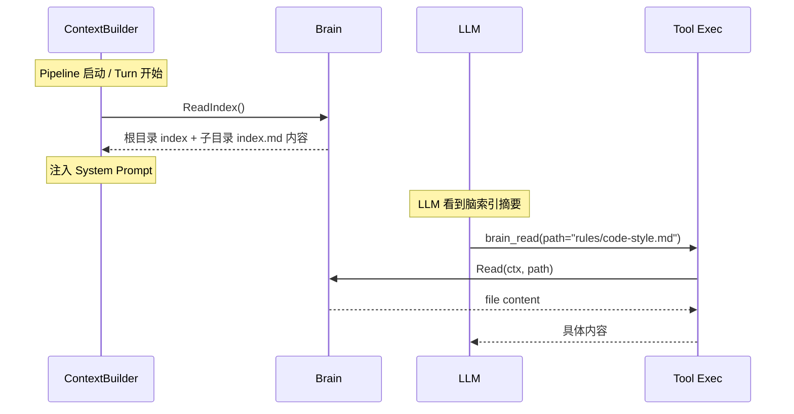
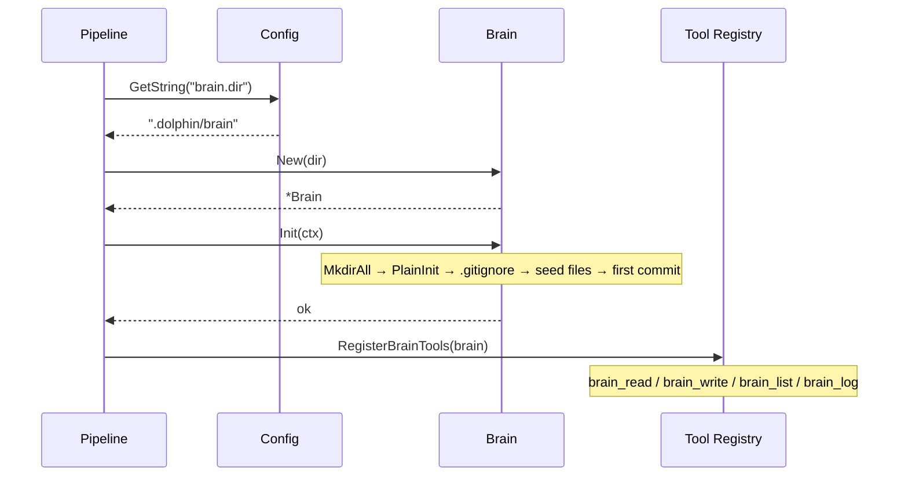
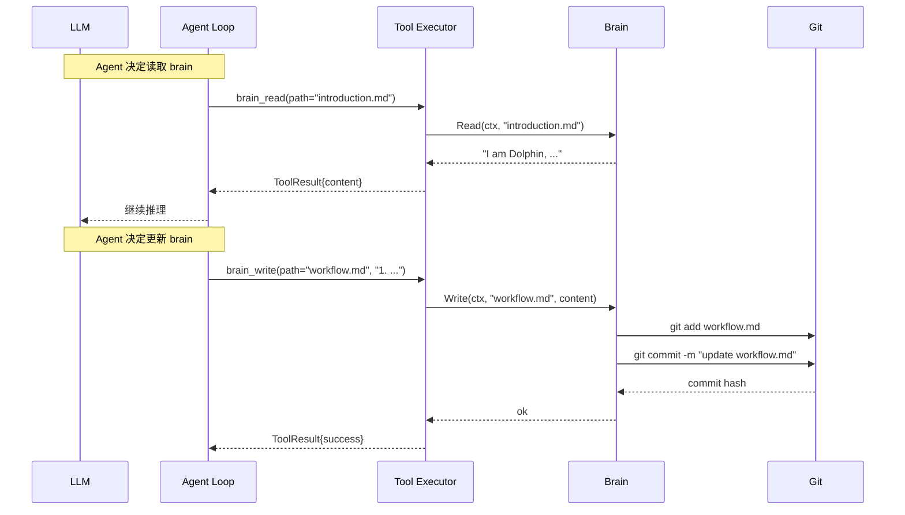
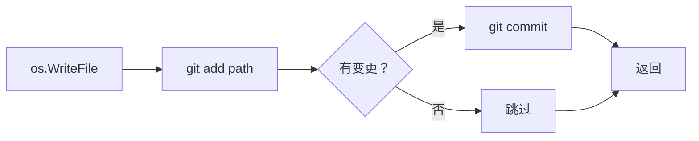

# Brain

Brain 是一个文件系统目录，用于持久化 AI 助手的长期记忆（自我介绍、工作流、偏好等）。首次初始化时使用 go-git 做 `git init`，每个子目录通过 `index.md` 索引。

## 职责

- 提供结构化长期存储（非对话记忆，而是身份/规则/知识）
- 每次写入自动 commit，形成可审计的变更历史
- Agent 可通过 Tool 读写 Brain 文件，实现自我认知更新

## 目录结构

```
.dolphin/brain/              # brain.dir 配置的根目录 (go-git repo)
├── introduction.md          # 自我介绍
├── workflow.md              # 工作流描述
├── rules/                   # 规则子目录
│   ├── index.md             # rules/ 下的文件索引
│   ├── code-style.md
│   └── review.md
├── knowledge/               # 知识子目录
│   ├── index.md
│   ├── architecture.md
│   └── glossary.md
└── meta/                    # 元信息
    └── index.md
```

- 根目录下直接放全局文件
- 子目录下必须有 `index.md` 描述该目录下的文件用途
- `index.md` 由 Agent 维护（通过 Tool 写入），格式自由

## 接口

```go
type Brain struct {
    dir string              // 根目录绝对路径
    repo *git.Repository    // go-git 实例
}

func New(dir string) (*Brain, error)
// Init 确保目录存在且是 git 仓库：
//   1. os.MkdirAll(dir)
//   2. git.PlainInit(dir, false)
//   3. 创建初始 .gitignore（排除敏感文件）
// 如果已经是 git 仓库则跳过
func (b *Brain) Init(ctx context.Context) error

func (b *Brain) Dir() string
// Read 读取 brain 内任意文件（禁止路径穿越）
func (b *Brain) Read(ctx context.Context, path string) (string, error)
// Write 写入 brain 内文件并自动 git commit
func (b *Brain) Write(ctx context.Context, path, content string) error
// List 递归列出 brain 内文件（仅 .md 文件）
func (b *Brain) List(ctx context.Context) ([]string, error)
// ReadIndex 读取两层 index.md：根目录 index.md + 一级子目录下 index.md
// 用于 ContextBuilder 加载脑索引，实现渐进式按需加载
func (b *Brain) ReadIndex(ctx context.Context) (string, error)
// GitLog 返回最近 N 条变更历史
func (b *Brain) GitLog(ctx context.Context, n int) ([]GitCommit, error)
```

## 渐进式按需加载

Brain 采用两级索引策略，避免启动时加载全部文件：

1. **启动时**：仅加载根目录 `index.md`（或 `introduction.md`）+ 一级子目录下的 `index.md`
2. **按需**：Agent 通过 `brain_read` tool 读取具体文件
3. **上下文管理**：Session 上下文只包含索引摘要，完整内容由 Tool 返回



## 初始化流程

```mermaid
flowchart TD
    A[加载配置 brain.dir] --> B{目录存在？}
    B -->|否| C[os.MkdirAll 创建]
    B -->|是| D{是 git 仓库？\n.git/HEAD 存在}
    C --> D
    D -->|否| E[git.PlainInit\nbare=false]
    D -->|是| F[git.PlainOpen]
    E --> G[写入 .gitignore\n*.log .env tokens]
    F --> H[加载 repo 句柄]
    G --> I[写入初始文件\nintroduction.md\nworkflow.md]
    H --> I
    I --> J[git add + commit\n\"chore: init brain\"]
    J --> K[就绪]
```

### 初始化步骤详解

1. **检查目录**：`os.Stat(dir)`，不存在则 `os.MkdirAll(dir, 0755)`
2. **检查 git 仓库**：`os.Stat(filepath.Join(dir, ".git", "HEAD"))`，不存在则 `git.PlainInit(dir, false)`
3. **写入 .gitignore**：排除 `*.log` `.env` `tokens` 等不应进入版本控制的文件
4. **写入种子文件**：创建 `introduction.md` 和 `workflow.md` 等初始内容
5. **首次 commit**：`git add -A` + `git commit -m "chore: init brain"`

## Pipeline 集成流程

Pipeline 启动时在 `New()` 中初始化 Brain：



### Pipeline 中注册

```go
// lifecycle/pipeline.go

brainDir := cfg.GetString("brain.dir")
br, err := brain.New(brainDir)
if err != nil {
    zapLogger.Fatal("brain init failed", zap.Error(err))
}
if err := br.Init(ctx); err != nil {
    zapLogger.Fatal("brain init failed", zap.Error(err))
}
tool.RegisterBrainTools(toolReg, br)
```

## Agent 读写流程

Agent 通过 Tool 调用与 Brain 交互：



## 自动 Commit 策略

每次 `Write()` 执行：



- commit message 格式：`<action> <path>` （如 `update introduction.md`）
- 首次写入使用 `create` 前缀，后续用 `update`
- 空 commit 自动跳过

## Tool 安全校验

所有路径操作做路径穿越防护：

```go
func (b *Brain) safePath(path string) (string, error) {
    full := filepath.Join(b.dir, path)
    // 校验最终路径仍在 b.dir 下
    if !strings.HasPrefix(filepath.Clean(full), filepath.Clean(b.dir)+string(filepath.Separator)) {
        return "", fmt.Errorf("path traversal denied: %s", path)
    }
    return full, nil
}
```

## 配置

```yaml
brain:
  dir: ".dolphin/brain"     # brain 根目录（相对路径基于进程 CWD）
```

默认值 `".dolphin/brain"`，通过 `brain.dir` 配置。支持绝对路径和相对路径。

## 种子文件内容

首次初始化时写入以下默认文件：

### 根目录

```
introduction.md    # 自我介绍
workflow.md        # 工作流
```

### 子目录（含 index.md）

```
rules/index.md         # 规则目录索引
knowledge/index.md     # 知识目录索引  
meta/index.md          # 元信息目录索引
```

子目录的 `index.md` 是目录索引，描述该目录下文件用途，由 Agent 通过 Tool 维护。

### introduction.md

```markdown
# Introduction

I am Dolphin, an AI assistant.

## Identity

- Name: Dolphin
- Purpose: General-purpose AI assistant

## Capabilities

- Answer questions and engage in dialogue
- Execute tools and MCP servers
- Manage skills and sessions
- Learn from interactions
```

### workflow.md

```markdown
# Workflow

## Interaction Flow

1. Receive user input
2. Understand intent and context
3. Formulate response or execute tools
4. Present results to user

## Guidelines

- Be concise and accurate
- Use tools when appropriate
- Learn from feedback
```

## Agent Tool 集成

Brain 文件通过 Tool 暴露给 Agent：

| Tool 名 | 功能 |
|---------|------|
| `brain_read` | 读取 brain 内文件 |
| `brain_write` | 写入/覆盖 brain 内文件（自动 commit） |
| `brain_list` | 列出 brain 目录结构 |
| `brain_log` | 查看变更历史 |

每个 Tool 在 Tool Executor Stage 执行，LLM 通过 Tool Call 调用。

## 与 Memory 的区别

| | Memory | Brain |
|--|--------|-------|
| 内容 | 对话历史 | 长期知识/身份 |
| 存储方式 | 按 Session 分文件 | 结构化目录 + git |
| 版本控制 | 无 | go-git，每次写入自动 commit |
| 读写方 | Agent Loop 自动 | Agent 通过 Tool 手动 |
| 生命周期 | Session 级别，按 window 截断 | 持久，跨 Session |
| 用户可编辑 | 不推荐 | 可直接编辑文件 |

<!-- last-modified: 2026-05-29 -->
