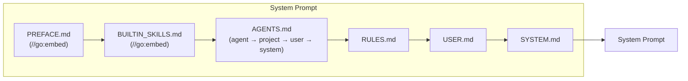
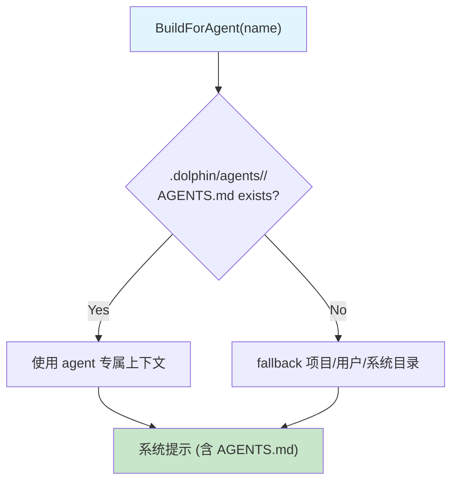

# Context Building (`internal/context/`)

## Builder

`Builder.Build()` / `Builder.BuildForAgent(agentName)` 按顺序拼接系统提示：

## BuildForAgent

## Caching

文件内容按 mtime 缓存，仅在文件变更时重新读取。

## Agent-Specific Context

`BuildForAgent("reviewer")` 会在 `.dolphin/agents/reviewer/` 下优先查找 AGENTS.md/RULES.md/USER.md，fallback 到项目/用户/系统目录。

<!-- last-modified: 2026-05-17 -->
