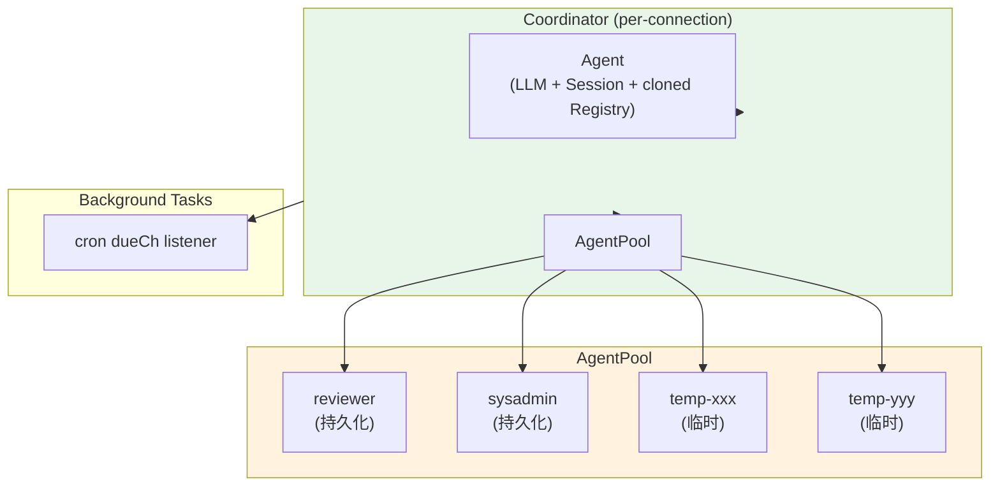
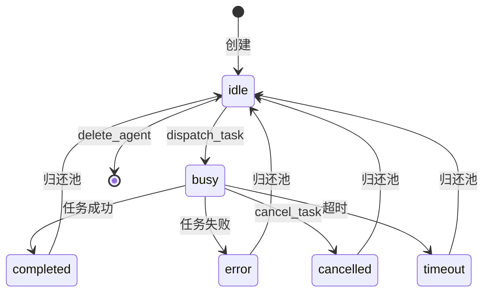
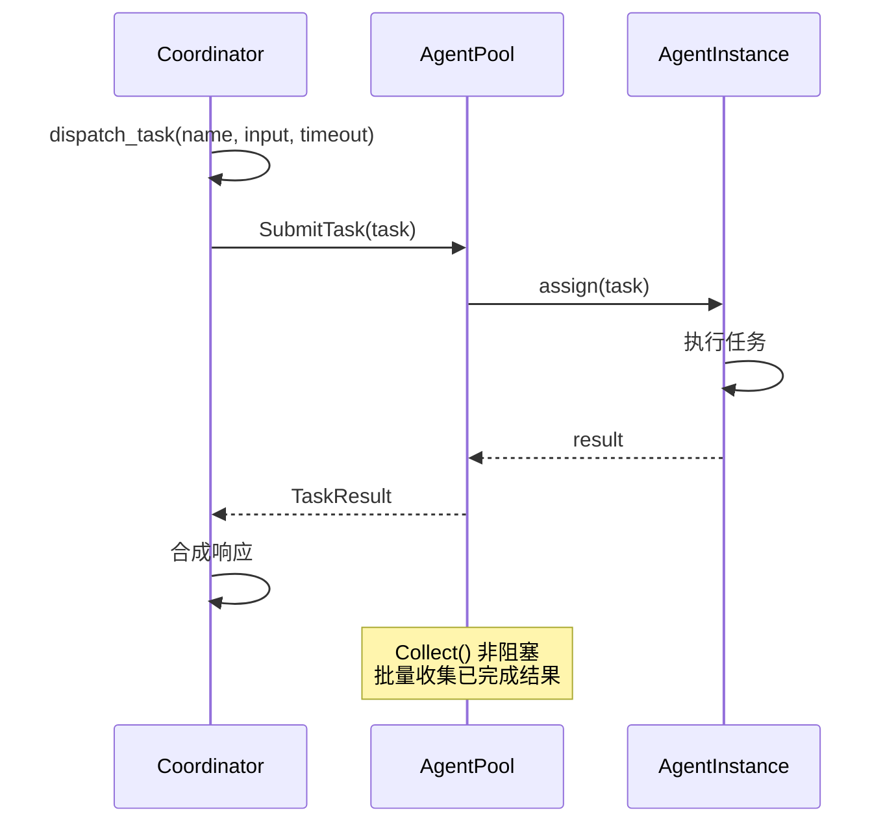
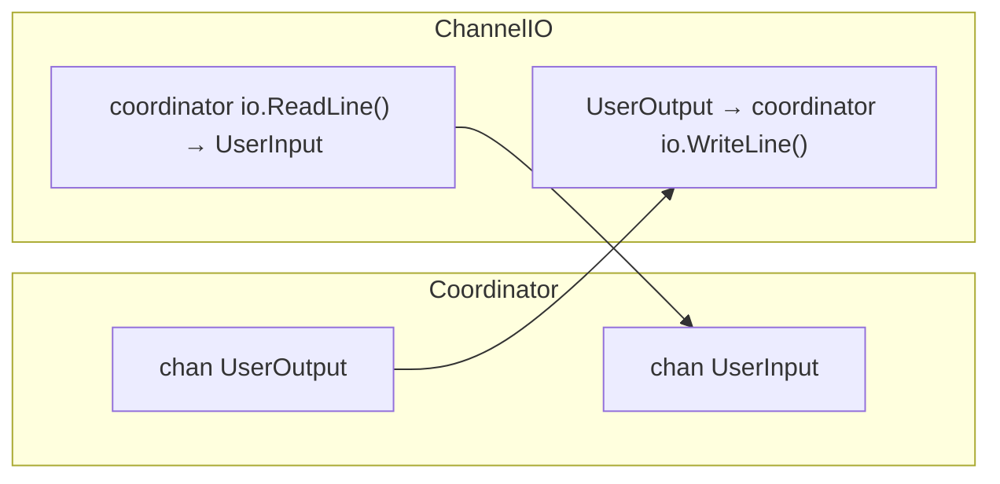

# Multi-Agent Coordination (`internal/agent/` — v0.2)

## Architecture

## AgentInstance State Machine

## Task Dispatch Flow

## Coordinator MCP Tools

| Tool | Description |
|------|-------------|
| `dispatch_task` | 分发任务给池中 Agent |
| `create_agent` | 创建持久化 Agent |
| `get_agent_status` | 查看 Agent 状态 |
| `cancel_task` | 取消运行中任务 |
| `delete_agent` | 删除持久化 Agent |

## ChannelIO

`agent/channel_io.go` — 内存 UserIO 实现，通过 channel 在 Coordinator 与子 Agent 间通信。

