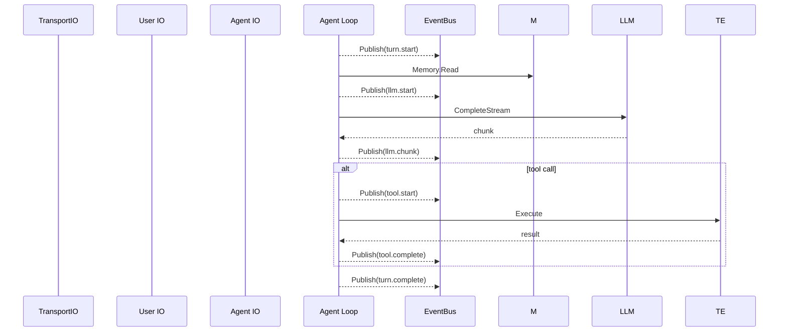

# Event

Event 是 Pipeline 执行过程中的重要节点通知。事件由各阶段自动触发，不改变执行流程。

## Event 定义

```go
type EventType string

const (
    // Turn 生命周期
    EventTurnStart     EventType = "turn.start"
    EventTurnComplete  EventType = "turn.complete"
    EventTurnError     EventType = "turn.error"
    EventTurnInterrupt EventType = "turn.interrupt"

    // LLM
    EventLLMStart    EventType = "llm.start"
    EventLLMChunk    EventType = "llm.chunk"
    EventLLMComplete EventType = "llm.complete"
    EventLLMError    EventType = "llm.error"
    EventLLMRetry    EventType = "llm.retry"

    // Tool
    EventToolStart   EventType = "tool.start"
    EventToolComplete EventType = "tool.complete"
    EventToolError    EventType = "tool.error"

    // Transport
    EventTransportConnected    EventType = "transport.connected"
    EventTransportDisconnected EventType = "transport.disconnected"

    // Skill
    EventSkillLoaded  EventType = "skill.loaded"
    EventSkillCreated EventType = "skill.created"
    EventSkillDeleted EventType = "skill.deleted"

    // System
    EventPipelineStart   EventType = "pipeline.start"
    EventPipelineShutdown EventType = "pipeline.shutdown"
)

type Event struct {
    Type      EventType
    Timestamp time.Time
    SessionID string
    Payload   map[string]any
}
```

## EventBus

```go
type EventBus struct {
    subscribers []Subscriber
}

type Subscriber func(ctx context.Context, event Event)

func (b *EventBus) Publish(ctx context.Context, event Event) {
    for _, sub := range b.subscribers {
        sub(ctx, event)
    }
}

func (b *EventBus) Subscribe(fn Subscriber) {
    b.subscribers = append(b.subscribers, fn)
}
```

## 触发点



Event 由各阶段的 TraceWrapper 或 Stage 自身在关键节点触发，EventBus 不阻塞执行流程。

<!-- last-modified: 2026-05-29 -->
