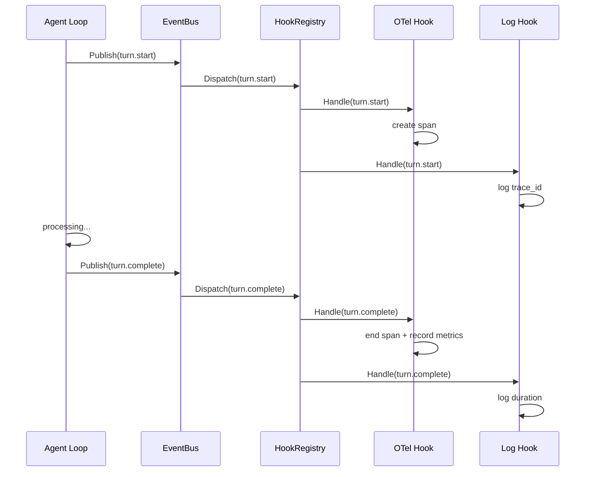

# Hook

Hook 是 Pipeline 执行过程中的拦截点，可以观察或影响事件流。
Observability 基于 Hook 实现。

## Hook 定义

```go
// Hook 是一个事件回调
type Hook interface {
    Name() string
    Handle(ctx context.Context, event Event) error
}
```

## HookRegistry

```go
type HookRegistry struct {
    hooks []Hook
}

func (r *HookRegistry) Register(hook Hook) {
    r.hooks = append(r.hooks, hook)
}

func (r *HookRegistry) Dispatch(ctx context.Context, event Event) {
    for _, hook := range r.hooks {
        if err := hook.Handle(ctx, event); err != nil {
            // hook 错误不中断其他 hook
            continue
        }
    }
}
```

## 事件 + Hook 数据流



<!-- last-modified: 2026-05-29 -->
