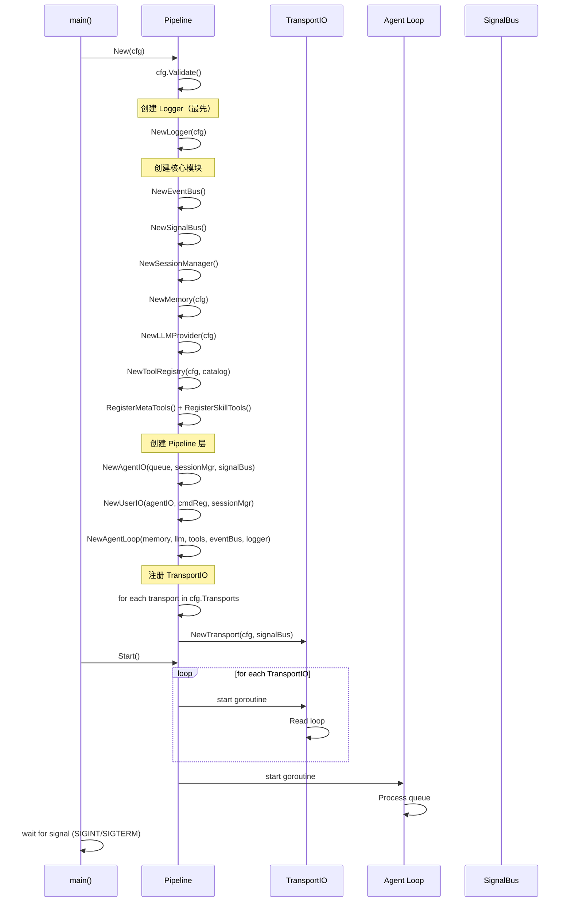
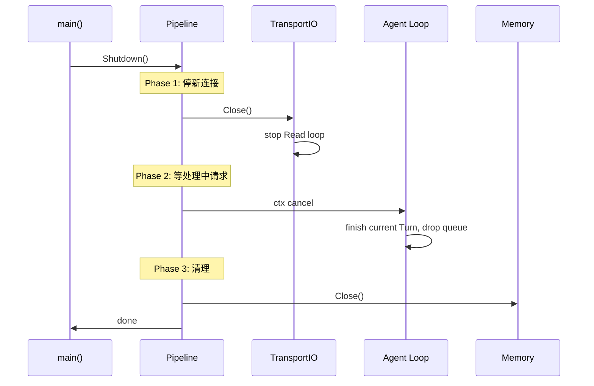

# Lifecycle

Pipeline 的启动、运行、关闭管理。

## 启动流程



## Pipeline 组装

```go
type Pipeline struct {
    transports []TransportIO
    userIO     *UserIO
    agentIO    *AgentIO
    agentLoop  *AgentLoop
    sessionMgr *SessionManager
    logger     *zap.Logger
}

func New(cfg *config.Config) *Pipeline {
    // 1. 校验配置
    if err := cfg.Validate(); err != nil {
        log.Fatalf("config validation failed: %v", err)
    }

    // 2. 创建 Logger 和 EventBus（最底层依赖）
    logger := NewLogger(cfg)
    eventBus := NewEventBus()
    hookRegistry := NewHookRegistry()

    // 3. 创建信号和会话管理层
    signalBus := NewSignalBus()
    sessionMgr := session.NewManager(cfg)

    // 4. 创建存储和外部依赖
    memory := NewMemory(cfg)
    llmProvider := NewLLMProvider(cfg)
    toolRegistry := NewToolRegistry(cfg)

    // 5. 创建命令注册中心（含 session new/current/stop/continue）
    cmdReg := NewCommandRegistry(sessionMgr, signalBus)

    // 6. 创建 Pipeline 层
    agentIO := NewAgentIO(cfg.Agent.BufferSize)

    compositor := &Compositor{
        initStages: []Stage{
            &MemoryReadStage{memory: memory},
            &ContextBuilderStage{skillStore: skillStore, baseSystemPrompt: basePrompt},
        },
        loopStages: []Stage{
            &LLMStage{llm: llmProvider, memory: memory, cfg: cfg.LLM, logger: logger, eventBus: eventBus},
            &ToolStage{tools: toolRegistry, signalBus: signalBus, cfg: cfg.Tool, logger: logger},
            &MemoryWriteStage{memory: memory},
        },
    }

    pipeline := &Pipeline{}

    agentLoop := NewAgentLoop(agentIO.queue, compositor, logger)
    // 连接回调：AgentLoop → AgentIO
    agentLoop.onResult = func(tr TurnResult) {
        agentIO.OnResult(&tr)
    }

    userIO := NewUserIO(agentIO, cmdReg, sessionMgr)

    // 7. 构建 TransportIO（通过注册模式）
    var transports []TransportIO
    for _, tc := range cfg.Transports {
        tio, err := transport.Build(context.Background(), tc)
        if err != nil {
            logger.Fatal("transport build failed", zap.String("type", tc.Type), zap.Error(err))
        }
        agentIO.RegisterTransport(tio.ID(), tio)
        transports = append(transports, tio)
    }

    // 8. 注册 Observability
    if cfg.OTel.Enabled {
        hookRegistry.Register(NewOTelHook(cfg, logger))
        hookRegistry.Register(NewMetricsHook(cfg, logger))
    }
    eventBus.Subscribe(hookRegistry.Dispatch)

    return &Pipeline{
        transports: transports,
        userIO:     userIO,
        agentIO:    agentIO,
        agentLoop:  agentLoop,
        sessionMgr: sessionMgr,
        logger:     logger,
    }
}
```

## Start

```go
func (p *Pipeline) Start(ctx context.Context) {
    p.logger.Info("pipeline starting",
        zap.Int("transports", len(p.transports)),
    )

    // Agent Loop goroutine（串行消费队列）
    go p.agentLoop.Run(ctx)

    // 每个 TransportIO 一个 goroutine
    for _, tio := range p.transports {
        t := tio
        go func() {
            for {
                input, err := t.Read(ctx)
                if err != nil {
                    p.logger.Info("transport read stopped",
                        zap.String("transport_id", t.ID()),
                        zap.Error(err),
                    )
                    return
                }
                p.userIO.Handle(ctx, t, input)
            }
        }()
    }
}
```

## Agent Loop Run

AgentLoop 通过共享的 queue channel 接收 Turn：

```go
type AgentLoop struct {
    queue      chan *Turn       // 与 AgentIO 共享
    onResult   func(TurnResult) // 由 AgentIO 注入
    compositor *Compositor
    memory     Memory
    logger     *zap.Logger
}

func NewAgentLoop(queue chan *Turn, compositor *Compositor, logger *zap.Logger) *AgentLoop {
    return &AgentLoop{
        queue:      queue,
        compositor: compositor,
        logger:     logger,
    }
}

func (a *AgentLoop) Run(ctx context.Context) {
    for {
        select {
        case <-ctx.Done():
            a.logger.Info("agent loop stopped")
            return
        case turn := <-a.queue:
            a.processTurn(ctx, turn)
        }
    }
}

func (a *AgentLoop) processTurn(ctx context.Context, turn Turn) {
    state := &State{
        SessionID: turn.SessionID,
        Input:     turn.Input,
        OnChunk: func(text string) {
            a.onResult(TurnResult{
                TransportID: turn.TransportID,
                SessionID:   turn.SessionID,
                Text:        text,
            })
        },
    }

    err := a.compositor.Execute(ctx, state)
    if err != nil {
        a.logger.Error("turn failed",
            zap.Error(err),
            zap.String("session_id", turn.SessionID),
        )
        a.onResult(TurnResult{
            TransportID: turn.TransportID,
            SessionID:   turn.SessionID,
            Text:        "Error: " + err.Error(),
            Done:        true,
        })
        return
    }

    a.onResult(TurnResult{
        TransportID: turn.TransportID,
        SessionID:   turn.SessionID,
        Done:        true,
    })
}
```

## 关闭流程



```go
func (p *Pipeline) Shutdown() {
    p.logger.Info("pipeline shutting down")
    for _, tio := range p.transports {
        tio.Close()
    }
    // Agent Loop 收到 ctx.Done() 后退出
}
```

<!-- last-modified: 2026-05-29 -->
