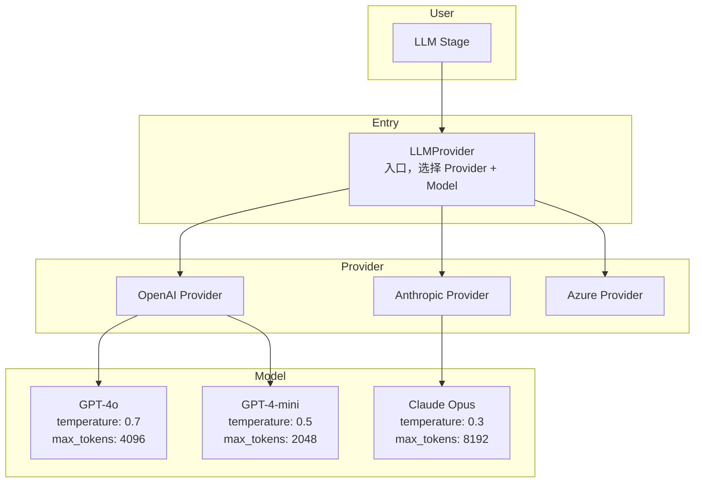

# LLM Provider

## 设计原则

- **三层隔离** — LLMProvider → Provider → Model，各层可独立替换
- **厂商无关** — 核心代码不依赖具体厂商 SDK
- **逐层配置** — Provider 层管连接/鉴权，Model 层管推理参数

## 三层架构



## 接口定义

```go
// LLMProvider 入口——根据配置选择 Provider + Model
type LLMProvider interface {
    CompleteStream(ctx context.Context, req LLMRequest) (<-chan LLMChunk, error)
}

// Provider 厂商适配器——管理连接和鉴权
type Provider interface {
    Name() string
    CompleteStream(ctx context.Context, req LLMRequest, model *ModelConfig) (<-chan LLMChunk, error)
    Models(ctx context.Context) ([]ModelConfig, error)
}

// ModelConfig 模型配置——控制推理参数
type ModelConfig struct {
    Name        string             // 模型名，如 gpt-4o
    Temperature float64            // 0.0 ~ 2.0
    MaxTokens   int                // 最大 token 数
    TopP        float64            // nucleus sampling
    Stop        []string           // 停止词
    ProviderExtra map[string]any   // 透传给 Provider 实现的特有参数
}
```

## LLMProvider 实现

LLMProvider 根据配置中的 `llm.provider` 和 `llm.model` 选择 Provider + ModelConfig：

```go
type llmProviderImpl struct {
    provider Provider
    model    *ModelConfig
    logger   *zap.Logger
}

func NewLLMProvider(cfg *LLMConfig, logger *zap.Logger) (LLMProvider, error) {
    provider, err := buildProvider(cfg)
    if err != nil {
        return nil, err
    }

    model := &ModelConfig{
        Name:        cfg.Model,
        Temperature: cfg.Temperature,
        MaxTokens:   cfg.MaxTokens,
        TopP:        cfg.TopP,
        Stop:        cfg.Stop,
    }

    return &llmProviderImpl{
        provider: provider,
        model:    model,
        logger:   logger,
    }, nil
}

func (p *llmProviderImpl) CompleteStream(ctx context.Context, req LLMRequest) (<-chan LLMChunk, error) {
    p.logger.Info("llm call",
        zap.String("provider", p.provider.Name()),
        zap.String("model", p.model.Name),
    )
    return p.provider.CompleteStream(ctx, req, p.model)
}
```

## Provider 实现

每个厂商一个实现，内部封装 SDK：

```go
// ===== OpenAI =====
type OpenAIProvider struct {
    client *openai.Client
}

func NewOpenAIProvider(cfg *LLMConfig) (*OpenAIProvider, error) {
    return &OpenAIProvider{
        client: openai.NewClient(cfg.OpenAI.APIKey),
    }, nil
}

func (p *OpenAIProvider) Name() string { return "openai" }

func (p *OpenAIProvider) CompleteStream(ctx context.Context, req LLMRequest, model *ModelConfig) (<-chan LLMChunk, error) {
    // 使用 model.Name 作为模型名（如 gpt-4o）
    // 使用 model.Temperature / model.MaxTokens 等参数
    // 调用 OpenAI SDK 流式接口
}

// ===== Anthropic =====
type AnthropicProvider struct {
    client *anthropic.Client
}

func NewAnthropicProvider(cfg *LLMConfig) (*AnthropicProvider, error) {
    return &AnthropicProvider{
        client: anthropic.NewClient(cfg.Anthropic.APIKey),
    }, nil
}

func (p *AnthropicProvider) Name() string { return "anthropic" }
```

## 配置

```yaml
llm:
  provider: openai            # openai | anthropic | azure
  model: gpt-4o               # 默认模型
  temperature: 0.7
  max_tokens: 4096
  top_p: 1.0
  stop: []
  max_retries: 3
  timeout: 30s

  # Provider 配置（按厂商独立）
  openai:
    api_key: "${OPENAI_API_KEY}"
    base_url: ""              # 自定义 endpoint

  anthropic:
    api_key: "${ANTHROPIC_API_KEY}"

  azure:
    api_key: "${AZURE_API_KEY}"
    endpoint: ""
    deployment: ""             # Azure 部署名
```

## Provider 构建

```go
func buildProvider(cfg *LLMConfig) (Provider, error) {
    switch cfg.Provider {
    case "openai":
        return NewOpenAIProvider(cfg)
    case "anthropic":
        return NewAnthropicProvider(cfg)
    case "azure":
        return NewAzureProvider(cfg)
    default:
        return nil, fmt.Errorf("unknown provider: %s", cfg.Provider)
    }
}
```

## 扩展：同一 Provider 多模型

一个 LLMProvider 实例绑定一个 Provider + ModelConfig。需要多模型时建多个实例：

```go
// 默认对话模型
defaultLLM := NewLLMProvider(cfg, logger)

// 省钱快速模型
fastLLM := NewLLMProvider(&LLMConfig{
    Provider: "openai",
    Model:    "gpt-4-mini",
    Temperature: 0.5,
}, logger)
```

## 配置 Key

| Key 路径 | 说明 |
|----------|------|
| `llm.provider` | 厂商选择 |
| `llm.model` | 模型名 |
| `llm.temperature` | 默认温度 |
| `llm.max_tokens` | 默认最大 token |
| `llm.max_retries` | 重试次数 |
| `llm.timeout` | 超时 |
| `llm.openai.api_key` | OpenAI 密钥 |
| `llm.anthropic.api_key` | Anthropic 密钥 |
| `llm.azure.*` | Azure 配置 |

<!-- last-modified: 2026-05-29 -->
