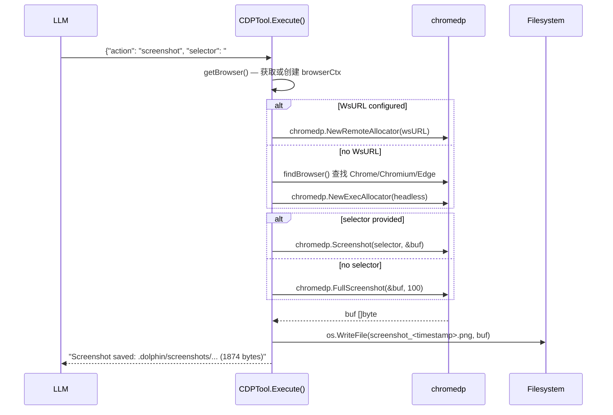
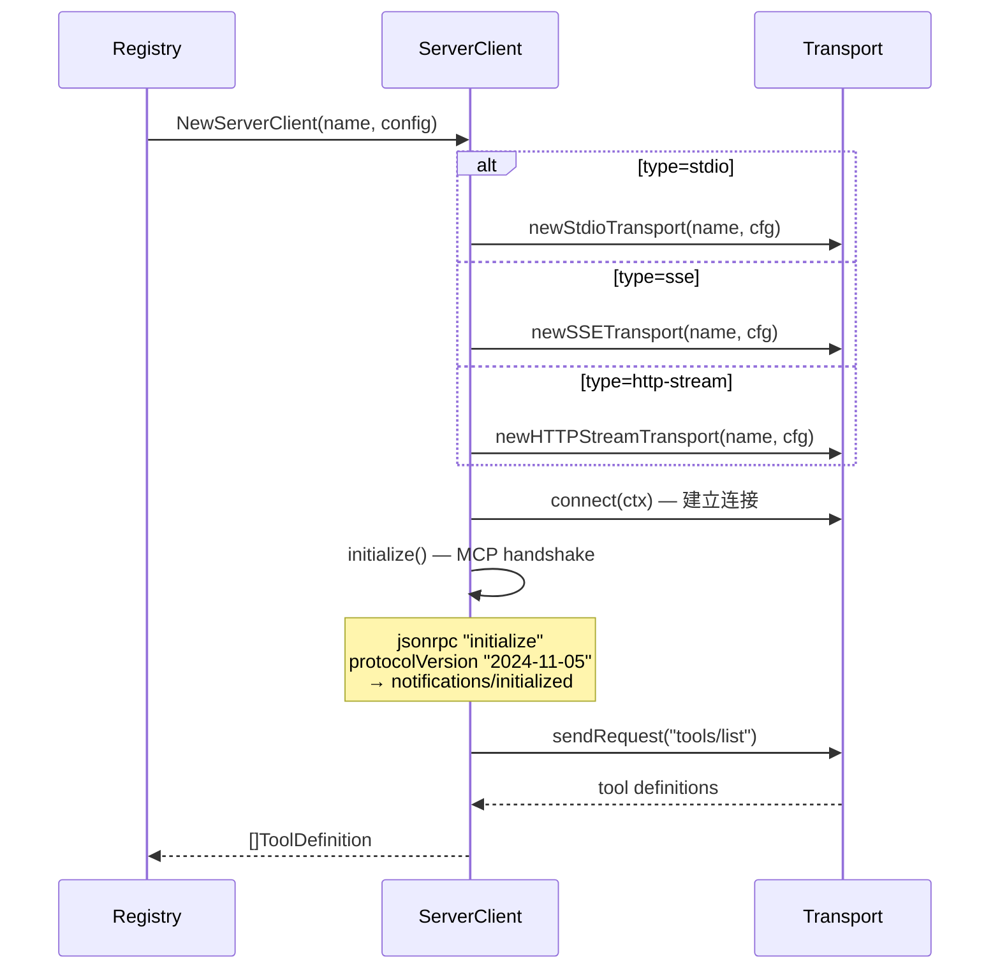

# MCP Tool System (`internal/mcp/`)

## Interface

```go
type Tool interface {
    Definition() ToolDefinition
    Execute(ctx context.Context, input json.RawMessage) (*ToolResult, error)
}
```

## Built-in Tools

| Tool | File | Capability |
|------|------|------------|
| Shell | `shell.go` | 执行命令, 白名单, 超时, 路径安全 |
| CDP | `cdp.go` | 浏览器: Navigate/Click/Screenshot/Evaluate/GetText |
| Email | `email.go` | SMTP 发送 + IMAP/POP3 搜索/取回 |
| Webhook | `webhook.go` | HTTP 请求 (配置 target / inline URL) |

## CDP Tool Flow



## External Server Connection Flow



## Progressive Disclosure

- 默认展示 Top 10 工具 (按 CallCount)
- 始终暴露 `search_mcp_tools`
- `Clone()` — per-coordinator 独立副本
- `FilteredView(names)` — 子 Agent 工具子集
- 自动统计: CallCount, ErrorCount, LastCalledAt, TotalDuration

<!-- last-modified: 2026-05-17 -->
