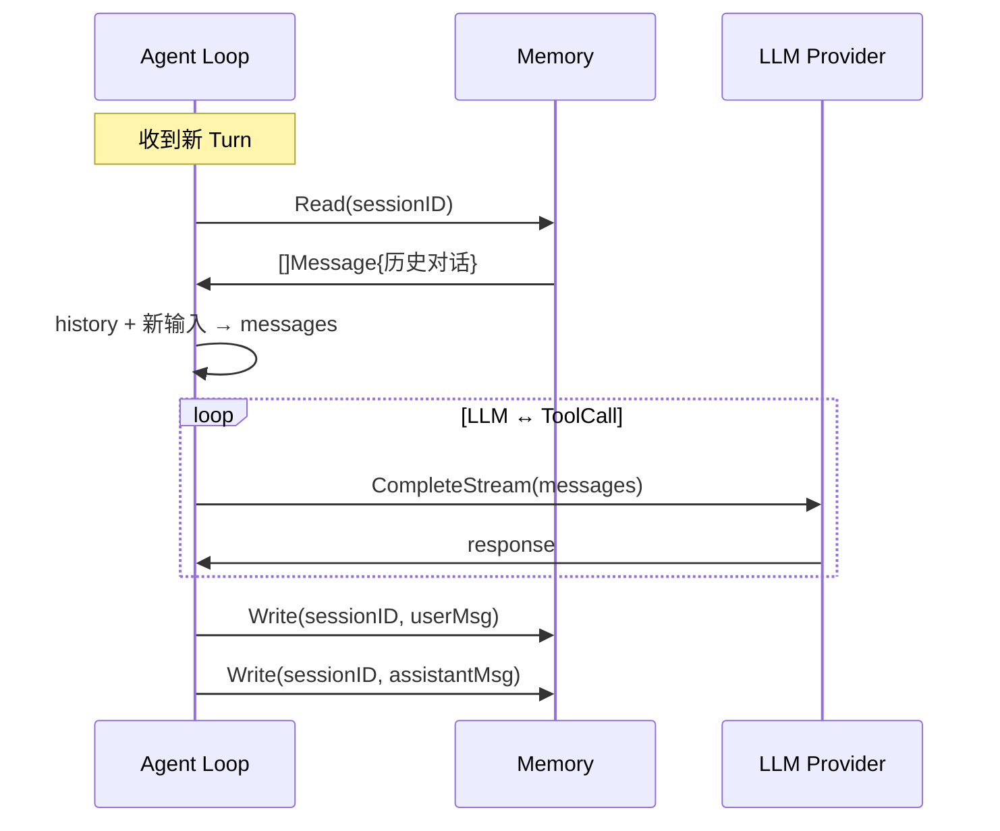

# Memory

Memory 是历史消息存储抽象，Agent Loop 每轮对话前读当前 Session 的全部消息、对话后追加写入。

## 接口

```go
type Memory interface {
    Read(ctx context.Context, sessionID string) ([]Message, error)
    Write(ctx context.Context, sessionID string, msg Message) error
}
```

## Message 结构

```go
type Message struct {
    Role       Role       // user / assistant / tool / system
    Content    string
    ToolCallID string
    ToolCalls  []ToolCall
    Timestamp  time.Time
}
```

## 实现：FileMemory（默认）

每个 Session 一个 markdown 文件，按时间顺序追加：

```
data/
  sessions/
    abc123.md          # Session ID 命名的文件
    def456.md
```

### 格式

```markdown
## user (2026-05-29 10:00:00)
check weather

## assistant (2026-05-29 10:00:03)
The weather is 22°C

## assistant (2026-05-29 10:00:05)
_raw: {"role":"assistant","content":"","thinking":"...","tool_calls":[{"id":"call_1","name":"get_weather","arguments":"{\"city\":\"Beijing\"}"}]}

## tool (2026-05-29 10:00:06)
_raw: {"role":"tool","tool_call_id":"call_1","content":"{\"temperature\": 22}"}
```

- 纯文本消息直接存储
- 包含 `Thinking`、`ToolCalls` 或 `Tool` 角色的复杂消息序列化为 JSON，以 `_raw: ` 前缀存储

### 实现

```go
type FileMemory struct {
    dir    string
    window int  // 保留最近 N 轮，0=全部
    mu     sync.RWMutex
}

func NewFileMemory(dir string, window int) *FileMemory {
    os.MkdirAll(dir, 0755)
    return &FileMemory{dir: dir, window: window}
}

func (m *FileMemory) path(sessionID string) string {
    return filepath.Join(m.dir, sessionID+".md")
}

func (m *FileMemory) Read(ctx context.Context, sessionID string) ([]Message, error) {
    m.mu.RLock()
    defer m.mu.RUnlock()

    data, err := os.ReadFile(m.path(sessionID))
    if err != nil {
        if os.IsNotExist(err) {
            return nil, nil  // 新 Session，空历史
        }
        return nil, err
    }

    msgs := parseMarkdown(string(data))

    // window 截断
    if m.window > 0 && len(msgs) > m.window*2 {
        msgs = msgs[len(msgs)-m.window*2:]
    }
    return msgs, nil
}

func (m *FileMemory) Write(ctx context.Context, sessionID string, msg Message) error {
    m.mu.Lock()
    defer m.mu.Unlock()

    line := formatMarkdown(msg)
    f, err := os.OpenFile(m.path(sessionID), os.O_APPEND|os.O_CREATE|os.O_WRONLY, 0644)
    if err != nil {
        return err
    }
    defer f.Close()
    _, err = f.WriteString(line + "\n")
    return err
}
```

### markdown 解析

```go
func formatMarkdown(msg Message) string {
    ts := msg.Timestamp.Format("2006-01-02 15:04:05")
    switch msg.Role {
    case RoleUser:
        return fmt.Sprintf("## user (%s)\n%s", ts, msg.Content)
    case RoleAssistant:
        if msg.Thinking != "" || len(msg.ToolCalls) > 0 {
            raw, _ := json.Marshal(msg)
            return fmt.Sprintf("## assistant (%s)\n_raw: %s", ts, string(raw))
        }
        return fmt.Sprintf("## assistant (%s)\n%s", ts, msg.Content)
    case RoleTool:
        raw, _ := json.Marshal(msg)
        return fmt.Sprintf("## tool (%s)\n_raw: %s", ts, string(raw))
    case RoleSystem:
        return fmt.Sprintf("## system (%s)\n%s", ts, msg.Content)
    }
    return ""
}
```

## 使用流程



## 替换策略

当前只需 FileMemory。后续需要其他实现时：

| 实现 | 场景 | 切换理由 |
|------|------|---------|
| `FileMemory` | 默认 | 人类可读，调试友好，无外部依赖 |
| `SQLiteMemory` | 生产/大规模 | 查询能力强，支持并发 |
| `InMemory` | 测试 | gock + 纯内存，速度快 |

```yaml
memory:
  dir: "./data/sessions"    # markdown 文件目录
  window: 40                 # 读取时截断到最近 N 轮（0=全部）
```

<!-- last-modified: 2026-05-29 -->
