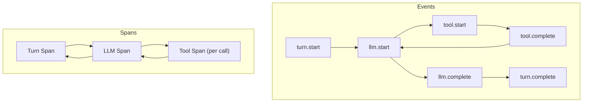

# Observability

基于 Event + Hook 构建。Observability 是一个 Hook，不侵入任何 Stage。

## OTel Hook

```go
type OTelHook struct {
    tracer trace.Tracer
    meter  metric.Meter
    spans  map[string]trace.Span  // eventID → span
    mu     sync.Mutex
}

func NewOTelHook(tp trace.TracerProvider, mp metric.MeterProvider) *OTelHook {
    return &OTelHook{
        tracer: tp.Tracer("dolphin"),
        meter:  mp.Meter("dolphin"),
        spans:  make(map[string]trace.Span),
    }
}

func (h *OTelHook) Name() string { return "otel" }

func (h *OTelHook) Handle(ctx context.Context, event Event) error {
    switch event.Type {
    case EventTurnStart:
        _, span := h.tracer.Start(ctx, "turn." + event.SessionID)
        h.saveSpan(event, span)

    case EventLLMStart:
        _, span := h.tracer.Start(ctx, "llm.complete")
        h.saveSpan(event, span)

    case EventLLMComplete:
        if span := h.popSpan(event); span != nil {
            tokens := event.Payload["tokens"].(int)
            span.SetAttributes(attribute.Int("tokens", tokens))
            span.End()
        }

    case EventToolStart:
        _, span := h.tracer.Start(ctx, "tool." + event.Payload["name"].(string))
        h.saveSpan(event, span)

    case EventToolComplete:
        if span := h.popSpan(event); span != nil {
            span.SetAttributes(
                attribute.Bool("error", event.Payload["is_error"].(bool)),
            )
            span.End()
        }

    case EventTurnComplete, EventTurnError, EventTurnInterrupt:
        if span := h.popSpan(event); span != nil {
            span.End()
        }
    }
    return nil
}

func (h *OTelHook) saveSpan(event Event, span trace.Span) {
    h.mu.Lock()
    h.spans[eventID(event)] = span
    h.mu.Unlock()
}

func (h *OTelHook) popSpan(event Event) trace.Span {
    h.mu.Lock()
    span := h.spans[eventID(event)]
    delete(h.spans, eventID(event))
    h.mu.Unlock()
    return span
}
```

## Metrics Hook

```go
type MetricsHook struct {
    turnDuration    metric.Float64Histogram
    llmTokens       metric.Int64Counter
    toolCalls       metric.Int64Counter
    turnTotal       metric.Int64Counter
}

func (h *MetricsHook) Handle(ctx context.Context, event Event) error {
    switch event.Type {
    case EventTurnComplete:
        ms := event.Payload["duration_ms"].(float64)
        h.turnDuration.Record(ctx, ms)
        h.turnTotal.Add(ctx, 1)

    case EventLLMComplete:
        tokens := event.Payload["tokens"].(int)
        h.llmTokens.Add(ctx, int64(tokens))

    case EventToolComplete:
        h.toolCalls.Add(ctx, 1)
    }
    return nil
}
```

## 注册

```go
func BuildObservability(cfg *config.Config, hr *HookRegistry) {
    if cfg.OTel.Enabled {
        hr.Register(NewOTelHook(cfg.OTel.TracerProvider(), cfg.OTel.MeterProvider()))
        hr.Register(NewMetricsHook(cfg.OTel.MeterProvider()))
    }
}
```

## Span 结构



所有 observability 基于 Event + Hook，Stage 内部零修改。

<!-- last-modified: 2026-05-29 -->
