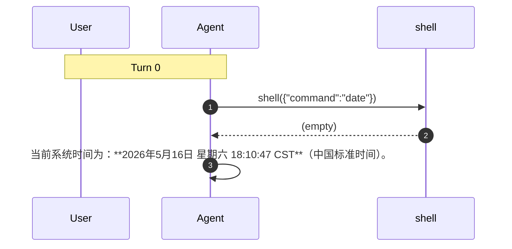

# Session Management (`internal/session/`)

## Format

每会话一个 `{dir}/{uuid}.jsonl`，JSONL 格式每行一个 Event:

| Event Type | Content |
|------------|---------|
| `message` | 用户/助手消息，含 `input_tokens` / `output_tokens` |
| `tool_call` | LLM 请求的工具调用 |
| `tool_result` | 工具执行结果 |
| `system` | turn start/end, 错误 |
| `summary` | 会话摘要 |

### Token Tracking

每条 assistant `message` 事件记录 LLM 调用的 token 用量：
- `input_tokens` — 输入 token 数
- `output_tokens` — 输出 token 数

`sessions dump` 在每个 turn 的结束 note 中自动聚合展示 token 用量。
`sessions show` 在每个 turn 标题显示 token 统计。

## Session Dump Command

Generate a Mermaid sequence diagram from a session's JSONL file:

```bash
dolphin sessions dump <session-id>
```

Output is Mermaid `sequenceDiagram` syntax. Actors: `User`, `Agent`, and any tool participants (e.g. `shell`, `search_mcp_tools`).

Example:



Paste output into https://mermaid.live to render.

## Manager

- `NewManager(dir)` → `EnsureDir()` → 多会话生命周期管理
- `Reaper` — 后台定时清理过期会话 (`max_age`)
- `Summary` — 到达 MaxLoop 时生成摘要，支持 Resume (从摘要续对话)

## Sessions Directory

Session 存储目录跟随配置层级，不可通过配置文件修改：

| 层级 | 路径 |
|------|------|
| 项目级 | `.dolphin/sessions/` |
| 用户级 (fallback) | `~/.dolphin/sessions/` |

`config.SessionsDir()` 优先返回项目级路径（当 `.dolphin/` 存在时），否则回退到用户级路径。
测试可通过 `config.SetSessionsDir(dir)` 覆盖。
