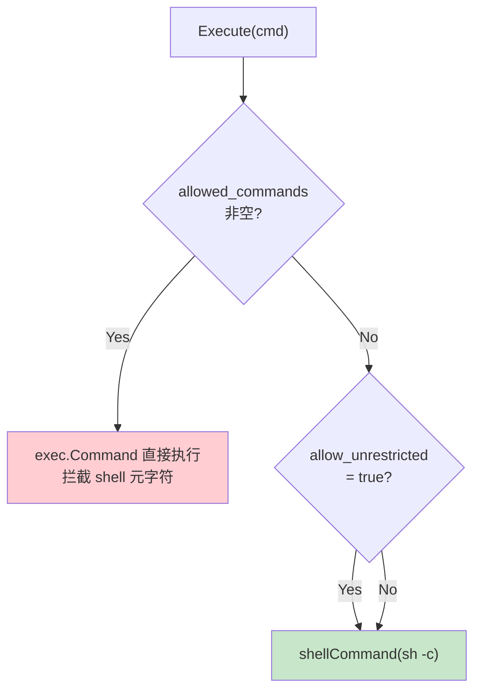

# Shell 默认模式启用管道/重定向

## 问题

`internal/mcp/shell.go` 的默认执行模式（无 `allowed_commands` 白名单且 `allow_unrestricted=false`）使用 `exec.Command` 直接执行命令，不经过 shell 解释器。导致：

- 管道 `|`、重定向 `>`/`>>` 不可用
- 环境变量展开 `$VAR`、命令替换 `$(cmd)` 不可用
- 基本文件创建操作 `echo "text" > file` 失败

## 方案

将默认模式改为使用平台原生 shell（`sh -c` on Unix, `cmd /C` on Windows），与当前的 `AllowUnrestricted` 路径一致。

### 执行决策流程

### 变更点

| 文件 | 变更 |
|------|------|
| `internal/mcp/shell.go` | Execute(): 当 `allowed` 为空时，统一走 `shellCommand()` 路径，移除 `AllowUnrestricted` 分支判断 |
| `internal/mcp/shell.go` | NewShellTool(): 更新 Warn 日志，移除"shell features disabled"描述 |
| `internal/mcp/shell_test.go` | 更新测试，确保管道命令正常工作 |

### 安全考量

- 当用户设置了 `allowed_commands`（白名单模式），仍使用 `exec.Command` 直接执行并拦截 shell 元字符——安全模式不变
- 仅当无白名单时（即不限制任何命令），才启用 shell 解释
- 权限控制由操作系统用户权限保障，而非人工禁用 shell 特性
- 恢复与绝大多数 CLI 工具一致的预期行为

### 影响范围

- 正向：用户体验改善，管道/重定向/变量展开恢复正常
- 兼容性：命令输出格式不变；如有依赖 `exec.Command` 精确行为（如参数转义）的边缘情况需测试

## 验证

- `go test -race ./internal/mcp/... -count=1`
- 回归测试：白名单模式仍能正确拦截 shell 元字符
- 新测试：管道命令 `echo hello | wc -c` 正常输出

<!-- last-modified: 2026-05-17 -->
