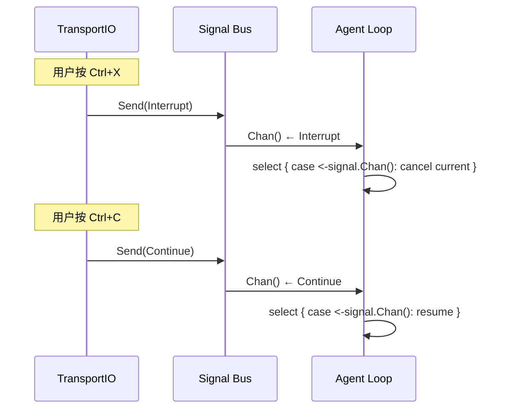

# Signal

Signal 是 TransportIO 和 Agent Loop 之间的控制通道，不传递数据，只传递信号。

## 信号类型

```go
type Signal int

const (
    SignalInterrupt Signal = iota  // 中断当前操作
    SignalContinue                  // 继续当前操作
    SignalCancel                    // 取消/终止
    SignalPause                     // 暂停
    SignalResume                    // 恢复
)
```

## 接口

```go
// Signaler 是信号发射器，由 TransportIO 持有
type Signaler interface {
    Send(sig Signal)
    Subscribe() (Signal, error)  // 阻塞等待下一个信号
}

// SignalHandler 是信号接收器，由 Agent Loop 持有
type SignalHandler interface {
    Recv(ctx context.Context) (Signal, error)  // 非阻塞/带超时接收
    Chan() <-chan Signal                        // 用于 select 多路复用
}
```

## 信号路由



## 实现示例

```go
// sessionSignal 是关联到某个 Session 的信号通道
type sessionSignal struct {
    ID      string
    sendCh  chan Signal
    recvChs []chan Signal
}

// SignalBus 管理所有 Session 的信号
type SignalBus struct {
    mu       sync.RWMutex
    sessions map[string]*sessionSignal
}

func (b *SignalBus) ForSession(sessionID string) (Signaler, SignalHandler) {
    // 返回一对绑定到 sessionID 的收发接口
}

func (b *SignalBus) Subscribe(sessionID string) <-chan Signal {
    // Agent Loop 用它做 select
}
```

## 使用场景

| 信号 | 触发方式 | 接收方 | 行为 |
|------|---------|--------|------|
| Interrupt | Ctrl+X / 超时 | Agent Loop | 取消当前 LLM call + tool exec，丢弃本轮 |
| Continue | Ctrl+C | Agent Loop | 取消中断状态，继续处理 |
| Cancel | 断开连接 | Agent Loop | 销毁 Session，清理资源 |
| Pause | 系统信号 | Agent Loop | 暂停，保存状态 |
| Resume | 系统信号 | Agent Loop | 恢复执行 |

<!-- last-modified: 2026-05-28 -->
