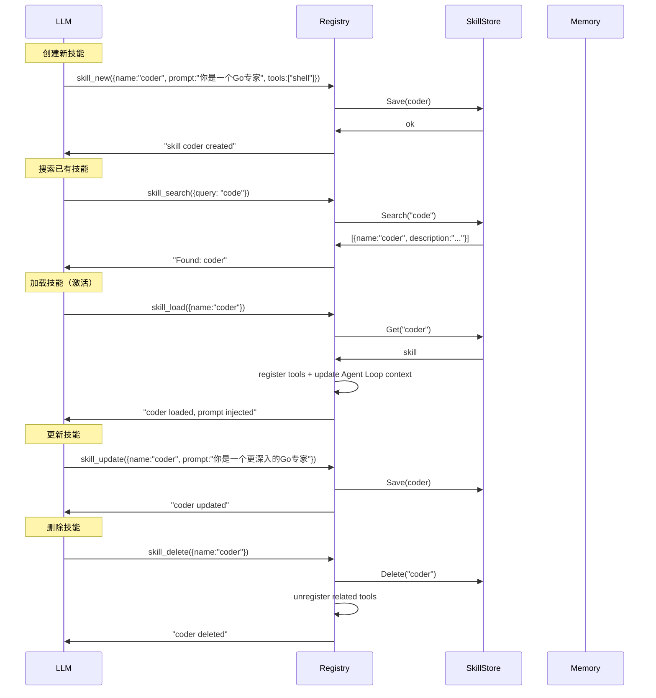
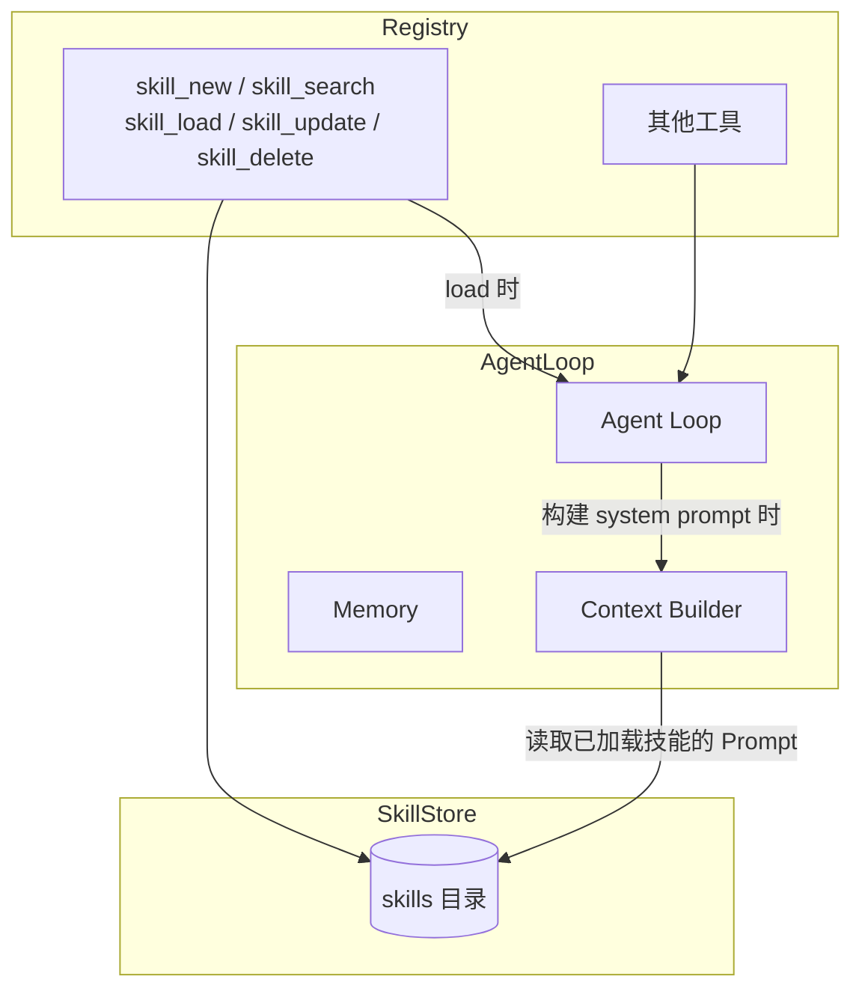

# Skills

Skill 是 LLM 可自主管理的能力单元。一个 Skill 包含名称、描述、系统提示词，并可关联一组工具。
LLM 可通过内置工具对 Skill 进行 CRUD 操作。

## Skill 定义（磁盘格式）

每个 Skill 存为一个 **Markdown 文件（.md）**：

```markdown
---
name: joke-teller
description: 讲笑话的技能
tools:
  - shell
enabled: true
---

你是一个讲笑话的专家。你可以讲各种类型的笑话：
- 冷笑话
- 谐音梗
- 程序员笑话
```

- `---` 之间是 YAML frontmatter（字段对应 Skill 结构体）
- `---` 之后是 Prompt 正文
- 纯 Markdown 文件（无 frontmatter）也兼容：整个内容作为 Prompt，文件名作为 name

### Skill 结构体

```go
type Skill struct {
    Name        string   `yaml:"name"`
    Description string   `yaml:"description"`
    Prompt      string   `yaml:"prompt"`       // 激活时注入 system prompt
    Tools       []string `yaml:"tools"`         // 关联的工具名
    Enabled     bool     `yaml:"enabled"`
}
```

## 兼容性

- 纯 Markdown 文件（无 frontmatter）自动适配，文件名作为技能名称
- YAML frontmatter 中缺失 name 时用文件名兜底
- 支持其他工具产出的技能文件直接放入 skills 目录使用

## SkillStore 接口

```go
type SkillStore interface {
    List(ctx context.Context) ([]Skill, error)
    Get(ctx context.Context, name string) (*Skill, error)
    Save(ctx context.Context, skill Skill) error
    Delete(ctx context.Context, name string) error
    Search(ctx context.Context, query string) ([]Skill, error)
}
```

## 作为内置工具暴露



## 与 Agent Loop 的交互



## 注册

```go
func RegisterSkillTools(r *Registry, store SkillStore) {
    r.RegisterBuiltin("skill_new", func(ctx context.Context, args json.RawMessage) (*ToolResult, error) {
        var skill Skill
        if err := json.Unmarshal(args, &skill); err != nil {
            return &ToolResult{Content: "invalid skill definition", IsError: true}, nil
        }
        if err := store.Save(ctx, skill); err != nil {
            return &ToolResult{Content: err.Error(), IsError: true}, nil
        }
        return &ToolResult{Content: "skill '" + skill.Name + "' created"}, nil
    })
    // ...
}
```

## 在 System Prompt 中注入

```go
func (c *ContextBuilder) Process(ctx context.Context, state *State) error {
    skills, _ := c.skillStore.List(ctx)
    var sb strings.Builder
    sb.WriteString(c.baseSystemPrompt)

    for _, s := range skills {
        if s.Enabled && s.Name != "" {
            sb.WriteString("\n---\n")
            sb.WriteString("## Skill: " + s.Name + "\n")
            sb.WriteString(s.Prompt)
        }
    }

    state.SystemPrompt = sb.String()
    return nil
}
```

## 生命周期

Skill 不绑定 TransportIO Session。加载后对所有 Session 生效，存储在持久化 SkillStore 中，重启后保留。

<!-- last-modified: 2026-05-29 -->
