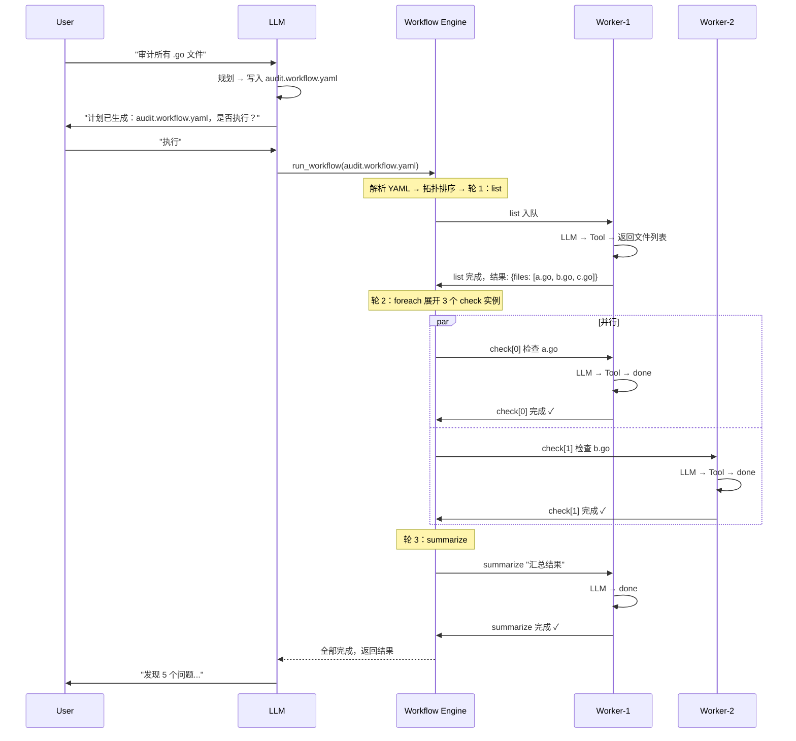
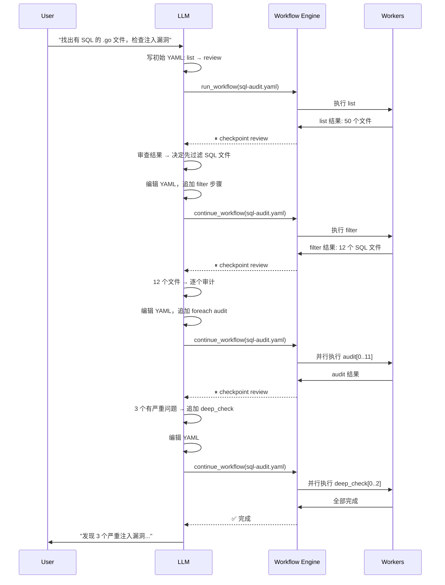

# Workflow — 任务编排与并行

## 背景

单 session 内，LLM 一次返回的 tool call 可以并行（改 ToolStage），但无法跨越 LLM 轮次。

Workflow 是一个 YAML 文件，用来声明多步骤任务——步骤间的依赖、每个步骤的描述。系统按拓扑顺序调度 workers：无依赖的步骤并行执行，上游完成后下游自动启动，全部完成后汇总结果交 LLM 整合输出。

对用户透明——输入输出不变，计划时可审查、执行时可观测。

## 为什么用 YAML

| 维度 | YAML 文件 | LLM 动态生成 JSON DAG |
|------|-----------|---------------------|
| LLM 可靠性 | 写文件是 LLM 强项 | 嵌套 JSON 参数容易出错 |
| 用户可见 | 先生成 → 审查 → 再执行 | 工具调用在内部，用户看不到 |
| 可复用 | 持久化，下次 `run xxx.yaml` | 一次性 |
| 可中断恢复 | 重跑 YAML 即可 | 上下文丢失就全没了 |
| 结果回溯 | 结果写回同目录 | 翻历史对话 |

## 文件格式

```yaml
# security-audit.workflow.yaml
version: "1"
name: Security Audit
description: 检查所有 .go 文件的安全漏洞并生成报告

steps:
  - id: list
    prompt: 列出项目所有 .go 文件的路径，以 JSON 返回
    output_schema:
      files: [string]

  - id: audit
    prompt: 检查 $each 的安全漏洞，包括 SQL 注入、XSS、硬编码密钥
    depends_on: [list]
    foreach: "$list.files"
    # list 返回 {"files":["a.go","b.go","c.go"]} → 展开为 audit[0] audit[1] audit[2]
    # $each = 每个文件名

  - id: report
    prompt: >
      汇总以下审计结果，生成安全报告：
      $audit[*].result
    depends_on: [audit]
```

**字段说明：**

| 字段 | 必填 | 说明 |
|------|------|------|
| `id` | ✓ | 步骤唯一标识 |
| `prompt` | ✓ | 发给 LLM 的任务描述，支持变量引用 `$step.field` |
| `depends_on` | | 上游步骤 id 列表，全部完成才执行 |
| `foreach` | | 动态展开：上游步骤返回列表时，每个元素创建一个实例 |
| `output_schema` | | 声明步骤输出的 JSON 结构，引擎解析后供后续步骤引用 |
| `timeout` | | 单步骤超时，默认 300s |
| `max_tokens` | | 步骤 LLM token 限制 |
| `checkpoint` | | true 时执行到此处暂停，等待审查 |

## 两种模式

### 模式 1：静态 DAG

步骤数固定，适合 LLM 能预判拆分粒度的场景：

```yaml
steps:
  - id: search_a
    prompt: 在 a 仓库搜索 TODO 注释
  - id: search_b
    prompt: 在 b 仓库搜索 TODO 注释
  - id: search_c
    prompt: 在 c 仓库搜索 TODO 注释
  - id: merge
    prompt: 合并上述搜索结果，去重后按文件分组
    depends_on: [search_a, search_b, search_c]
```

### 模式 2：动态展开（foreach）

步骤数量依赖上游结果，适合"列出文件 → 逐个处理 → 汇总"这种经典模式：

```yaml
steps:
  - id: list
    prompt: 列出 src/ 下所有 .go 文件，以 JSON 返回
    output_schema:
      files: [string]

  - id: check
    prompt: 检查 $each 的代码规范
    depends_on: [list]
    foreach: "$list.files"
    # → check 自动展开为 check[a.go], check[b.go]

  - id: summarize
    prompt: 汇总所有检查结果：$check[*].result
    depends_on: [check]
```

DAG 变化：

```
                    list
                     |
              +------+------+
              |      |      |
          check[0] check[1] check[2]    ← 运行时动态创建
              |      |      |
              +------+------+
                     |
                 summarize
```

### 模式 3：LLM 临时并行

3 个以内独立子任务且无后续依赖，不走文件，直接在 tool call 里一把梭：

```json
{
  "name": "parallel",
  "arguments": {
    "tasks": [
      {"id": "1", "description": "查天气"},
      {"id": "2", "description": "查新闻"},
      {"id": "3", "description": "查股价"}
    ]
  }
}
```

## 执行流程



## Workflow Engine

```go
// internal/workflow/engine.go

type Engine struct {
    steps       map[string]*Step
    ready       chan *Step
    resultCh    chan stepResult
    subTurnMgr  *SubTurnManager
    eventBus    *event.Bus
    logger      *zap.Logger
    workDir     string                   // workflow 文件所在目录，结果也写这里
}

type Step struct {
    ID          string
    Prompt      string
    DependsOn   []string
    ForEach     string                   // Go template，引用上游结果
    Timeout     time.Duration
    Status      StepStatus
    Result      json.RawMessage          // 步骤返回的原始结果
    TurnIDs     []string                 // foreach 展开后的 sub-turn id 列表
}

func (e *Engine) Run(ctx context.Context, wf *Workflow) (*WorkflowResult, error) {
    // 1. 拓扑排序 + 循环检测
    if err := e.validate(wf); err != nil {
        return nil, err
    }

    // 2. 事件循环
    e.enqueueReady()
    remaining := e.countRemaining()

    for remaining > 0 {
        select {
        case <-ctx.Done():
            e.markRemainingSkipped()
            return e.collectResults(), ctx.Err()
        case r := <-e.resultCh:
            e.updateStep(r)
            remaining--
            if r.Status == StepFailed {
                e.skipDependents(r.ID)
            } else {
                e.unblockDependents(r.ID)
            }
        }
    }

    // 3. 写回结果文件
    e.writeResultFile(wf)
    return e.collectResults(), nil
}
```

## Step 生命周期

```
pending ──→ ready ──→ running ──→ done
                 ↓         ↓
              (依赖未满足)  failed ──→ downstream skipped
```

- **pending** — 依赖未满足，等待上游
- **ready** — 依赖全部满足，等待 worker 领取
- **running** — worker 正在处理
- **done** — 成功完成，结果写入 resultCh
- **failed** — 执行失败或超时，下游自动 skipped
- **skipped** — 上游失败，无需执行

## 模板变量

Prompt 中使用 Go template 语法引用上游步骤的结果：

```
{{.stepID.field}}        — 引用步骤的返回字段
{{.list.files}}           — list 步骤返回的 files 数组
{{.list.error}}           — 步骤的错误信息

range 遍历：
{{range .audit}}
{{.Key}} → {{.Result}}
{{end}}
```

`foreach` 字段也一样：

```yaml
foreach: "$list.files"     # list 返回 {"files": [...]} → 按 files 数组展开
```

### 步骤间数据契约

`output_schema` 定义步骤的返回结构。引擎按 schema 解析 LLM 输出（纯文本 → JSON），校验后提供给后续步骤引用。没有声明 schema 的步骤，结果只作为纯文本传给下游。

```yaml
steps:
  - id: list
    prompt: 列出 src/ 下所有 .go 文件，以 JSON 数组返回
    output_schema:
      files: [string]          # 必须返回 {"files": ["a.go","b.go",...]}

  - id: add_numbers
    prompt: 计算 1+2+3 的结果
    output_schema:
      sum: number              # 必须返回 {"sum": 6}

  - id: check
    prompt: 检查 $file 的规范
    depends_on: [list]
    foreach: "$list.files"     # engine 从 list 结果中提取 files 数组
```

引擎解析流程：

```go
// 步骤完成后，LLM 返回纯文本
rawOutput := "{\"files\": [\"a.go\", \"b.go\"]}"

if step.OutputSchema != nil {
    parsed, err := parseJSON(rawOutput, step.OutputSchema)
    // 校验类型：files 必须是 []string
    // 校验通过 → step.Result = parsed
    // 校验失败 → step.Status = failed, step.Error = "output schema mismatch"
} else {
    step.Result = rawOutput  // 纯文本，下游用 "$step" 引用原文
}
```

没有 schema 时依然能用——只是下游拿到的是一整段文本。声明 schema 后，引擎帮你拆好字段。`foreach` 依赖 schema。

## 模板变量

Prompt 中使用 `$step.field` 语法引用上游结果，比 Go template 更直观：

```
$stepID.field       引用步骤的某个字段
$list.files          list 步骤返回的 files 数组
$step               引用步骤的原始文本（无 schema 时用这个）

foreach 遍历：
$each                当前迭代的元素值
$each.key            当前元素的 key（展开后的实例标识，如文件路径）
$audit               audit 步骤所有实例的结果列表

引用多个实例的结果：
$audit[0]            第 1 个实例的结果
$audit[*].result     所有实例的 result 字段（数组）
```

**对比 Go template：**

| 操作 | Go template | 简化语法 |
|------|-------------|---------|
| 引用字段 | `{{.list.files}}` | `$list.files` |
| 遍历 | `{{range .audit}}{{.Key}}{{end}}` | `$audit[*].result` |
| 当前元素 | `{{.}}` | `$each` |
| 原始文本 | `{{.list}}` | `$list` |

引擎内部将简化语法编译为 Go template 执行，用户看到的是 `$list.files`。

## 进度可见性

执行时流式推送：

```
[workflow] security-audit 开始执行，共 4 个步骤
[workflow] 轮 1：list 运行中...
[workflow] list 完成 ✓ (2.3s)
[workflow] 轮 2：audit 展开为 3 个实例，并行执行
[workflow] audit[a.go] 完成 ✓, audit[b.go] 完成 ✓, audit[c.go] 进行中...
[workflow] audit[c.go] 完成 ✓
[workflow] 轮 3：report 运行中...
[workflow] report 完成 ✓ (5.1s)
[workflow] 全部完成，结果保存至 security-audit.result.yaml
```

`/queue` 命令：

```
Agent Queue: 2 workers active, 1 pending / 1024 capacity

Workflow: security-audit (3/4 complete)
  Active:
    worker-1: [wf audit[c.go]] 检查 c.go 的安全漏洞... — elapsed 8s
    worker-2: [wf audit[b.go]] 检查 b.go 的安全漏洞... — elapsed 5s
  Pending:
    1. [wf report] 汇总审计结果... — blocked (waiting: audit)
```

## 结果文件

执行完成后，同目录生成 `{name}.result.yaml`：

```yaml
# security-audit.result.yaml
workflow: security-audit
status: completed
duration: 45.2s
steps:
  - id: list
    status: done
    duration: 2.3s
    result:
      files: [a.go, b.go]
  - id: audit
    status: done
    instances:
      - key: a.go
        status: done
        duration: 18.1s
        result: "a.go: 发现 2 个问题..."
      - key: b.go
        status: done
        duration: 15.7s
        result: "b.go: 发现 3 个问题..."
  - id: report
    status: done
    duration: 5.1s
    result: "共计发现 5 个安全问题..."
```

## 用户交互 — 审查与变更

YAML 生成后不会直接执行。用户先看到计划，可以审阅、修改、确认后再跑。

### 生成阶段

```
用户: "审计所有 .go 文件的安全漏洞"
  ↓
LLM: 生成 audit.workflow.yaml → 展示给用户

--- 计划预览 ---
name: Security Audit
steps:
  1. list     列出所有 .go 文件                  → {files: [...]}
  2. audit    foreach: 检查 $each 的安全漏洞     (depends: list)
  3. report   汇总审计结果                      (depends: audit)
---
是否执行？可以直接回复修改意见。
```

### 用户变更

用户像平常对话一样提修改，LLM 直接编辑 YAML：

```
用户: "audit 步骤加上 CSRF 检查"
  → LLM 编辑 audit.prompt，追加 "，包括 CSRF"
  → 重新展示更新后的 YAML

用户: "report 之前加一个 prioritize 步骤，按严重程度排序"
  → LLM 在 report 的 depends_on 中挂上 prioritize
  → 重新展示

用户: "去掉 list 步骤，只审计 routers/ 和 models/"
  → LLM 删掉 list，把 audit 的 foreach 改成固定列表
  → 重新展示

用户: "可以了，跑吧"
  → LLM 调用 run_workflow → 开始执行
```

### 执行中干预

跑起来以后也可以插手。checkpoint 暂停时，用户和 LLM 都能看到进度：

```
[workflow] 轮 2/3: audit 完成 8/12
[workflow] ⏸ checkpoint review — 当前结果可在 audit.workflow.yaml 查看

用户: "停，这个方向不对。剩下的文件改用静态分析，不要调 LLM"
  → LLM 更新剩余步骤的 prompt
  → 用户: "继续"
  → LLM: continue_workflow
```

### 变更约束

| 可变更 | 不可变更 |
|--------|---------|
| 未执行步骤的 prompt、timeout | 已执行完成步骤的结果 |
| 新增步骤（挂到任意已存在的依赖） | 已执行步骤的 depends_on（拓扑已定） |
| 删除未执行步骤 | 删除当前正在运行的步骤 |
| 调整 foreach 参数 | 改变已运行步骤的 id |

已完成的步骤结果已经在 result 文件里了，改不了也不需要改。未执行的部分完全自由。

## 动态 Workflow — 边执行边调整

YAML 不是死的。执行过程中，LLM 可以随时修改剩余步骤。这解决了"用户给一个模糊需求，逐步发现"的场景：

```
用户: "找出所有有 SQL 的文件，检查注入漏洞"
  → LLM 只知道大概方向，但不知道具体有哪些文件、哪些有 SQL
  → 先写一个初始 YAML：list → check → report
  → 执行 list，发现 50 个文件
  → LLM 查看结果，意识到需要先过滤 → 在 check 前插入 filter 步骤
  → YAML 更新：list → filter(SQL) → check → report
  → check 跑完后发现 3 个文件有问题
  → LLM 觉得需要深入看这 3 个 → 追加 deep_check 步骤
  → YAML 更新：... → check → deep_check → report
```

### 实现：checkpoint 机制

在 YAML 中声明 `checkpoint: true`——执行到此处暂停，LLM 审查结果后决定下一步：

```yaml
# sql-audit.workflow.yaml  ← 初始版本，LLM 只知道大概方向
version: "1"
name: SQL Injection Audit
description: 逐步发现并审计 SQL 文件

steps:
  - id: list
    prompt: 列出 src/ 下所有 .go 文件，以 JSON 返回
    output_schema:
      files: [string]

  - id: review                          # ← checkpoint 步骤
    checkpoint: true
    prompt: >
      已发现以下文件：
      $list.files
      
      请审查上述结果：
      1. 如果文件太多，先加一个 filter 步骤只保留含 SQL 的
      2. 如果文件数量合理，直接加 foreach audit 步骤逐个审计
      3. 编辑并保存此 YAML 后，调用 continue_workflow 继续
    # checkpoint 步骤不走 Compositor 管线
    # 引擎把结果交给 LLM，LLM 决定是否修改 YAML

  # ↓ 以下步骤初始为空，LLM 第一轮后追加
```

**第一轮后 LLM 编辑 YAML：**

```yaml
# sql-audit.workflow.yaml  ← 第二轮，LLM 追加了 filter
steps:
  - id: list
    # ... 同上 ...

  - id: review                          
    checkpoint: true
    prompt: >
      已发现 $list.files
      已过滤出含 SQL 的文件：$filter.sql_files
      
      如果结果合理，追加 foreach audit 步骤逐个审计。
      编辑并保存此 YAML 后，调用 continue_workflow 继续。

  - id: filter                          # ← LLM 追加
    prompt: 从 $list.files 中筛选出包含 SQL 代码的文件，以 JSON 返回
    depends_on: [list]
    output_schema:
      sql_files: [string]

  - id: review                          # ← LLM 追加第二个 checkpoint
    checkpoint: true
    prompt: ...
```

**最终版本：**

```yaml
# sql-audit.workflow.yaml  ← 最终版本，LLM 逐步追加完成
steps:
  - id: list
    prompt: 列出 src/ 下所有 .go 文件，以 JSON 返回
    output_schema:
      files: [string]

  - id: review
    checkpoint: true
    prompt: ...

  - id: filter
    prompt: 从 $list.files 中筛选出包含 SQL 代码的文件
    depends_on: [list]
    output_schema:
      sql_files: [string]

  - id: review
    checkpoint: true
    prompt: ...

  - id: audit
    prompt: 检查 $each 的 SQL 注入漏洞
    depends_on: [filter]
    foreach: "$filter.sql_files"

  - id: report
    prompt: 汇总审计结果：$audit[*].result，生成安全报告
    depends_on: [audit]
```

Checkpoint 步骤和普通步骤在 YAML 里的区别就是 `checkpoint: true` 一行——有它就是暂停点，没有就是自动流转。

```
YAML 演变过程：

v1:  list → review(已执行)
         → filter  ← LLM 追加
         
v2:  list → review → filter(已执行) → review
         → audit[0..N]  ← LLM 追加
         
v3:  list → review → filter → review → audit(已执行) → review
         → deep_check[0..2]  ← LLM 只对 2 个有问题的文件深入
```

### Checkpoint 规则

- 已完成的步骤**不可修改**（结果已写回，改也没用）
- 当前 checkpoint 之后的步骤可增删改
- 未执行的步骤可随时删除或修改 prompt
- 新增步骤可声明对任何已完成步骤的依赖

### 引擎支持

```go
func (e *Engine) Run(ctx context.Context, wf *Workflow) (*WorkflowResult, error) {
    for {
        done, err := e.executeRound(ctx, wf)
        if err != nil {
            return nil, err
        }
        if done {
            return e.collectResults(), nil
        }
        // 碰到 checkpoint，暂停，等 LLM 修改 YAML 后调用 continue
        return nil, ErrCheckpointReached
    }
}

func (e *Engine) Continue(ctx context.Context, wf *Workflow) (*WorkflowResult, error) {
    // 从上次 checkpoint 继续，跳过已完成的步骤
    return e.Run(ctx, wf)
}
```

### 断点续跑

进程崩溃或手动停止后，重启 workflow 从上次进度继续，不重复执行已完成的步骤。

result.yaml 在每一步完成后实时更新，记录了哪些步骤已完成、哪些还在运行。续跑时引擎读取 result.yaml，跳过已完成步骤，从第一个未完成的步骤开始。

```go
func (e *Engine) Run(ctx context.Context, wf *Workflow) (*WorkflowResult, error) {
    // 检查是否有未完成的 result 文件，决定是全新执行还是续跑
    prevResult := e.loadResult(wf.Name)
    if prevResult != nil && prevResult.Status == "running" {
        e.restoreFrom(prevResult)
    }
    // ... 正常调度循环
}

func (e *Engine) restoreFrom(prev *WorkflowResult) {
    for _, step := range prev.Steps {
        s := e.steps[step.ID]
        s.Status = step.Status
        s.Result = step.Result
        // foreach 展开的实例也逐个恢复状态
        for _, inst := range step.Instances {
            s.Instances[inst.Key] = inst.Status
        }
    }
    // 已完成的不再入队，从断点继续
}
```

场景：

```
[workflow] 轮 3/5: audit 完成 8/12
[workflow] audit[9] 运行中...
--- 进程崩溃 ---

用户重启: "继续上次的 sql-audit"
  → 引擎加载 sql-audit.result.yaml
  → list: done ✓ (跳过)
  → filter: done ✓ (跳过)
  → audit[0..7]: done ✓ (跳过)
  → audit[8]: running → 重跑（未确认完成）
  → audit[9..11]: pending → 继续调度
  → report: pending → 等 audit 全部完成
```

checkpoint 暂停状态也记录在 result.yaml 中，续跑时直接恢复到最后一次 checkpoint 之后。

### 完整流程



这就是"活的 YAML"——LLM 不是一次性写好所有步骤，而是**走一步看一步，根据需要调整**。

## 配置

```yaml
agent:
  pool_size: 4                    # 多 worker，建议 ≥4
  workflow_timeout: 600s          # 整个 workflow 总超时
  step_timeout: 300s              # 单个步骤超时
  max_steps: 50                   # 单次 workflow 最大步骤数（含展开后）
```

## 收益场景

| 场景 | 文件 | 加速比 |
|------|------|--------|
| 列出文件 → 逐个审计 → 生成报告 | `foreach` | ~5x |
| 3 个仓库同时搜索 → 合并结果 | 静态 DAG | ~3x |
| 读设计文档 → 改代码 → 跑测试 | 串行 DAG | ~2x（改代码并行） |
| 简单问答 | 无 | 1x |

<!-- last-modified: 2026-06-16 -->
