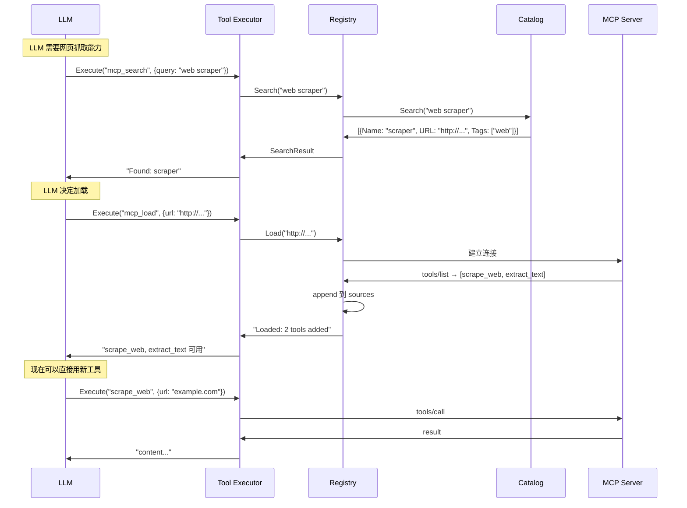
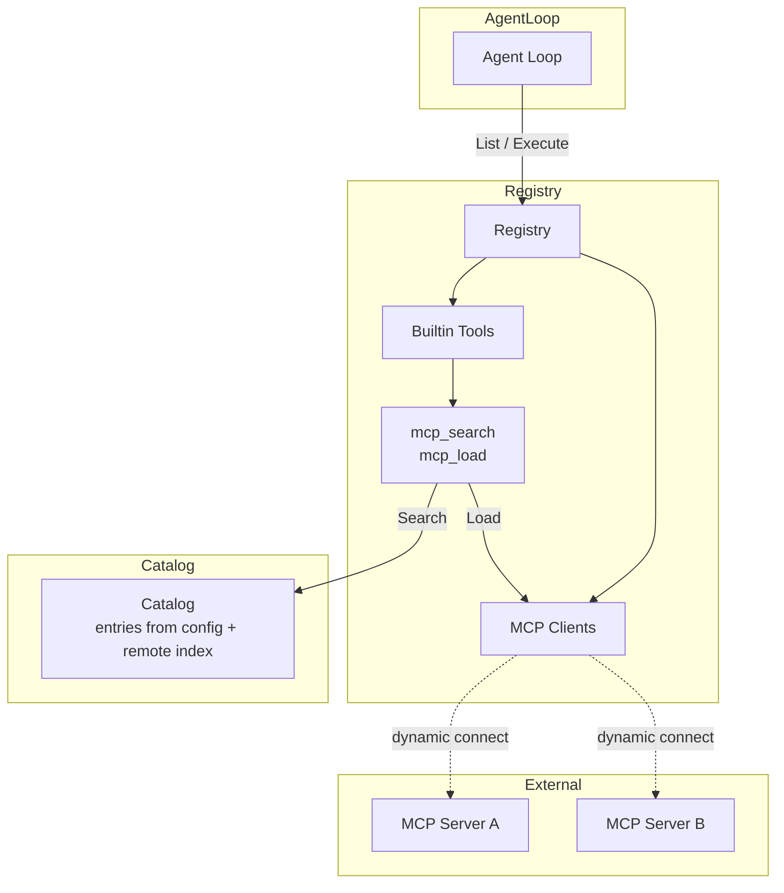

# Tool Executor

Tool Executor 管理工具定义和执行工具调用。工具来源包括内置函数和 MCP 服务器。
MCP 支持搜索和动态加载，允许 LLM 自主发现和接入新工具。

## ToolExecutor 接口

```go
type ToolExecutor interface {
    List(ctx context.Context) ([]ToolDef, error)
    Execute(ctx context.Context, call ToolCall) (*ToolResult, error)
}
```

## Registry：聚合注册中心 + 动态加载

```go
type Registry struct {
    sources []ToolExecutor
    catalog *Catalog  // 可搜索的 MCP 服务器目录
}

func (r *Registry) List(ctx context.Context) ([]ToolDef, error) {
    var all []ToolDef
    for _, s := range r.sources {
        defs, err := s.List(ctx)
        if err != nil {
            continue
        }
        all = append(all, defs...)
    }
    return all, nil
}

func (r *Registry) Execute(ctx context.Context, call ToolCall) (*ToolResult, error) {
    for _, s := range r.sources {
        defs, _ := s.List(ctx)
        for _, d := range defs {
            if d.Name == call.Name {
                return s.Execute(ctx, call)
            }
        }
    }
    return &ToolResult{ToolCallID: call.ID, Content: "tool not found", IsError: true}, nil
}

// Load 动态连接一个新的 MCP 服务器，将其工具加入来源
func (r *Registry) Load(ctx context.Context, serverURL string) error {
    client := NewMCPClient(serverURL)
    // 验证连接可用
    _, err := client.List(ctx)
    if err != nil {
        return err
    }
    r.sources = append(r.sources, client)
    return nil
}
```

## Catalog：MCP 服务器目录

Catalog 提供可搜索的 MCP 服务器列表，来源可以是本地配置或远程索引。

```go
// CatalogEntry 描述一个可用的 MCP 服务器
type CatalogEntry struct {
    Name        string   `json:"name"`
    Description string   `json:"description"`
    URL         string   `json:"url"`
    Tags        []string `json:"tags"`
}

type Catalog struct {
    entries []CatalogEntry
}

func (c *Catalog) Search(ctx context.Context, query string) ([]CatalogEntry, error) {
    // 按名称、描述、标签匹配
    var results []CatalogEntry
    for _, e := range c.entries {
        if matches(e, query) {
            results = append(results, e)
        }
    }
    return results, nil
}
```

## Search 和 Load 作为工具暴露

Search 和 Load 本身是注册在 Registry 中的内置工具，LLM 可以自主调用。



## 注册

```go
// Bootstrap 时把 Search 和 Load 作为内置工具注册
func RegisterMetaTools(r *Registry, catalog *Catalog) {
    r.RegisterBuiltin("mcp_search", func(ctx context.Context, args json.RawMessage) (*ToolResult, error) {
        var req struct{ Query string `json:"query"` }
        json.Unmarshal(args, &req)
        results, _ := catalog.Search(ctx, req.Query)
        data, _ := json.Marshal(results)
        return &ToolResult{Content: string(data)}, nil
    })

    r.RegisterBuiltin("mcp_load", func(ctx context.Context, args json.RawMessage) (*ToolResult, error) {
        var req struct{ URL string `json:"url"` }
        json.Unmarshal(args, &req)
        err := r.Load(ctx, req.URL)
        if err != nil {
            return &ToolResult{Content: "load failed: " + err.Error(), IsError: true}, nil
        }
        return &ToolResult{Content: "loaded successfully"}, nil
    })
}
```

## 数据流总览



## 配置

```go
// 启动时，从配置文件加载初始 MCP 服务器 + Catalog
func BuildToolRegistry(cfg *config.Config) (*Registry, error) {
    catalog := &Catalog{}
    for _, entry := range cfg.MCPCatalog {
        catalog.entries = append(catalog.entries, entry)
    }

    r := NewRegistry()

    // 注册内置工具
    r.RegisterBuiltin("get_weather", weatherHandler)
    RegisterMetaTools(r, catalog)  // mcp_search, mcp_load

    // 注册启动时需要预加载的 MCP 服务器
    for _, mcpCfg := range cfg.MCPServers {
        client := NewMCPClient(mcpCfg.URL)
        r.sources = append(r.sources, client)
    }

    return r, nil
}
```

<!-- last-modified: 2026-05-28 -->
