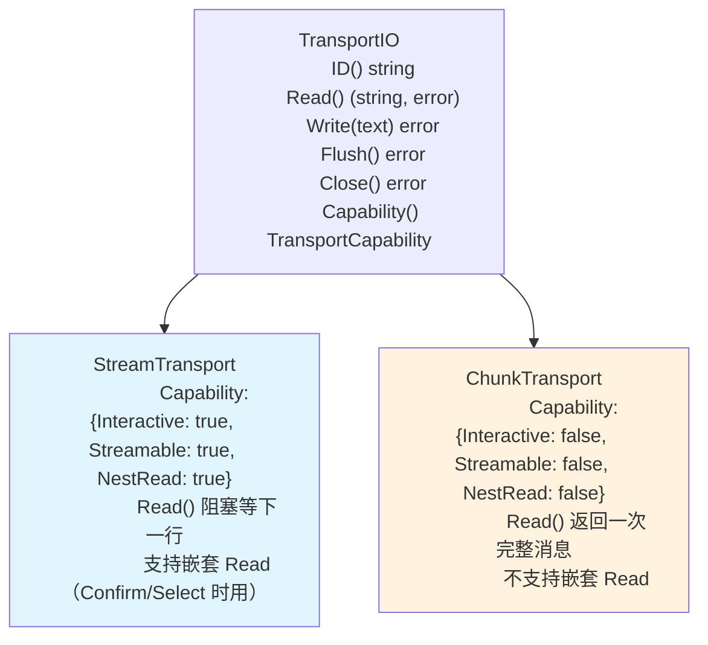
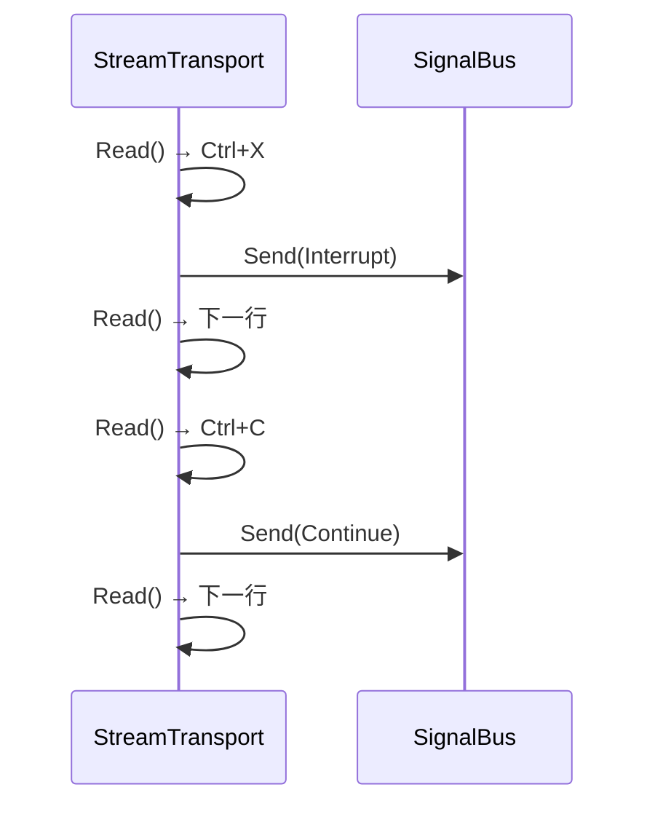

# TransportIO

TransportIO 是底层 IO 抽象，由配置驱动创建。

## 接口

```go
// TransportCapability 描述 TransportIO 的能力
type TransportCapability struct {
    Interactive bool  // 是否支持 Confirm/Select 交互
    Streamable  bool  // Write 是否可以实时推流
    NestRead    bool  // 是否支持在回调中嵌套 Read
}

type TransportIO interface {
    ID() string
    Read(ctx context.Context) (string, error)
    Write(ctx context.Context, text string) error
    Flush() error
    Close() error
    Capability() TransportCapability
}
```

## 两种实现



| 特性 | StreamTransport | ChunkTransport |
|------|----------------|----------------|
| Read 次数 | 多行，逐行返回 | 一次，完整消息 |
| Write | 实时推 | buffer 到 Flush |
| Confirm/Select | 可用 | error |
| 嵌套 Read | 支持 | 不支持 |

## 注册模式

TransportIO 使用注册模式，每种 Transport 实现通过 `init()` 或启动时注册自己的构造器：

```go
// TransportBuilder 创建 TransportIO 实例
type TransportBuilder func(ctx context.Context, cfg config.TransportConfig) (TransportIO, error)

// TransportRegistry 管理 Transport 类型到构造器的映射
type TransportRegistry struct {
    builders map[string]TransportBuilder
}

var globalRegistry = NewTransportRegistry()

func NewTransportRegistry() *TransportRegistry {
    return &TransportRegistry{builders: make(map[string]TransportBuilder)}
}

func (r *TransportRegistry) Register(name string, builder TransportBuilder) {
    r.builders[name] = builder
}

func (r *TransportRegistry) Build(ctx context.Context, cfg config.TransportConfig) (TransportIO, error) {
    builder, ok := r.builders[cfg.Type]
    if !ok {
        return nil, fmt.Errorf("unknown transport type: %s", cfg.Type)
    }
    return builder(ctx, cfg)
}
```

### 注册

```go
// stdio 包 init() 时自动注册
func init() {
    transport.Register("stdio", func(ctx context.Context, cfg config.TransportConfig) (TransportIO, error) {
        return NewStdioTransport(cfg.Stdio)
    })
}

// 新增 Transport 只需在自己的包中 init() 注册
// func init() {
//     transport.Register("webhook", NewWebhookTransport)
// }
```

### Pipeline 使用

```go
for _, tc := range cfg.Transports {
    tio, err := transport.Build(ctx, tc)
    if err != nil {
        return nil, err
    }
    agentIO.RegisterTransport(tio.ID(), tio)
}
```

## 信号集成

TransportIO 识别用户输入中的控制信号（如 Ctrl+X 对应 Interrupt），通过 SignalBus 发送。

### Context 创建

每个 `Read()` 调用创建一个带 Transport 上下文的 Context，沿整条链路传播：

```go
type transportKey struct{}

// TransportInfo 携带在 Context 中贯穿 Pipeline
type TransportInfo struct {
    ID        string
    Type      string    // "stdio" | "email" | ...
    ClientIP  string    // 可用时
}

func WithTransportInfo(ctx context.Context, info *TransportInfo) context.Context {
    return context.WithValue(ctx, transportKey{}, info)
}

func GetTransportInfo(ctx context.Context) *TransportInfo {
    return ctx.Value(transportKey{}).(*TransportInfo)
}
```



<!-- last-modified: 2026-05-28 -->
