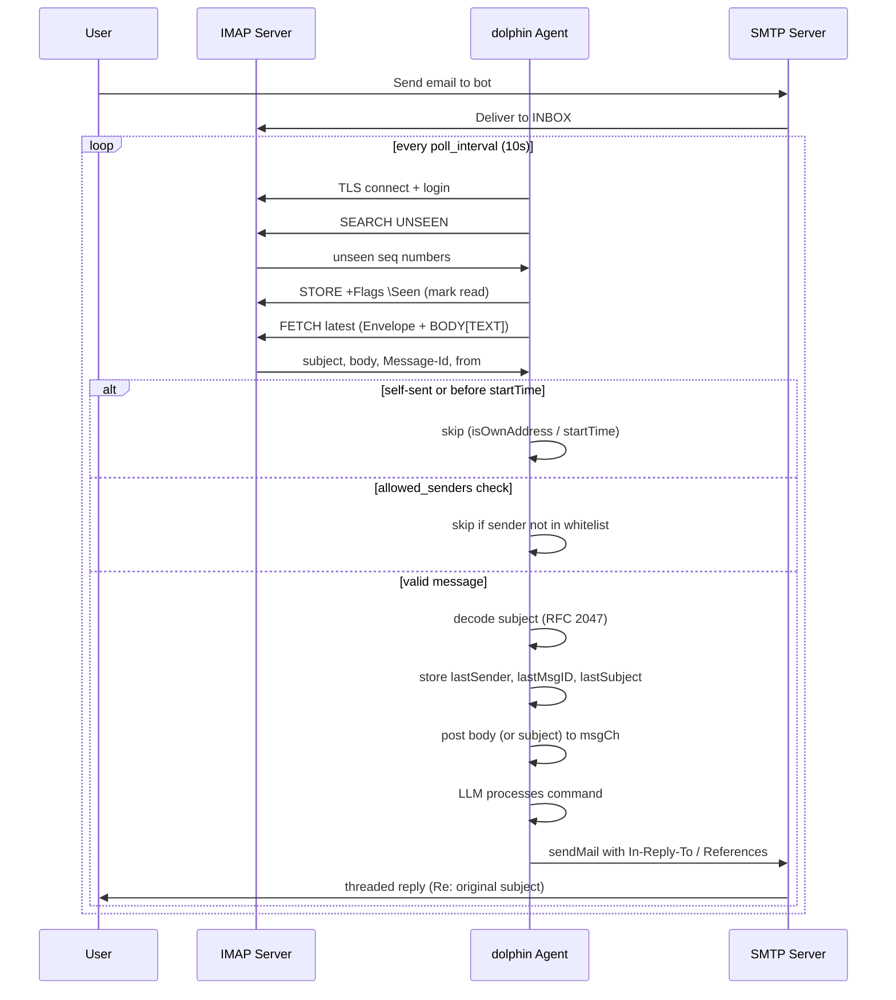

# Transport Layer (`internal/transport/`)

## Interfaces

```go
type Transport interface {
    Name() string
    Start(ctx) error   // 阻塞直到会话结束
    Close() error
}

type UserIO interface {
    ReadLine() (string, error)
    WriteLine(string) error
    WriteString(string) error
    Capabilities() Capabilities
    Context() context.Context
}
```

每个 Transport 绑定一个独立的 Coordinator goroutine。

## Implementations

| Transport | Library | Mechanism | Capabilities |
|-----------|---------|-----------|-------------|
| **stdio** | `chzyer/readline` | stdin/stdout 行编辑 | 全部支持 |
| **SSH** | `golang.org/x/crypto/ssh` | TCP :2222, 密码认证 | 全部支持 |
| **MQTT** | `eclipse/paho.mqtt.golang` | Subscribe command topic, Publish response topic | 非流式 |
| **Email** | `net/smtp` + `emersion/go-imap` | SMTP 发送, IMAP 轮询, 正文 → 命令, In-Reply-To 线索化回复 | 非流式 |
| **DingTalk** | `open-dingtalk/dingtalk-stream-sdk-go` | Stream 模式 (WebSocket 长连接), 无需公网IP | 非流式 |

## Email Transport Flow



### Filter Chain

1. **startTime check** — skip messages dated before agent process started
2. **isOwnAddress** — skip self-sent messages (from == `cfg.From` or `cfg.Username`, supports `@domain` suffix matching)
3. **allowed_senders** — if configured, only process messages from allowlisted addresses/domains
4. **Subject decode** — RFC 2047 encoded subjects (GBK, UTF-8 B/Q) are decoded before processing

### Reply Headers

| Header | Source |
|--------|--------|
| `From` | `cfg.From` (fallback: `cfg.Username`) |
| `To` | `lastSender` (set from incoming message envelope) |
| `Subject` | `Re: <decoded original subject>` |
| `In-Reply-To` | `<original Message-Id>` |
| `References` | `<original Message-Id>` |
