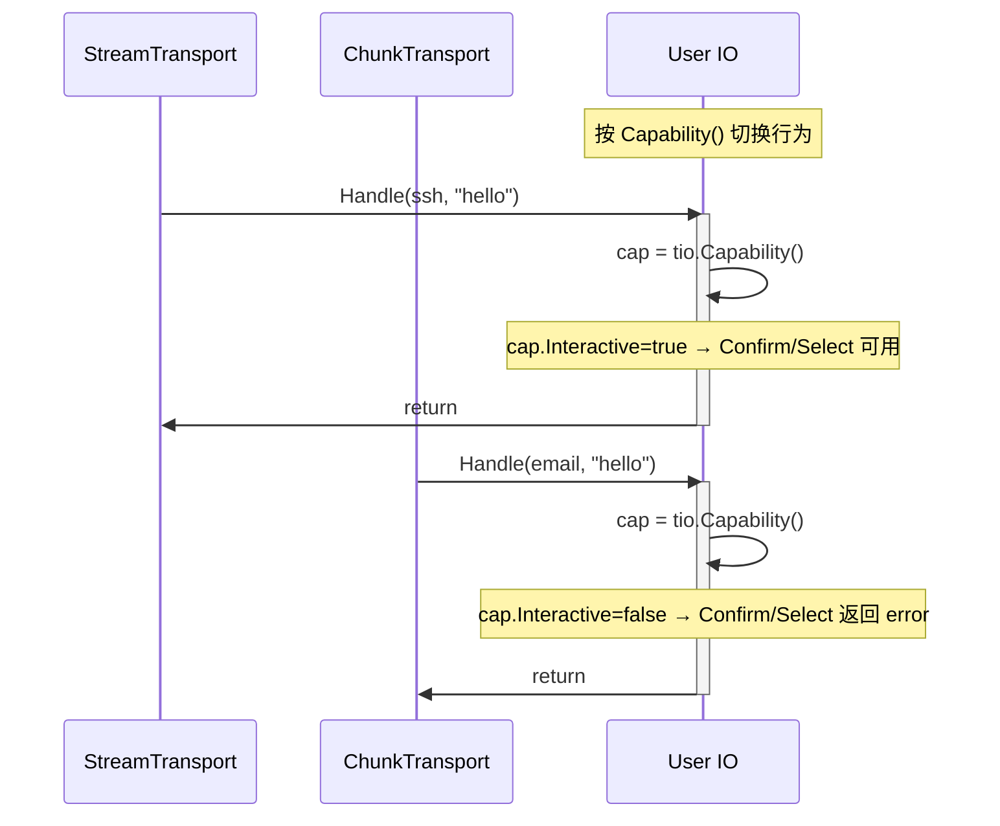
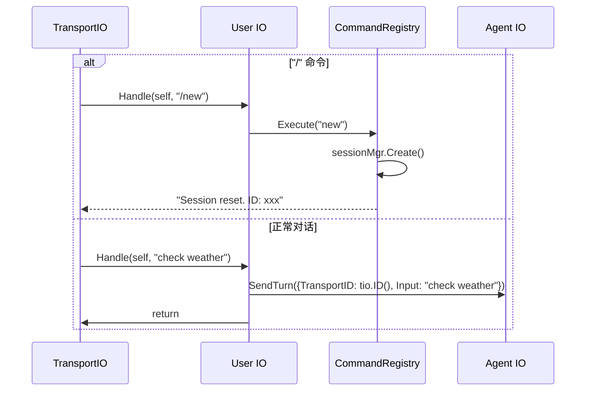

# User IO

User IO 是共享单例，每个 TransportIO 读取输入后通过 Handle 调进来。UserIO 根据传入的 TransportIO 决定行为模式。

## 接口

```go
type UserIO struct {
    agentIO   *AgentIO
    cmdReg    *CommandRegistry   // 命令路由到 cobra
}

func (u *UserIO) Handle(ctx context.Context, tio TransportIO, input string) {
    // 以 "/" 开头 → 走 cobra 命令
    if strings.HasPrefix(input, "/") {
        line := strings.TrimPrefix(input, "/")
        u.cmdReg.Execute(line)
        return
    }

    // 正常对话 → AgentIO，context 透传
    u.agentIO.SendTurn(ctx, &Turn{
        TransportID: tio.ID(),
        Input:       input,
    })
}

func (u *UserIO) ReadLine(ctx context.Context, tio TransportIO) (string, error) {
    return tio.Read(ctx)
}

func (u *UserIO) WriteLine(ctx context.Context, tio TransportIO, text string) error {
    return tio.Write(ctx, text)
}

func (u *UserIO) Confirm(ctx context.Context, tio TransportIO, msg string) (bool, error) {
    cap := tio.Capability()
    if !cap.Interactive {
        return false, fmt.Errorf("transport %s does not support interactive confirm", tio.ID())
    }
    tio.Write(ctx, msg)
    answer, err := tio.Read(ctx)
    if err != nil {
        return false, err
    }
    return strings.EqualFold(answer, "y") || strings.EqualFold(answer, "yes"), nil
}

func (u *UserIO) Select(ctx context.Context, tio TransportIO, opts []string) (int, error) {
    cap := tio.Capability()
    if !cap.Interactive {
        return 0, fmt.Errorf("transport %s does not support interactive select", tio.ID())
    }
    // write options, read choice
    for i, opt := range opts {
        tio.Write(ctx, fmt.Sprintf("%d. %s", i+1, opt))
    }
    answer, err := tio.Read(ctx)
    if err != nil {
        return 0, err
    }
    // parse answer
    return strconv.Atoi(strings.TrimSpace(answer))
}

func (u *UserIO) Flush(ctx context.Context, tio TransportIO) error {
    return tio.Flush()
}
```

## 模式切换



## 流程



<!-- last-modified: 2026-05-28 -->
