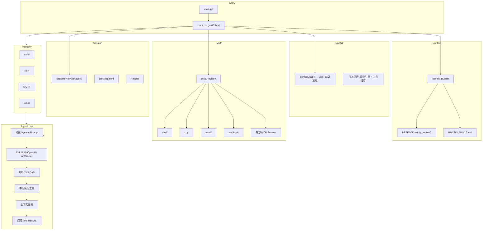
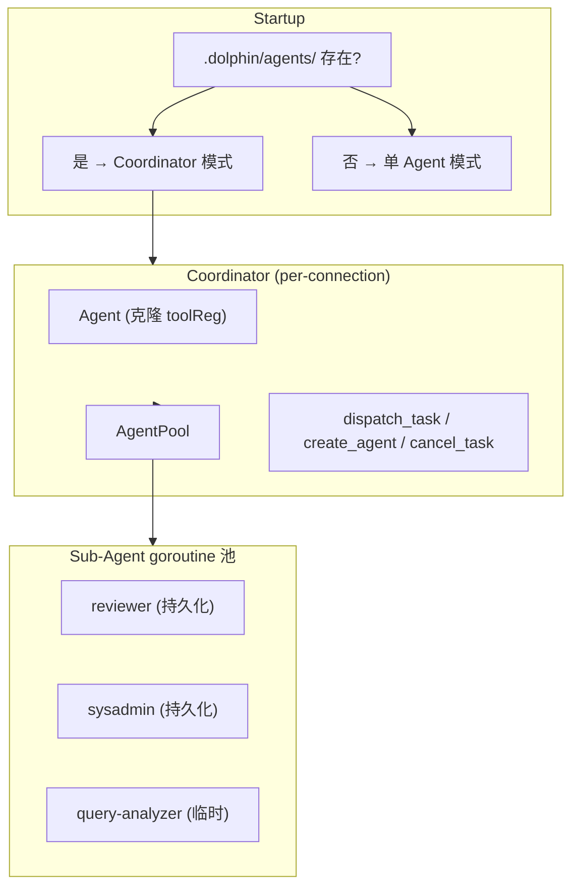
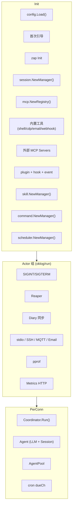

# Overall Architecture

## Context

Go 实现的 AI Agent 系统，支持 stdio/SSH/MQTT/Email 四种传输层，具备 Agent Loop、Viper 多级配置、MCP 工具集、会话管理、多 Agent 协同、插件系统、Prometheus 可观测性、国际化、定时任务和 Skills 技能系统。

## v0.1 — Single Agent



## v0.2 — Multi-Agent



## v0.3 — Full System



## Startup Flow

```
runAgent():
  1. config.Load() — 四级 Viper + 环境变量覆盖
  2. logger.Init() — zap + lumberjack
  3. 首次运行: 职业引导 → 工具推荐 → SYSTEM.md → config gen
  4. session.NewManager()
  5. mcp.NewRegistry() → Register 内置工具 → LoadServers()
  6. 检查 .dolphin/agents/ → coordinator / single-agent
  7. skill + command + scheduler Manager
  8. hook + event + plugin Manager
  9. newCoordinator factory (per-connection)
  10. run.Group{ signal, reaper, diary, transports, pprof, metrics }
  11. g.Run() — 任一 Actor 退出 → cancel 全部
```

<!-- last-modified: 2026-05-13 -->
