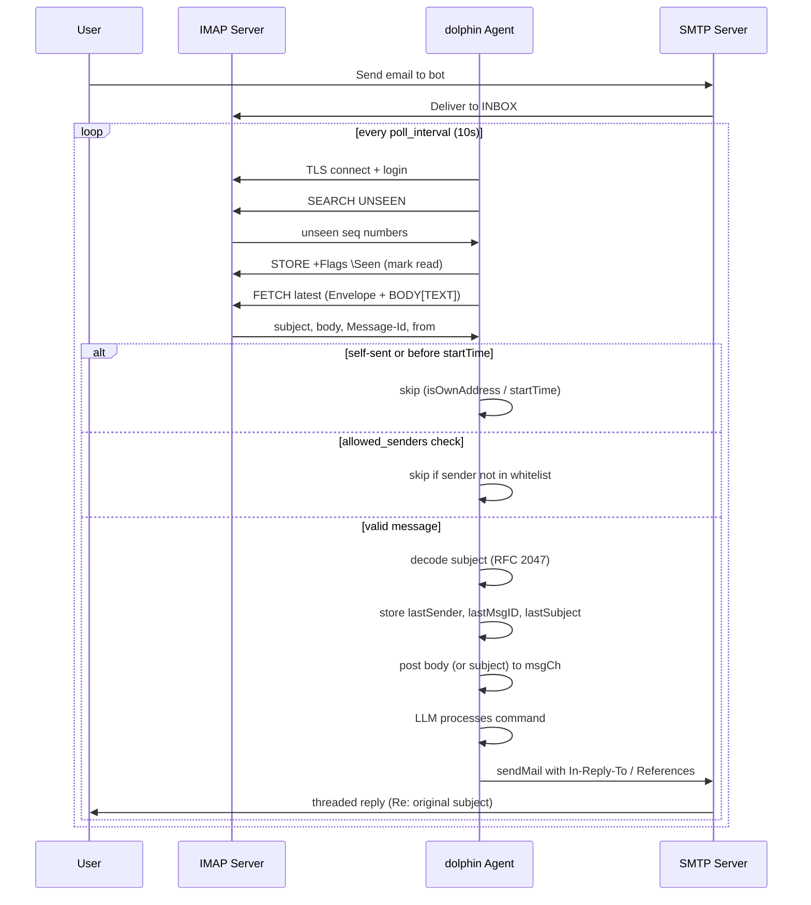

This document describes every configuration field in `config.yaml`. All settings have sensible defaults — you only need to override what you want to change.

**Configuration loading order** (each overrides the previous):
1. `/etc/dolphin/config.yaml` — system-wide
2. `~/.dolphin/config.yaml` — per-user
3. `.dolphin/config.yaml` — per-project
4. `-c <file>` flag — explicit override
5. `DZ_*` environment variables

> **Tip**: Use `dolphin init` to generate a commented default config file, or copy `docs/en/config.example.yaml` to `.dolphin/config.yaml` and edit.

---

## LLM (`llm`)

Controls the LLM provider, model selection, and generation parameters.

### Single-Provider Fields (Legacy)

These fields are used when `providers` is empty. They can also be set via `DZ_LLM_*` environment variables.

| Field | Type | Default | Description |
|-------|------|---------|-------------|
| `llm.type` | `string` | `"openai"` | Provider API type. `"openai"` for OpenAI-compatible APIs, `"anthropic"` for Anthropic API. |
| `llm.base_url` | `string` | `"https://api.openai.com/v1"` | API base URL. Override for proxy or compatible services. Env: `DZ_LLM_BASE_URL`. |
| `llm.api_key` | `string` | `""` | API key. **Recommended**: set via `DZ_LLM_API_KEY` env var instead of in the file. |
| `llm.model` | `string` | `"gpt-4o"` | Model identifier (e.g. `claude-sonnet-4-6`, `gpt-4o`, `deepseek-v4-flash`). Env: `DZ_LLM_MODEL`. |
| `llm.max_tokens` | `int` | `4096` | Maximum tokens per response. Env: `DZ_LLM_MAX_TOKENS`. |
| `llm.max_context_tokens` | `int` | `1048576` | Context window limit. When usage exceeds 70% of this, context compression triggers. |
| `llm.temperature` | `float` | `0.7` | Generation randomness. Range: `0.0` (deterministic) to `2.0` (creative). |
| `llm.max_sub_turns` | `int` | `10` | Max consecutive tool-call rounds per user turn (prevents runaway loops). |
| `llm.compress_mode` | `string` | `"drop"` | Context compression strategy. One of: `drop` (discard oldest), `segment` (merge segments), `tiered`, `incremental`, `topic`. |
| `llm.segment_merge_limit` | `int` | `100` | Segment count threshold before recursive merging (only used in `segment` mode). |

### Multi-Provider (`llm.providers`)

When `providers` is configured, startup tries each entry in order with a health check and uses the first that responds. If a provider has an empty `api_key`, it inherits from `llm.api_key` (or `DZ_LLM_API_KEY`). Similarly, empty `max_tokens` inherits from `llm.max_tokens`.

| Field | Type | Description |
|-------|------|-------------|
| `name` | `string` | Provider label (informational, e.g. `"deepseek"`, `"claude"`). |
| `type` | `string` | API type. `"openai"` or `"anthropic"`. |
| `base_url` | `string` | API endpoint URL. |
| `api_key` | `string` | API key for this provider. Falls back to `llm.api_key` if empty. |
| `model` | `string` | Model name. |
| `max_tokens` | `int` | Max tokens for this provider. Falls back to `llm.max_tokens` if zero. |

```yaml
llm:
  providers:
    - name: claude
      type: anthropic
      api_key: ""
      base_url: https://api.anthropic.com/v1
      model: claude-sonnet-4-6
    - name: deepseek
      type: openai
      api_key: ""
      base_url: https://api.deepseek.com/v1
      model: deepseek-v4-flash
```

---

## Sessions (`session`)

Controls session persistence, auto-checkpoint, and cleanup.

| Field | Type | Default | Description |
|-------|------|---------|-------------|
| `session.dir` | `string` | `"/tmp/dolphin"` | Directory for session files. |
| `session.max_loop` | `int` | `50` | Max turns per session before a checkpoint summary is saved. |
| `session.summary` | `bool` | `true` | Auto-generate a session summary on checkpoint. |
| `session.max_age` | `string` | `"24h"` | Auto-delete sessions older than this duration (e.g. `"72h"`, `"7d"`). Env: `DZ_SESSION_MAX_AGE`. |
| `session.resume` | `bool` | `false` | If true, prompt to resume the last session on startup. |

---

## MCP Tools (`mcp`)

Configures the Model Context Protocol tools available to the agent.

### Shell (`mcp.shell`)

Executes shell commands.

| Field | Type | Default | Description |
|-------|------|---------|-------------|
| `mcp.shell.enabled` | `bool` | `true` | Enable the shell tool. |
| `mcp.shell.timeout_seconds` | `int` | `30` | Per-command timeout. |
| `mcp.shell.priority` | `int` | `10` | Tool listing priority (lower = listed first). |
| `mcp.shell.max_command_length` | `int` | `4096` | Max characters per command. |
| `mcp.shell.allowed_commands` | `[]string` | `[]` | Allowlist of command names (empty = allow all). Populated automatically in restrictive mode. |

### CDP Browser (`mcp.cdp`)

Chrome DevTools Protocol — browser automation.

| Field | Type | Default | Description |
|-------|------|---------|-------------|
| `mcp.cdp.enabled` | `bool` | `true` | Enable browser automation. |
| `mcp.cdp.headless` | `bool` | `true` | Run browser in headless mode (no GUI). |
| `mcp.cdp.priority` | `int` | `1000` | Tool listing priority. |
| `mcp.cdp.ws_url` | `string` | `""` | Connect to an existing CDP endpoint instead of launching a new browser. |
| `mcp.cdp.idle_timeout` | `int` | `300` | Seconds of inactivity before auto-closing the browser. Set to `0` to disable. |
| `mcp.cdp.startup_timeout` | `int` | `30` | Seconds to wait for browser init verification. Cold starts on macOS can be slow. |

### Email MCP (`mcp.email`)

Email send/search/fetch tool (requires `transport.email` to be configured separately).

| Field | Type | Default | Description |
|-------|------|---------|-------------|
| `mcp.email.enabled` | `bool` | `true` | Enable the email MCP tool. |
| `mcp.email.priority` | `int` | `500` | Tool listing priority. |

### Webhook MCP (`mcp.webhook`)

HTTP webhook tool for sending requests to external services.

| Field | Type | Default | Description |
|-------|------|---------|-------------|
| `mcp.webhook.enabled` | `bool` | `true` | Enable the webhook tool. |
| `mcp.webhook.priority` | `int` | `100` | Tool listing priority. |
| `mcp.webhook.targets` | `map[string]object` | `{}` | Named pre-configured webhook targets. Each target has: `url` (string, required), `method` (string, default `"POST"`), `headers` (map[string]string). |

```yaml
mcp:
  webhook:
    targets:
      my_bot:
        url: "https://hooks.example.com/webhook"
        method: POST
        headers: {Authorization: "Bearer my-token"}
```

### External MCP Servers (`mcp.servers`)

Connect to external MCP servers. Each key is a server name.

| Field | Type | Description |
|-------|------|-------------|
| `type` | `string` | Transport type. One of: `"stdio"` (subprocess), `"sse"` (Server-Sent Events), `"http-stream"`. |
| `command` | `string` | Executable path (for `stdio` type). |
| `args` | `[]string` | Command arguments (for `stdio` type). |
| `url` | `string` | Server URL (for `sse` / `http-stream` types). |
| `headers` | `map[string]string` | Custom HTTP headers (e.g. `Authorization`). |
| `timeout` | `int` | Request timeout in seconds (`0` = default `30`). |

```yaml
mcp:
  servers:
    my-server:
      type: stdio
      command: npx
      args: ["-y", "@modelcontextprotocol/server-filesystem"]
    remote-server:
      type: sse
      url: "https://mcp.example.com/sse"
      headers: {Authorization: "Bearer token"}
```

### MCP Repos (`mcp.repos`)

| Field | Type | Default | Description |
|-------|------|---------|-------------|
| `mcp.repos` | `[]string` | `[]` | Manifest repository URLs for discovering community MCP tools, e.g. `["dolphinv/mcp"]`. |

---

## Agent Pool (`agent_pool`)

Controls concurrent sub-agent execution.

| Field | Type | Default | Description |
|-------|------|---------|-------------|
| `agent_pool.max_concurrency` | `int` | `5` | Maximum simultaneous sub-agent tasks. |
| `agent_pool.default_timeout` | `int` | `300` | Default timeout per task in seconds. |
| `agent_pool.workspace_dir` | `string` | `".dolphin/workspaces"` | Directory for sub-agent workspaces. |
| `agent_pool.idle_timeout` | `int` | `600` | Seconds before reaping idle temporary agents. |
| `agent_pool.max_pending_results` | `int` | `10` | Max pending results preserved per agent. |
| `agent_pool.max_pending_result_len` | `int` | `500` | Max characters per result in the prompt. `0` = no truncation. |

---

## Skills (`skills`)

Manages skill files that teach the agent new capabilities.

| Field | Type | Default | Description |
|-------|------|---------|-------------|
| `skills.dir` | `string` | `".dolphin/skills"` | Directory containing skill `.md` files. |
| `skills.max_top` | `int` | `10` | Number of top-ranked skills injected into the LLM context. |
| `skills.repos` | `[]string` | `[]` | Skill manifest repository URLs, e.g. `["dolphinv/skills"]`. |

---

## Transports (`transport`)

Controls how the agent communicates: local terminal, SSH, MQTT, email, or DingTalk.

### Stdio (`transport.stdio`)

Local terminal I/O.

| Field | Type | Default | Description |
|-------|------|---------|-------------|
| `transport.stdio.enabled` | `bool` | `true` | Enable local terminal interaction. Env: `DZ_TRANSPORT_STDIO_ENABLED`. |

### SSH (`transport.ssh`)

Remote shell access.

| Field | Type | Default | Description |
|-------|------|---------|-------------|
| `transport.ssh.enabled` | `bool` | `false` | Enable SSH transport. |
| `transport.ssh.addr` | `string` | `":2222"` | Listen address (e.g. `"0.0.0.0:2222"`, `"localhost:2222"`). |
| `transport.ssh.host_key` | `string` | `"~/.ssh/id_ed25519"` | Path to the SSH host private key. |
| `transport.ssh.username` | `string` | `"dolphin"` | SSH login username. |
| `transport.ssh.password` | `string` | `""` | SSH password. Auto-generated on first start if empty and SSH is enabled. |

### MQTT (`transport.mqtt`)

MQTT messaging transport.

| Field | Type | Default | Description |
|-------|------|---------|-------------|
| `transport.mqtt.enabled` | `bool` | `false` | Enable MQTT transport. Env: `DZ_TRANSPORT_MQTT_ENABLED`. |
| `transport.mqtt.broker` | `string` | `"tcp://localhost:1883"` | MQTT broker URL. Env: `DZ_MQTT_BROKER`. |
| `transport.mqtt.topic` | `string` | `"dolphin/agent/command"` | Command subscription topic. Env: `DZ_MQTT_TOPIC`. |
| `transport.mqtt.response_topic` | `string` | `"dolphin/agent/response"` | Response publication topic. Env: `DZ_MQTT_RESPONSE_TOPIC`. |
| `transport.mqtt.client_id` | `string` | `"dolphin-agent"` | MQTT client ID. |
| `transport.mqtt.embedded` | `bool` | `true` | Run an embedded MQTT broker. Env: `DZ_MQTT_EMBEDDED`. |
| `transport.mqtt.embedded_addr` | `string` | `":1883"` | Listen address for the embedded broker. Env: `DZ_MQTT_EMBEDDED_ADDR`. |
| `transport.mqtt.embedded_accounts` | `[]object` | `[]` | Credentials for the embedded broker. If empty and embedded is enabled, one account is auto-generated. Each entry has: `username` (string), `password` (string). Env: `DZ_MQTT_USER` / `DZ_MQTT_PASSWORD` set the first account. |
| `transport.mqtt.username` | `string` | `""` | Client username for broker connection (not the embedded broker). |
| `transport.mqtt.password` | `string` | `""` | Client password for broker connection. Auto-populated from the first embedded account if empty. |

### Email (`transport.email`)

Email transport — receives instructions and sends responses via SMTP/IMAP.

| Field | Type | Default | Description |
|-------|------|---------|-------------|
| `transport.email.enabled` | `bool` | `false` | Enable email transport. |
| `transport.email.protocol` | `string` | `"imap"` | Incoming mail protocol. `"imap"` or `"pop3"`. |
| `transport.email.smtp_host` | `string` | `""` | SMTP server hostname for outgoing mail. |
| `transport.email.smtp_port` | `int` | `587` | SMTP port (typically `587` for STARTTLS, `465` for SSL/TLS). |
| `transport.email.imap_host` | `string` | `""` | IMAP server hostname. |
| `transport.email.imap_port` | `int` | `993` | IMAP port (typically `993` for SSL/TLS). |
| `transport.email.pop3_host` | `string` | `""` | POP3 server hostname. Defaults to `imap_host` / `smtp_host` if empty. |
| `transport.email.pop3_port` | `int` | `995` | POP3 port (typically `995` for SSL/TLS). |
| `transport.email.username` | `string` | `""` | Email account username. Env: `DZ_EMAIL_USERNAME`. |
| `transport.email.password` | `string` | `""` | Email account password. **Recommended**: set via `DZ_EMAIL_PASSWORD` env var. |
| `transport.email.from` | `string` | `""` | "From" address for outgoing mail. |
| `transport.email.use_tls` | `bool` | `true` | Enable TLS for SMTP and IMAP. |
| `transport.email.skip_tls_verify` | `bool` | `false` | Skip TLS certificate verification (for self-signed certificates). |
| `transport.email.poll_interval` | `string` | `"10s"` | IMAP inbox poll interval (e.g. `"30s"`, `"5m"`). |
| `transport.email.allowed_senders` | `[]string` | `[]` | Allowlist of sender addresses or domains. Entries starting with `@` match any address ending with that domain suffix (e.g. `"@siciv.space"` matches `user@siciv.space`). Empty = allow all senders. |

**Email transport flow:**



### DingTalk (`transport.dingtalk`)

DingTalk bot transport via Stream mode (WebSocket long connection). The bot actively connects to DingTalk servers — no public IP or callback URL needed.

| Field | Type | Default | Description |
|-------|------|---------|-------------|
| `transport.dingtalk.enabled` | `bool` | `false` | Enable DingTalk transport. Env: `DZ_DINGTALK_ENABLED`. |
| `transport.dingtalk.client_id` | `string` | `""` | DingTalk app AppKey. Env: `DZ_DINGTALK_CLIENT_ID`. |
| `transport.dingtalk.client_secret` | `string` | `""` | DingTalk app AppSecret. Env: `DZ_DINGTALK_CLIENT_SECRET`. |

**Quickstart:**

1. Create a DingTalk Open Platform app at [open.dingtalk.com](https://open.dingtalk.com), select **"Enterprise Internal App"**
2. Go to **App Development → Robot → Application Robot** (not Bot), create a robot
3. Set message receive mode to **Stream** (the robot actively connects to DingTalk servers — no public IP or callback URL needed)
4. Under **Permission Management**, grant `qyapi_robot_sendmsg` permission
5. Copy AppKey → `client_id`, AppSecret → `client_secret`
6. Add the bot to a group chat and `@robot <command>`

```yaml
transport:
  dingtalk:
    enabled: true
    client_id: "your-appkey"
    client_secret: "your-appsecret"
```

---

## Crontab (`crontab`)

Scheduled task management.

| Field | Type | Default | Description |
|-------|------|---------|-------------|
| `crontab.file` | `string` | `".dolphin/CRONTAB.md"` | Path to the crontab file (Markdown format with cron expressions). |
| `crontab.check_interval` | `string` | `"30s"` | How often to check for pending tasks (e.g. `"10s"`, `"1m"`). |

---

## Diary (`diary`)

Aggregates session summaries into a hierarchical diary (day → week → month → year).

| Field | Type | Default | Description |
|-------|------|---------|-------------|
| `diary.dir` | `string` | `".dolphin/diary"` | Diary storage directory. |
| `diary.max_day_sessions` | `int` | `200` | Max sessions per day before pruning the oldest. |
| `diary.max_week_days` | `int` | `7` | Max days per week before pruning the oldest. |
| `diary.max_month_weeks` | `int` | `5` | Max weeks per month before pruning the oldest. |
| `diary.max_year_months` | `int` | `12` | Max months per year before pruning the oldest. |
| `diary.max_total_mb` | `int` | `500` | Total diary size limit in MB. Exceeding this deletes the oldest year. |

---

## Plugins (`plugins`)

Dolphin has two extension systems:

- **Hook** (sync) — intercepts the agent loop at specific points. At abortable points, returning an error aborts the flow.
- **Event** (async) — subscribes to notifications dispatched in the background. Delivered via webhook (HTTP POST) or JSONL log.

Both can be driven by script plugins in the plugins directory.

| Field | Type | Default | Description |
|-------|------|---------|-------------|
| `plugins.enabled` | `bool` | `true` | Enable the plugin system. |
| `plugins.dir` | `string` | `"~/.dolphin/plugins/"` | Directory for plugin scripts (executable scripts or `.md` files). |
| `plugins.webhook_url` | `string` | `""` | HTTP endpoint for event delivery. Events are POSTed as JSON. |
| `plugins.webhook_events` | `[]string` | `["*"]` | Event types to deliver. `["*"]` delivers all. Filter with a list like `["tool:called", "tool:completed"]`. |

**Available event types**: `session:created`, `session:ended`, `user:message`, `llm:response`, `tool:called`, `tool:completed`, `compression`, `error`, `heartbeat`, `agent:dispatched`, `agent:completed`, `skill:loaded`.

| Field | Type | Default | Description |
|-------|------|---------|-------------|
| `plugins.heartbeat_turns` | `int` | `0` | Emit a `heartbeat` event every N turns. `0` = off. |

**Available hook points** († = abortable): `session:start`, `session:end`, `user:input†`, `llm:before†`, `llm:after`, `tool:before†`, `tool:after`, `response:before`, `error`.

Each hook script receives the context as JSON on stdin and may return a modified JSON object on stdout.

```yaml
# Example: audit all user input
plugins:
  dir: ~/.dolphin/plugins/
  webhook_url: "https://hooks.example.com/dolphin"
  webhook_events: ["tool:called", "tool:completed"]
  heartbeat_turns: 5
```

---

## Observability

| Field | Type | Default | Description |
|-------|------|---------|-------------|
| `log_level` | `string` | `"info"` | Log level. One of: `"debug"`, `"info"`, `"warn"`, `"error"`, `"dpanic"`, `"panic"`, `"fatal"`. Env: `DZ_LOG_LEVEL`. |
| `log_file` | `string` | `".dolphin/logs/agent.log"` | Log file path. Env: `DZ_LOG_FILE`. |

---

## Pprof (`pprof`)

Go pprof profiling endpoints. For debugging performance issues.

| Field | Type | Default | Description |
|-------|------|---------|-------------|
| `pprof.enabled` | `bool` | `false` | Enable pprof HTTP server. |
| `pprof.addr` | `string` | `"127.0.0.1:6060"` | Listen address (e.g. `":6060"` for all interfaces). |

---

## Metrics (`metrics`)

Prometheus-style metrics endpoint.

| Field | Type | Default | Description |
|-------|------|---------|-------------|
| `metrics.enabled` | `bool` | `false` | Enable metrics HTTP server. |
| `metrics.addr` | `string` | `"127.0.0.1:9090"` | Listen address (e.g. `":9090"` for all interfaces). |

---

## Environment Variables

All settings can be overridden via `DZ_`-prefixed environment variables at runtime.

| Variable | Overrides | Description |
|----------|-----------|-------------|
| `DZ_LLM_API_KEY` | `llm.api_key` | API key (propagated to all providers with empty keys) |
| `DZ_LLM_BASE_URL` | `llm.base_url` | API base URL |
| `DZ_LLM_MODEL` | `llm.model` | Model name |
| `DZ_LLM_TYPE` | `llm.type` | Provider type (`"openai"` / `"anthropic"`) |
| `DZ_LLM_MAX_TOKENS` | `llm.max_tokens` | Max tokens per response |
| `DZ_LOG_LEVEL` | `log_level` | Log level |
| `DZ_LOG_FILE` | `log_file` | Log file path |
| `DZ_SESSION_MAX_AGE` | `session.max_age` | Session retention duration |
| `DZ_TRANSPORT_STDIO_ENABLED` | `transport.stdio.enabled` | Enable stdio transport |
| `DZ_TRANSPORT_MQTT_ENABLED` | `transport.mqtt.enabled` | Enable MQTT transport |
| `DZ_MQTT_BROKER` | `transport.mqtt.broker` | MQTT broker URL |
| `DZ_MQTT_TOPIC` | `transport.mqtt.topic` | MQTT command topic |
| `DZ_MQTT_RESPONSE_TOPIC` | `transport.mqtt.response_topic` | MQTT response topic |
| `DZ_MQTT_EMBEDDED` | `transport.mqtt.embedded` | Enable embedded broker |
| `DZ_MQTT_EMBEDDED_ADDR` | `transport.mqtt.embedded_addr` | Embedded broker address |
| `DZ_MQTT_USER` | `transport.mqtt.embedded_accounts[0].username` | First embedded account username |
| `DZ_MQTT_PASSWORD` | `transport.mqtt.embedded_accounts[0].password` | First embedded account password |
| `DZ_EMAIL_USERNAME` | `transport.email.username` | Email username |
| `DZ_EMAIL_PASSWORD` | `transport.email.password` | Email password |

---

## Restrictive Mode

Run `dolphin init --restrictive` to generate a security-hardened config:

- **Shell**: only allowlisted commands (`ls`, `cat`, `grep`, `find`, `pwd`, `date`, `echo`, `head`, `tail`, `wc`, `sort`, `whoami`, `uname`)
- **CDP browser automation**: disabled
- **Webhook tool**: disabled
- **Log level**: `warn` (reduces secret leakage in logs)
- **Plugins**: disabled

<!-- last-modified: 2026-05-16 -->
