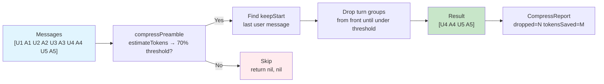
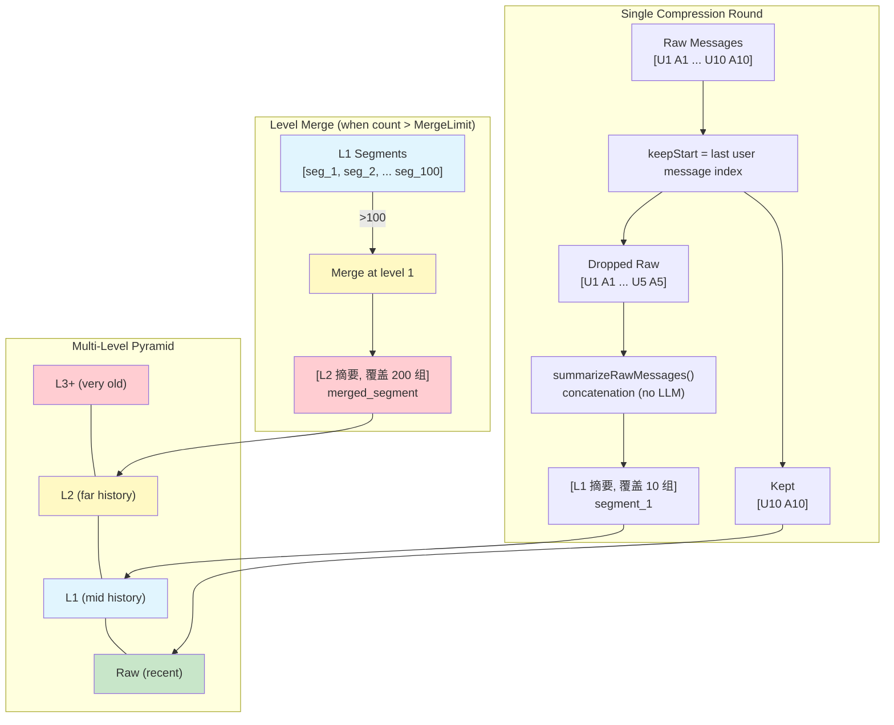
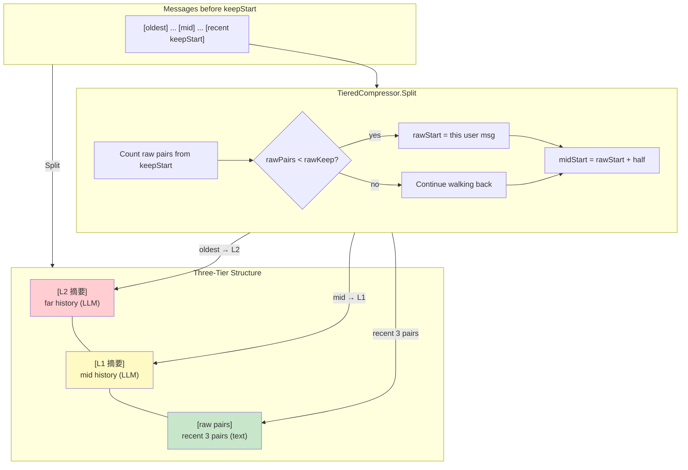
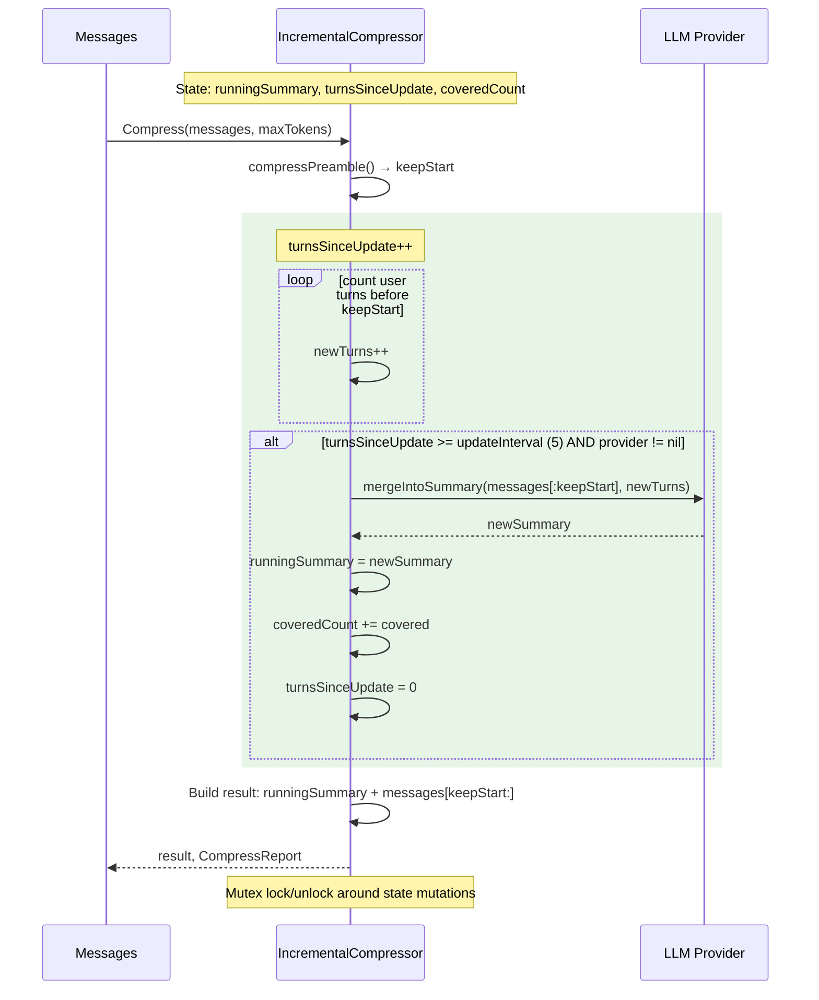
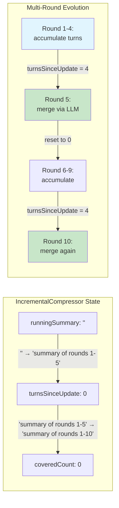
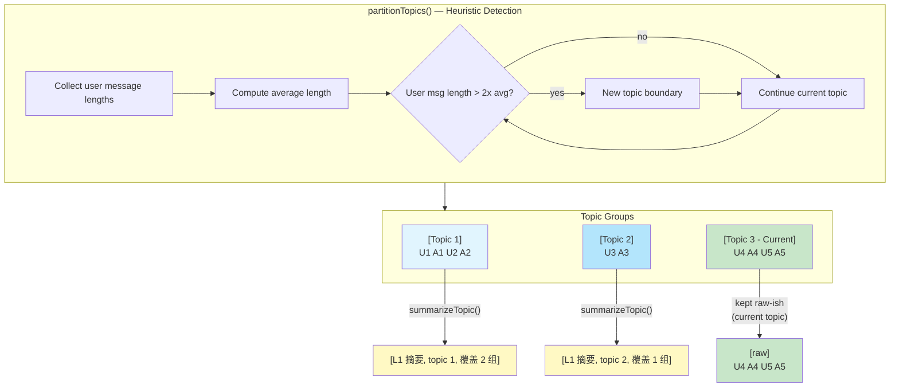
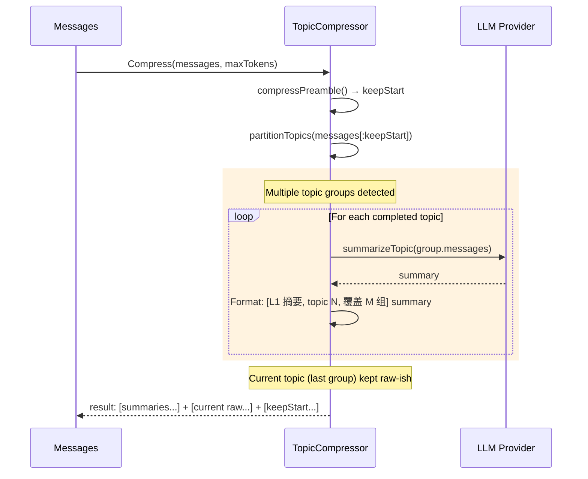

Dolphin automatically manages context windows by compressing long conversations. This ensures the LLM never rejects requests due to token limits.

## How It Works

When your conversation approaches 70% of `max_context_tokens`, Dolphin compresses the message history using one of the strategies below.

All strategies share a **common preamble**:
1. Estimate total tokens (CJK-aware: ~1 token per CJK char, bytes/3.5 for ASCII)
2. If under 70% threshold → skip compression
3. If ≤6 messages → skip (too small to compress)
4. Find `keepStart` — the last user message + everything after it
5. If no messages before `keepStart` → skip

## Compression Strategies

### drop (Default)

The simplest strategy: drops complete user+assistant turn groups from the front.

- No summarization, no LLM calls
- Fast, zero cost, no latency
- Best for: short sessions, interactive use



### segment

Creates a multi-level pyramid of summaries. Each compression round generates an L1 segment from dropped messages. When any level exceeds `segment_merge_limit` (default 100), segments merge into the next level.

- Uses concatenation for summaries (LLM integration planned)
- Best for: very long sessions with predictable growth



### tiered

Three-tier cache structure: L2 (far history) → L1 (mid history) → raw (recent N pairs).

- Keeps last 3 user+assistant pairs as raw text
- Uses LLM to generate summaries for L2 and L1
- Best for: sessions needing detailed recent context with summarized old history



### incremental

Single running summary, incrementally updated every N turns (default 5).

- New messages merge into the existing summary via LLM call
- Thread-safe (mutex-protected state)
- Drift risk: low-quality summaries compound over time
- Best for: sessions where maintaining a coherent running narrative matters





### topic

Partitions messages by topic boundaries (user message length >2x average → new topic).

- Each completed topic group is independently summarized
- Topic metadata preserved: `[L1 摘要, topic N, 覆盖 M 组]`
- Best for: sessions that naturally switch between distinct topics





## Configuration

Configure via `llm.compress_mode` in config.yaml:

| Value | Strategy |
|-------|----------|
| `drop` (default) | DropCompressor — simplest, no LLM |
| `segment` | SegmentCompressor — multi-level pyramid |
| `tiered` | TieredCompressor — three-tier cache |
| `incremental` | IncrementalCompressor — running summary |
| `topic` | TopicCompressor — topic-aware segmentation |

For `segment` mode, also configure:
- `llm.segment_merge_limit` — segment count before merging (default: 100)
- `llm.compress_timeout_seconds` — LLM call timeout (default: 15s)

## Compression Report

Each compression returns a `CompressReport`:

| Field | Description |
|-------|-------------|
| `dropped_count` | Number of messages dropped |
| `tokens_saved` | Estimated tokens freed |
| `new_level` | Summary level generated (0 = pure drop) |

Check logs for compression events:
```
zap.Info("compression", zap.Int("dropped", r.DroppedCount), ...)
```