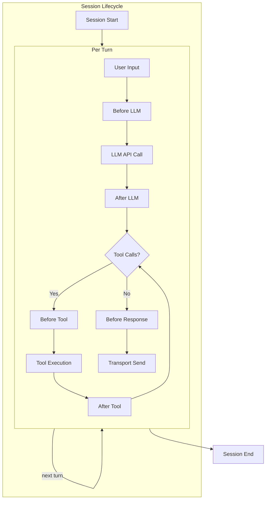
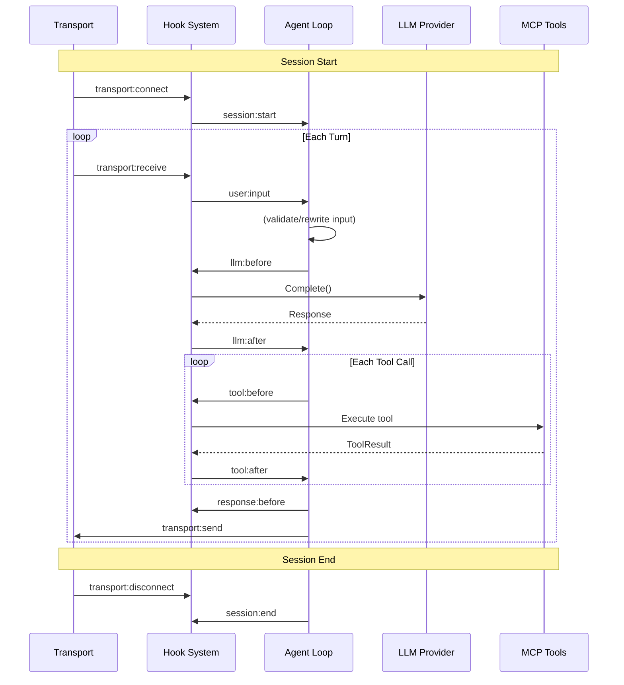
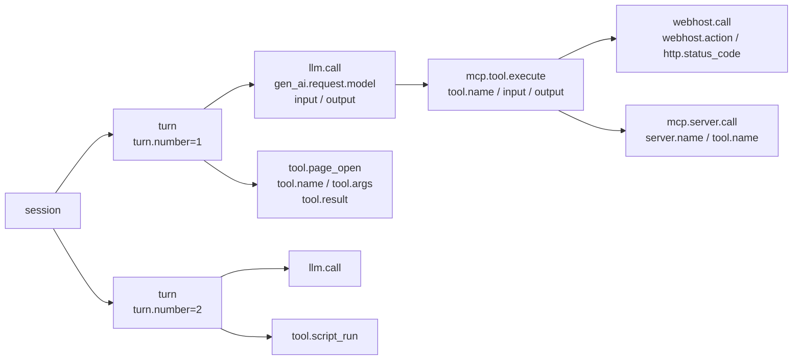

The hook system provides synchronous interception points throughout the agent loop. Plugins and telemetry handlers register callbacks that fire at well-defined points in the session lifecycle.

## Hook Points Overview



## Hook Points Reference

| Point | Trigger | Context Fields | Abortable |
|-------|---------|---------------|-----------|
| `session:start` | New session created | `SessionID` | No |
| `session:end` | Session closing | `SessionID`, `Turn` | No |
| `user:input` | User message received | `SessionID`, `Turn`, `UserInput` | Yes |
| `llm:before` | Before LLM API call | `SessionID`, `Turn`, `Request` | Yes |
| `llm:after` | After LLM response | `SessionID`, `Turn`, `Response`, `Error` | No |
| `tool:before` | Before MCP tool call | `SessionID`, `Turn`, `ToolName`, `ToolArgs` | Yes |
| `tool:after` | After MCP tool result | `SessionID`, `Turn`, `ToolName`, `ToolResult`, `Error` | No |
| `response:before` | Before response delivery | `SessionID`, `Turn` | Yes |
| `error` | Error occurred | `SessionID`, `Turn`, `Error` | No |

### Transport Hooks

| Point | Trigger | Context Fields |
|-------|---------|---------------|
| `transport:connect` | Transport connection established | `SessionID`, `TransportName` |
| `transport:disconnect` | Transport connection closed | `SessionID`, `TransportName`, `Turn` |
| `transport:receive` | Message received from transport | `SessionID`, `Turn`, `UserInput`, `TransportName` |
| `transport:send` | Message sent to transport | `SessionID`, `Turn`, `TransportName`, `UserOutput` |

### Scheduler Hooks

| Point | Trigger | Context Fields |
|-------|---------|---------------|
| `scheduler:task:before` | Before scheduled task execution | `SessionID`, `TaskName`, `TaskInput` |
| `scheduler:task:after` | After scheduled task completes | `SessionID`, `TaskName`, `Error` |

## Execution Flow (Coordinator Mode)



## OTel Span Hierarchy

The telemetry system creates the following span tree from hook points:



## Data Flow Per Hook Point

### `user:input`
- **Read**: `UserInput` — raw user message
- **Write**: `UserInput` — may be rewritten by handlers
- **Abort**: Return error to reject the input

### `llm:before`
- **Read**: `Request.(*provider.ProviderRequest)` — contains `Messages`, `System`, `Model`, `MaxTokens`
- **Write**: May modify `Request` fields (e.g., inject system prompt)
- **OTel span**: `llm.call` with attributes `gen_ai.request.model`, `input`, `message.count`
- **OTel metrics**: `gen_ai.client.requests`

### `llm:after`
- **Read**: `Response.(*provider.ProviderResponse)` — contains `Content`, `Usage`, `StopReason`
- **Read**: `Error` — if the LLM call failed
- **OTel span**: `llm.call` sets `output`, token usage, stop reason, status
- **OTel metrics**: latency, token usage, errors

### `tool:before`
- **Read**: `ToolName`, `ToolArgs` — which tool and with what arguments
- **Write**: May modify `ToolArgs` (e.g., argument transformation)
- **Abort**: Return error to skip the tool call
- **OTel span**: `tool.<name>` with `tool.args`

### `tool:after`
- **Read**: `ToolResult.(*mcp.ToolResult)` — `Content`, `IsError`
- **Read**: `Error` — execution error
- **OTel span**: `tool.<name>` sets `tool.result`, status
- **OTel metrics**: call count, error count, duration

### `transport:receive`
- **Read**: `UserInput` — raw message received from transport
- **OTel span**: `transport.receive` with `output` attribute (user input content)

### `transport:send`
- **Read**: `UserOutput` — response content sent to transport
- **OTel span**: `transport.send` with `input` attribute (response content)

## Telemetry Configuration

```yaml
telemetry:
  enabled: true
  service_name: dolphin
  exporter: stdout          # otlp-grpc, otlp-http, stdout
  otlp_endpoint: localhost:4317
  sample_rate: 1.0
  logs_enabled: false
  metrics_enabled: false
  input_max_len: 2048       # LLM input truncation for span attributes (0 = unlimited)
  output_max_len: 2048      # LLM output truncation for span attributes (0 = unlimited)
```

## Source Files

| File | Purpose |
|------|---------|
| `internal/hook/hook.go` | Hook point definitions and registry |
| `internal/hook/telemetry/hooks.go` | OTel telemetry handlers for all hook points |
| `internal/hook/telemetry/telemetry.go` | OTel provider initialization and metrics |
| `internal/hook/telemetry/metrics.go` | OTel metric instruments and recording helpers |
| `internal/agent/loop.go` | Single-agent mode hook firing |
| `internal/agent/coordinator.go` | Coordinator mode hook firing (transport + scheduler) |

> Last modified: 2026-05-27
