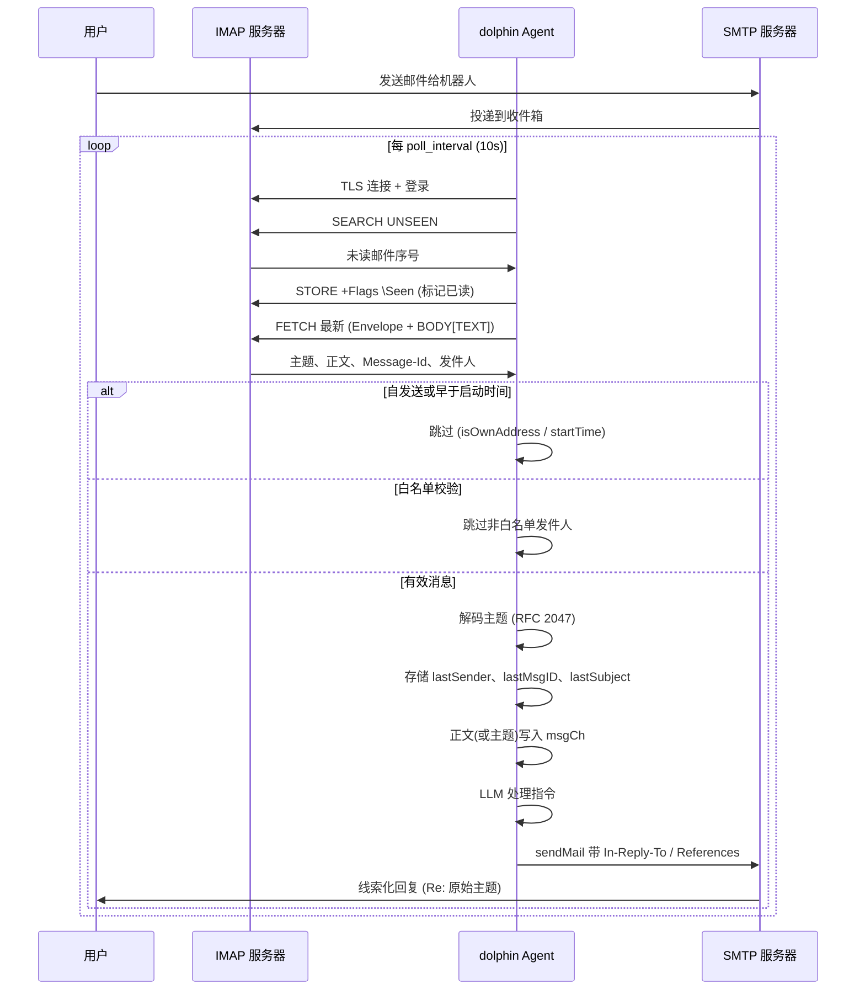

本文档详细说明 `config.yaml` 中的每个配置项。所有配置都有合理的默认值，你只需修改需要的部分。

**配置文件加载顺序**（后加载的会覆盖前面的）：
1. `/etc/dolphin/config.yaml` — 系统级配置
2. `~/.dolphin/config.yaml` — 用户级配置
3. `.dolphin/config.yaml` — 项目级配置
4. `-c <文件>` 参数 — 显式指定
5. `DZ_*` 环境变量

> **提示**：运行 `dolphin init` 可生成带注释的默认配置文件，或将 `docs/zh/config.example.zh.yaml` 复制到 `.dolphin/config.yaml` 后编辑修改。

---

## LLM 提供商 (`llm`)

控制 LLM 提供商、模型选择及生成参数。

### 单提供商字段（兼容旧版）

当 `providers` 为空时使用这些字段。也可以通过 `DZ_LLM_*` 环境变量设置。

| 字段 | 类型 | 默认值 | 说明 |
|------|------|--------|------|
| `llm.type` | `string` | `"openai"` | 提供商 API 类型。`"openai"` 表示兼容 API，`"anthropic"` 表示 Anthropic API。 |
| `llm.base_url` | `string` | `"https://api.openai.com/v1"` | API 基础 URL。可替换为代理或兼容服务地址。环境变量：`DZ_LLM_BASE_URL`。 |
| `llm.api_key` | `string` | `""` | API 密钥。**建议**：通过 `DZ_LLM_API_KEY` 环境变量设置，而非写在文件中。 |
| `llm.model` | `string` | `"gpt-4o"` | 模型标识（如 `claude-sonnet-4-6`、`deepseek-v4-flash`、`qwen3.6-max-preview` 等）。环境变量：`DZ_LLM_MODEL`。 |
| `llm.max_tokens` | `int` | `4096` | 每次响应的最大 token 数。环境变量：`DZ_LLM_MAX_TOKENS`。 |
| `llm.max_context_tokens` | `int` | `1048576` | 上下文窗口大小上限。使用量超过 70% 时触发上下文压缩。 |
| `llm.temperature` | `float` | `0.7` | 生成随机性。范围：`0.0`（确定性）到 `2.0`（创造性）。 |
| `llm.max_sub_turns` | `int` | `10` | 每轮用户输入最多工具调用反馈循环次数（防止无限循环）。 |
| `llm.compress_mode` | `string` | `"drop"` | 上下文压缩策略。可选值：`drop`（丢弃最早内容）、`segment`（合并片段）、`tiered`（分层）、`incremental`（增量）、`topic`（主题）。 |
| `llm.segment_merge_limit` | `int` | `100` | 片段数量阈值，超过后触发递归合并（仅 `segment` 模式使用）。 |
| `llm.timeout_seconds` | `int` | `300` | 每个 provider 的 HTTP 客户端超时秒数。 |
| `llm.health_check_timeout_seconds` | `int` | `10` | 每个 provider 健康检查的超时秒数。 |
| `llm.compress_timeout_seconds` | `int` | `15` | 上下文压缩 LLM 调用超时秒数。 |
| `llm.retry.max_attempts` | `int` | `3` | LLM 调用失败后的最大重试次数（瞬态错误，非限流）。 |
| `llm.retry.backoff_base` | `string` | `"1s"` | 指数退避基础时长（如 `"1s"`、`"2s"`）。 |

### 多提供商 (`llm.providers`)

配置 `providers` 后，启动时会逐个检测，自动选择第一个可用的。provider 的 `api_key` 为空时会继承自 `llm.api_key`（或 `DZ_LLM_API_KEY`），`max_tokens` 为 0 时会继承自 `llm.max_tokens`。

| 字段 | 类型 | 说明 |
|------|------|------|
| `name` | `string` | 提供商标签（标识用，如 `"deepseek"`、`"claude"`、`"qwen"`）。 |
| `type` | `string` | API 类型。`"openai"` 或 `"anthropic"`。 |
| `base_url` | `string` | API 端点 URL。 |
| `api_key` | `string` | 该提供商的 API 密钥。为空时回退到 `llm.api_key`。 |
| `model` | `string` | 模型名称。 |
| `max_tokens` | `int` | 该提供商的最大 token 数。为 0 时回退到 `llm.max_tokens`。 |
| `timeout_seconds` | `int` | 该 provider 的 HTTP 超时覆盖。为 0 时使用 `llm.timeout_seconds`。 |

```yaml
llm:
  providers:
    - name: deepseek
      type: openai
      api_key: ""
      base_url: https://api.deepseek.com
      model: deepseek-v4-flash
    - name: qwen
      type: openai
      api_key: ""
      base_url: https://dashscope.aliyuncs.com/compatible-mode/v1
      model: qwen3.6-max-preview
    - name: glm
      type: openai
      api_key: ""
      base_url: https://open.bigmodel.cn/api/paas/v4
      model: glm-5
```

---

## 会话 (`session`)

控制会话持久化、自动检查点和清理。

| 字段 | 类型 | 默认值 | 说明 |
|------|------|--------|------|
| `session.dir` | `string` | `"/tmp/dolphin"` | 会话文件存储目录。 |
| `session.max_loop` | `int` | `50` | 每次会话最大轮数，超出后保存检查点摘要。 |
| `session.summary` | `bool` | `true` | 是否在检查点时自动生成会话摘要。 |
| `session.max_age` | `string` | `"24h"` | 超过此时间的会话文件自动清理（如 `"72h"`、`"7d"`）。环境变量：`DZ_SESSION_MAX_AGE`。 |
| `session.resume` | `bool` | `false` | 启动时是否提示恢复上次会话。 |
| `session.max_size_mb` | `int` | `10` | 会话文件最大大小（MB），超出则拒绝加载。 |

---

## MCP 工具 (`mcp`)

配置 agent 可用的 Model Context Protocol 工具。

### Shell (`mcp.shell`)

执行 shell 命令。

| 字段 | 类型 | 默认值 | 说明 |
|------|------|--------|------|
| `mcp.shell.enabled` | `bool` | `true` | 启用 Shell 工具。 |
| `mcp.shell.timeout_seconds` | `int` | `30` | 每条命令的超时秒数。 |
| `mcp.shell.priority` | `int` | `10` | 工具列表优先级（越小越靠前）。 |
| `mcp.shell.max_command_length` | `int` | `4096` | 每条命令的最大字符数。 |
| `mcp.shell.allowed_commands` | `[]string` | `[]` | 命令白名单（空列表 = 允许所有）。限制模式下自动设置。 |
| `mcp.shell.output_max_bytes` | `int` | `65536` | 标准输出/错误截断字节上限。 |

### CDP 浏览器 (`mcp.cdp`)

Chrome DevTools Protocol — 浏览器自动化。

| 字段 | 类型 | 默认值 | 说明 |
|------|------|--------|------|
| `mcp.cdp.enabled` | `bool` | `true` | 启用浏览器自动化。 |
| `mcp.cdp.headless` | `bool` | `true` | 以无界面模式运行浏览器。 |
| `mcp.cdp.priority` | `int` | `1000` | 工具列表优先级。 |
| `mcp.cdp.ws_url` | `string` | `""` | 连接到已有的 CDP 端点（WebSocket URL），而非启动新浏览器。 |
| `mcp.cdp.idle_timeout` | `int` | `300` | 空闲多少秒后自动关闭浏览器。设为 `0` 禁用自动关闭。 |
| `mcp.cdp.startup_timeout` | `int` | `30` | 浏览器初始化验证超时秒数。macOS 冷启动可能较慢。 |
| `mcp.cdp.health_check_timeout` | `int` | `10` | 浏览器健康检查超时秒数。 |
| `mcp.cdp.navigation_wait` | `string` | `"2s"` | 页面导航后额外等待时长（如 `"2s"`、`"500ms"`）。空字符串 = 不等待。 |
| `mcp.cdp.screenshot_quality` | `int` | `100` | 全页截图质量（0-100）。 |
| `mcp.cdp.screenshot_dir` | `string` | `"screenshots"` | 截图输出目录（相对路径相对于项目目录）。 |
| `mcp.cdp.chrome_flags` | `map` | `{disable-gpu, no-sandbox, ...}` | 额外 chromedp 启动标志，覆盖内置默认值。 |
| `mcp.cdp.user_agent` | `string` | `"Mozilla/5.0 ..."` | 自定义 User-Agent。空字符串 = 使用 Chrome 默认值。 |

### 邮件 MCP (`mcp.email`)

邮件发送/搜索/读取工具（需要同时配置 `transport.email`）。

| 字段 | 类型 | 默认值 | 说明 |
|------|------|--------|------|
| `mcp.email.enabled` | `bool` | `true` | 启用邮件 MCP 工具。 |
| `mcp.email.priority` | `int` | `500` | 工具列表优先级。 |
| `mcp.email.max_attachment_size` | `int` | `10485760` | 附件大小上限（字节）。 |
| `mcp.email.connect_timeout` | `string` | `"30s"` | IMAP/POP3 连接超时（如 `"30s"`、`"10s"`）。 |

### Webhook MCP (`mcp.webhook`)

HTTP webhook 工具，用于向外部服务发送请求。

| 字段 | 类型 | 默认值 | 说明 |
|------|------|--------|------|
| `mcp.webhook.enabled` | `bool` | `true` | 启用 Webhook 工具。 |
| `mcp.webhook.priority` | `int` | `100` | 工具列表优先级。 |
| `mcp.webhook.targets` | `map[string]object` | `{}` | 命名的预配置 webhook 目标。每个目标包含：`url`（string，必填）、`method`（string，默认 `"POST"`）、`headers`（map[string]string）。 |
| `mcp.webhook.timeout_seconds` | `int` | `30` | HTTP 请求超时秒数。 |

```yaml
mcp:
  webhook:
    targets:
      my_bot:
        url: "https://hooks.example.com/webhook"
        method: POST
        headers: {Authorization: "Bearer my-token"}
```

### 网页搜索 MCP (`mcp.web_search`)

网页搜索工具，支持多搜索引擎。每个 provider 在 `internal/mcp/websearch/` 下通过 `init() + registerProvider()` 自注册。LLM 可用的枚举列表 = 配置中 `providers` 与已注册 provider 的交集。

| 字段 | 类型 | 默认值 | 说明 |
|------|------|--------|------|
| `mcp.web_search.enabled` | `bool` | `true` | 启用网页搜索工具。 |
| `mcp.web_search.priority` | `int` | `90` | 工具列表优先级。 |
| `mcp.web_search.provider` | `string` | `"duckduckgo"` | 默认搜索引擎（旧式单 provider 配置）。 |
| `mcp.web_search.providers` | `[]string` | `[]` | 启用的搜索引擎列表。与已注册的 provider 取交集后暴露给 LLM。为空时回退到 `provider`。 |
| `mcp.web_search.api_key` | `string` | `""` | 需要 API 密钥的搜索引擎共用（serper、iflow）。 |
| `mcp.web_search.timeout_seconds` | `int` | `15` | 搜索引擎 HTTP 请求超时秒数。 |
| `mcp.web_search.max_results` | `int` | `10` | 每次查询最大结果数。 |
| `mcp.web_search.user_agent` | `string` | `""` | 自定义 User-Agent。空 = 使用 provider 默认值。 |
| `mcp.web_search.provider_base_urls` | `map[string]string` | `{}` | 各搜索引擎的基础 URL 覆盖，如 `{duckduckgo: "https://html.duckduckgo.com/html/"}`。 |

支持的搜索引擎：
- `duckduckgo` — 零配置，HTML 抓取
- `serper` — 结构化 API，需要 `api_key`
- `iflow` — 心流搜索，需要 `api_key`

```yaml
mcp:
  web_search:
    enabled: true
    providers:
      - duckduckgo
      - iflow
    api_key: "your-key"
```

### 外部 MCP 服务器 (`mcp.servers`)

连接到外部的 MCP 服务器。每个键是一个服务器名称。

| 字段 | 类型 | 说明 |
|------|------|------|
| `type` | `string` | 传输类型。可选：`"stdio"`（子进程）、`"sse"`（Server-Sent Events）、`"http-stream"`。 |
| `command` | `string` | 可执行文件路径（`stdio` 类型使用）。 |
| `args` | `[]string` | 命令参数（`stdio` 类型使用）。 |
| `url` | `string` | 服务器 URL（`sse` / `http-stream` 类型使用）。 |
| `headers` | `map[string]string` | 自定义 HTTP 请求头（如 `Authorization`）。 |
| `timeout` | `int` | 请求超时秒数（`0` = 默认 `30`）。 |
| `reconnect_delay` | `string` | SSE 重连延迟（如 `"5s"`），仅 `sse` 类型使用。 |
| `shutdown_timeout` | `int` | stdio 子进程优雅关闭等待秒数。超时后强制终止。`0` = 默认 `3`。 |

```yaml
mcp:
  servers:
    my-server:
      type: stdio
      command: npx
      args: ["-y", "@modelcontextprotocol/server-filesystem"]
    remote-server:
      type: sse
      url: "https://mcp.example.com/sse"
      headers: {Authorization: "Bearer token"}
```

### MCP 仓库 (`mcp.repos`)

| 字段 | 类型 | 默认值 | 说明 |
|------|------|--------|------|
| `mcp.repos` | `[]string` | `[]` | 社区 MCP 工具的清单仓库 URL，如 `["dolphinv/mcp"]`。 |

---

## Agent 池 (`agent_pool`)

控制并发的子 agent 执行。

| 字段 | 类型 | 默认值 | 说明 |
|------|------|--------|------|
| `agent_pool.max_concurrency` | `int` | `5` | 最大并发子 agent 任务数。 |
| `agent_pool.default_timeout` | `int` | `300` | 每个任务的默认超时秒数。 |
| `agent_pool.workspace_dir` | `string` | `".dolphin/workspaces"` | 子 agent 工作区目录。 |
| `agent_pool.idle_timeout` | `int` | `600` | 空闲临时 agent 多少秒后被回收。 |
| `agent_pool.max_pending_results` | `int` | `10` | 每个 agent 最多保留的待处理结果数。 |
| `agent_pool.max_pending_result_len` | `int` | `500` | prompt 中每条结果的最大字符数。`0` = 不截断。 |
| `agent_pool.max_synthesis_rounds` | `int` | `3` | 协调器轮询结果时最多合成轮次。 |
| `agent_pool.poll_interval` | `string` | `"200ms"` | 子 agent 就绪轮询间隔（如 `"200ms"`、`"1s"`）。 |
| `agent_pool.min_reap_interval` | `string` | `"5s"` | 空闲回收最小检查间隔。 |
| `agent_pool.max_reap_interval` | `string` | `"30s"` | 空闲回收最大检查间隔。 |

---

## 技能 (`skills`)

管理技能文件，让 agent 学习新能力。

| 字段 | 类型 | 默认值 | 说明 |
|------|------|--------|------|
| `skills.dir` | `string` | `".dolphin/skills"` | 存放技能 `.md` 文件的目录。 |
| `skills.max_top` | `int` | `10` | 注入到 LLM 上下文中的排名靠前的技能数量。 |
| `skills.repos` | `[]string` | `[]` | 技能清单仓库 URL，如 `["dolphinv/skills"]`。 |

---

## 传输层 (`transport`)

控制 agent 的通信方式：本地终端、SSH、MQTT、邮件或钉钉。

### Stdio (`transport.stdio`)

本地终端 I/O。

| 字段 | 类型 | 默认值 | 说明 |
|------|------|--------|------|
| `transport.stdio.enabled` | `bool` | `true` | 启用本地终端交互。环境变量：`DZ_TRANSPORT_STDIO_ENABLED`。 |

### SSH (`transport.ssh`)

远程 shell 访问。

| 字段 | 类型 | 默认值 | 说明 |
|------|------|--------|------|
| `transport.ssh.enabled` | `bool` | `false` | 启用 SSH 传输层。 |
| `transport.ssh.addr` | `string` | `":2222"` | 监听地址（如 `"0.0.0.0:2222"`、`"localhost:2222"`）。 |
| `transport.ssh.host_key` | `string` | `"~/.ssh/id_ed25519"` | SSH 主机私钥路径。 |
| `transport.ssh.username` | `string` | `"dolphin"` | SSH 登录用户名。 |
| `transport.ssh.password` | `string` | `""` | SSH 密码。启用 SSH 后如果为空则首次启动时自动生成。 |
| `transport.ssh.read_timeout` | `string` | `"5m"` | ReadLine 超时时长（如 `"5m"`、`"30s"`）。 |
| `transport.ssh.markdown_render` | `bool` | `false` | 在 SSH 终端输出中渲染 Markdown。 |
| `transport.ssh.markdown_style` | `string` | `""` | 渲染 Markdown 的 CSS 主题（如 `"dracula"`、`"github"`）。 |

### MQTT (`transport.mqtt`)

MQTT 消息传输。

| 字段 | 类型 | 默认值 | 说明 |
|------|------|--------|------|
| `transport.mqtt.enabled` | `bool` | `false` | 启用 MQTT 传输层。环境变量：`DZ_TRANSPORT_MQTT_ENABLED`。 |
| `transport.mqtt.broker` | `string` | `"tcp://localhost:1883"` | MQTT 代理 URL。环境变量：`DZ_MQTT_BROKER`。 |
| `transport.mqtt.topic` | `string` | `"dolphin/agent/command"` | 命令订阅主题。环境变量：`DZ_MQTT_TOPIC`。 |
| `transport.mqtt.response_topic` | `string` | `"dolphin/agent/response"` | 响应发布主题。环境变量：`DZ_MQTT_RESPONSE_TOPIC`。 |
| `transport.mqtt.client_id` | `string` | `"dolphin-agent"` | MQTT 客户端 ID。 |
| `transport.mqtt.embedded` | `bool` | `true` | 运行内嵌 MQTT 代理。环境变量：`DZ_MQTT_EMBEDDED`。 |
| `transport.mqtt.embedded_addr` | `string` | `":1883"` | 内嵌代理的监听地址。环境变量：`DZ_MQTT_EMBEDDED_ADDR`。 |
| `transport.mqtt.embedded_accounts` | `[]object` | `[]` | 内嵌代理的账户凭据。如果内嵌代理启用且未配置账户，会自动生成一个。每个条目包含：`username`（string）、`password`（string）。环境变量 `DZ_MQTT_USER` / `DZ_MQTT_PASSWORD` 可设置第一个账户。 |
| `transport.mqtt.username` | `string` | `""` | 连接 broker 的客户端用户名（非内嵌 broker 用）。 |
| `transport.mqtt.password` | `string` | `""` | 连接 broker 的客户端密码。为空时自动取第一个内嵌账户的密码。 |
| `transport.mqtt.keep_alive_seconds` | `int` | `60` | MQTT KeepAlive 间隔秒数。 |
| `transport.mqtt.ping_timeout_seconds` | `int` | `10` | MQTT ping 响应超时秒数。 |
| `transport.mqtt.max_reconnect_seconds` | `int` | `30` | 最大重连回退间隔秒数。 |

### 邮件 (`transport.email`)

邮件传输层 — 通过 SMTP/IMAP 接收指令和发送回复。

| 字段 | 类型 | 默认值 | 说明 |
|------|------|--------|------|
| `transport.email.enabled` | `bool` | `false` | 启用邮件传输层。 |
| `transport.email.protocol` | `string` | `"imap"` | 收件协议。`"imap"` 或 `"pop3"`。 |
| `transport.email.smtp_host` | `string` | `""` | 发件 SMTP 服务器地址。 |
| `transport.email.smtp_port` | `int` | `587` | SMTP 端口（通常 `587` 用于 STARTTLS，`465` 用于 SSL/TLS）。 |
| `transport.email.imap_host` | `string` | `""` | IMAP 服务器地址。 |
| `transport.email.imap_port` | `int` | `993` | IMAP 端口（通常 `993` 用于 SSL/TLS）。 |
| `transport.email.pop3_host` | `string` | `""` | POP3 服务器地址。为空时默认使用 `imap_host` / `smtp_host`。 |
| `transport.email.pop3_port` | `int` | `995` | POP3 端口（通常 `995` 用于 SSL/TLS）。 |
| `transport.email.username` | `string` | `""` | 邮箱账号用户名。环境变量：`DZ_EMAIL_USERNAME`。 |
| `transport.email.password` | `string` | `""` | 邮箱账号密码。**建议**：通过 `DZ_EMAIL_PASSWORD` 环境变量设置。 |
| `transport.email.from` | `string` | `""` | 发件人地址。 |
| `transport.email.use_tls` | `bool` | `true` | 启用 SMTP 和 IMAP 的 TLS 加密。 |
| `transport.email.skip_tls_verify` | `bool` | `false` | 跳过 TLS 证书验证（用于自签名证书场景）。 |
| `transport.email.poll_interval` | `string` | `"10s"` | IMAP 收件箱轮询间隔（如 `"30s"`、`"5m"`）。 |
| `transport.email.allowed_senders` | `[]string` | `[]` | 发件人白名单。以 `@` 开头的条目匹配以该域名后缀结尾的任意地址（如 `"@siciv.space"` 匹配 `user@siciv.space`）。空列表 = 允许所有发件人。 |
| `transport.email.dial_timeout` | `string` | `"30s"` | IMAP/POP3 拨号超时（如 `"30s"`、`"10s"`）。 |

**邮件传输流程：**



### 钉钉 (`transport.dingtalk`)

钉钉机器人传输 — 基于 Stream 模式（WebSocket 长连接），机器人主动连接钉钉服务器，无需公网 IP 或回调地址。

| 字段 | 类型 | 默认值 | 说明 |
|------|------|--------|------|
| `transport.dingtalk.enabled` | `bool` | `false` | 启用钉钉传输。环境变量：`DZ_DINGTALK_ENABLED`。 |
| `transport.dingtalk.client_id` | `string` | `""` | 钉钉应用 AppKey。环境变量：`DZ_DINGTALK_CLIENT_ID`。 |
| `transport.dingtalk.client_secret` | `string` | `""` | 钉钉应用 AppSecret。环境变量：`DZ_DINGTALK_CLIENT_SECRET`。 |
| `transport.dingtalk.read_timeout` | `string` | `"5m"` | Stream 连接读取超时时长（如 `"5m"`、`"1m"`）。 |

**快速上手：**

1. 在 [open.dingtalk.com](https://open.dingtalk.com) 创建钉钉应用，选择 **"企业内部应用"**
2. 进入 **应用开发 → 机器人 → 应用机器人**（非 Bot），创建机器人
3. 消息接收模式设置为 **Stream**（机器人主动连接钉钉服务器，无需公网 IP 或回调 URL）
4. 在 **权限管理** 中开通 `qyapi_robot_sendmsg` 权限
5. 复制 AppKey → `client_id`，AppSecret → `client_secret`
6. 将机器人添加到群聊，@机器人 发送指令

```yaml
transport:
  dingtalk:
    enabled: true
    client_id: "your-appkey"
    client_secret: "your-appsecret"
```

### A2A (`transport.a2a`)

Agent-to-Agent（A2A）JSON-RPC 通信，基于 HTTP 协议。实现 Google A2A 协议规范。

| 字段 | 类型 | 默认值 | 说明 |
|------|------|--------|------|
| `transport.a2a.enabled` | `bool` | `false` | 启用 A2A 传输。 |
| `transport.a2a.listen_addr` | `string` | `":8080"` | HTTP 监听地址。 |
| `transport.a2a.agent_id` | `string` | `""` | 唯一智能体标识。 |
| `transport.a2a.agent_name` | `string` | `""` | 可读智能体名称。 |
| `transport.a2a.agent_version` | `string` | `""` | 智能体版本号。 |
| `transport.a2a.agent_description` | `string` | `""` | 智能体简短描述。 |
| `transport.a2a.capabilities` | `[]string` | `[]` | 智能体能力列表（如 `["text", "task"]`）。 |
| `transport.a2a.sync_timeout` | `string` | `"60s"` | 同步任务执行超时时长。 |
| `transport.a2a.api_key` | `string` | `""` | Bearer 认证的 API 密钥。为空则禁用认证。 |
| `transport.a2a.tls_enabled` | `bool` | `false` | 启用 TLS。 |
| `transport.a2a.tls_cert_file` | `string` | `""` | TLS 证书文件路径。 |
| `transport.a2a.tls_key_file` | `string` | `""` | TLS 密钥文件路径。 |
| `transport.a2a.handler_path` | `string` | `"/a2a"` | A2A RPC HTTP 处理路径。 |
| `transport.a2a.agent_card_path` | `string` | `"/.well-known/agent.json"` | Agent Card 端点路径。 |
| `transport.a2a.read_header_timeout` | `int` | `10` | HTTP 服务器 `ReadHeaderTimeout`（秒）。 |
| `transport.a2a.shutdown_timeout` | `int` | `5` | 服务器关闭上下文超时（秒）。 |

---

## 定时任务 (`crontab`)

定时任务管理。

| 字段 | 类型 | 默认值 | 说明 |
|------|------|--------|------|
| `crontab.file` | `string` | `".dolphin/CRONTAB.md"` | crontab 文件路径（Markdown 格式，含 cron 表达式）。 |
| `crontab.check_interval` | `string` | `"30s"` | 多久检查一次待执行任务（如 `"10s"`、`"1m"`）。 |

---

## 日记 (`diary`)

将会话摘要聚合为分层日记（日 → 周 → 月 → 年）。

| 字段 | 类型 | 默认值 | 说明 |
|------|------|--------|------|
| `diary.dir` | `string` | `".dolphin/diary"` | 日记存储目录。 |
| `diary.max_day_sessions` | `int` | `200` | 每天最多保留的会话数，超出则删除最旧会话。 |
| `diary.max_week_days` | `int` | `7` | 每周最多保留的天数，超出则删除最旧天。 |
| `diary.max_month_weeks` | `int` | `5` | 每月最多保留的周数，超出则删除最旧周。 |
| `diary.max_year_months` | `int` | `12` | 每年最多保留的月数，超出则删除最旧月。 |
| `diary.max_total_mb` | `int` | `500` | 日记总大小上限（MB），超出则删除最旧年份。 |

---

## 插件 (`plugins`)

小海豚提供两套扩展机制：

- **Hook（同步）** — 在 agent 循环的特定节点拦截执行。在可中止的节点返回错误可中断流程。
- **Event（异步）** — 订阅后台分发的事件通知。内置投递方式：Webhook（HTTP POST）和 JSONL 日志。

两种机制均可通过放置在插件目录下的脚本驱动。

| 字段 | 类型 | 默认值 | 说明 |
|------|------|--------|------|
| `plugins.enabled` | `bool` | `true` | 启用插件系统。 |
| `plugins.dir` | `string` | `"~/.dolphin/plugins/"` | 插件脚本目录（可执行脚本或 `.md` 文件）。 |
| `plugins.webhook_url` | `string` | `""` | 事件投递的 HTTP 端点。事件以 JSON 格式 POST 到此地址。 |
| `plugins.webhook_events` | `[]string` | `["*"]` | 要投递的事件类型。`["*"]` 表示全部投递。可过滤为指定列表如 `["tool:called", "tool:completed"]`。 |
| `plugins.heartbeat_turns` | `int` | `0` | 每 N 轮触发一次 `heartbeat` 事件。`0` = 关闭。 |
| `plugins.script_timeout_seconds` | `int` | `3` | 每个 Hook/Event 脚本的执行超时秒数。 |

**可用 Hook 节点**（† = 可中止）：`session:start`、`session:end`、`user:input†`、`llm:before†`、`llm:after`、`tool:before†`、`tool:after`、`response:before`、`error`。

每个 hook 脚本从 stdin 接收上下文的 JSON，可在 stdout 返回修改后的 JSON。

```yaml
# 示例：记录所有工具调用
plugins:
  dir: ~/.dolphin/plugins/
  webhook_url: "https://hooks.example.com/dolphin"
  webhook_events: ["tool:called", "tool:completed"]
  heartbeat_turns: 5
```

---

## 更新 (`update`)

自动更新检查与安装。

| 字段 | 类型 | 默认值 | 说明 |
|------|------|--------|------|
| `update.enabled` | `bool` | `false` | 启用自动更新检查。 |
| `update.check_interval` | `string` | `"24h"` | 更新检查间隔（如 `"24h"`、`"12h"`）。 |
| `update.channel` | `string` | `"stable"` | 发布频道：`"stable"` 或 `"pre-release"`。 |
| `update.auto_install` | `bool` | `false` | 自动下载并安装更新。 |
| `update.timeout_seconds` | `int` | `30` | 更新检查的 HTTP 客户端超时秒数。 |

---

## 健康检查 (`health`)

HTTP 健康检查端点。

| 字段 | 类型 | 默认值 | 说明 |
|------|------|--------|------|
| `health.enabled` | `bool` | `false` | 启用健康检查 HTTP 服务。 |
| `health.addr` | `string` | `":9091"` | 监听地址（如 `":9091"` 监听所有接口）。 |
| `health.debounce` | `string` | `"30s"` | 心跳去抖间隔（如 `"30s"`、`"1m"`）。在此窗口内避免重复触发健康事件。 |

---

## 可观测性

| 字段 | 类型 | 默认值 | 说明 |
|------|------|--------|------|
| `log_level` | `string` | `"info"` | 日志级别。可选：`"debug"`、`"info"`、`"warn"`、`"error"`、`"dpanic"`、`"panic"`、`"fatal"`。环境变量：`DZ_LOG_LEVEL`。 |
| `log_file` | `string` | `".dolphin/logs/agent.log"` | 日志文件路径。环境变量：`DZ_LOG_FILE`。 |

---

## Pprof (`pprof`)

Go pprof 性能分析端点。用于调试性能问题。

| 字段 | 类型 | 默认值 | 说明 |
|------|------|--------|------|
| `pprof.enabled` | `bool` | `false` | 启用 pprof HTTP 服务。 |
| `pprof.addr` | `string` | `"127.0.0.1:6060"` | 监听地址（如 `":6060"` 表示监听所有接口）。 |

---

## 指标 (`metrics`)

Prometheus 风格指标端点。

| 字段 | 类型 | 默认值 | 说明 |
|------|------|--------|------|
| `metrics.enabled` | `bool` | `false` | 启用指标 HTTP 服务。 |
| `metrics.addr` | `string` | `"127.0.0.1:9090"` | 监听地址（如 `":9090"` 表示监听所有接口）。 |

---

## 环境变量

所有设置均可通过 `DZ_` 前缀的环境变量在运行时覆盖。

| 环境变量 | 覆盖配置项 | 说明 |
|----------|-----------|------|
| `DZ_LLM_API_KEY` | `llm.api_key` | API 密钥（自动传播到所有密钥为空的 provider） |
| `DZ_LLM_BASE_URL` | `llm.base_url` | API 基础 URL |
| `DZ_LLM_MODEL` | `llm.model` | 模型名称 |
| `DZ_LLM_TYPE` | `llm.type` | 提供商类型（`"openai"` / `"anthropic"`） |
| `DZ_LLM_MAX_TOKENS` | `llm.max_tokens` | 每次响应的最大 token 数 |
| `DZ_LOG_LEVEL` | `log_level` | 日志级别 |
| `DZ_LOG_FILE` | `log_file` | 日志文件路径 |
| `DZ_SESSION_MAX_AGE` | `session.max_age` | 会话保留时长 |
| `DZ_TRANSPORT_STDIO_ENABLED` | `transport.stdio.enabled` | 启用 stdio 传输 |
| `DZ_TRANSPORT_MQTT_ENABLED` | `transport.mqtt.enabled` | 启用 MQTT 传输 |
| `DZ_MQTT_BROKER` | `transport.mqtt.broker` | MQTT 代理 URL |
| `DZ_MQTT_TOPIC` | `transport.mqtt.topic` | MQTT 命令主题 |
| `DZ_MQTT_RESPONSE_TOPIC` | `transport.mqtt.response_topic` | MQTT 响应主题 |
| `DZ_MQTT_EMBEDDED` | `transport.mqtt.embedded` | 启用内嵌代理 |
| `DZ_MQTT_EMBEDDED_ADDR` | `transport.mqtt.embedded_addr` | 内嵌代理地址 |
| `DZ_MQTT_USER` | `transport.mqtt.embedded_accounts[0].username` | 第一个内嵌账户的用户名 |
| `DZ_MQTT_PASSWORD` | `transport.mqtt.embedded_accounts[0].password` | 第一个内嵌账户的密码 |
| `DZ_EMAIL_USERNAME` | `transport.email.username` | 邮箱用户名 |
| `DZ_EMAIL_PASSWORD` | `transport.email.password` | 邮箱密码 |

---

## 限制模式

运行 `dolphin init --restrictive` 可生成安全加固的配置：

- **Shell**：仅允许白名单命令（`ls`、`cat`、`grep`、`find`、`pwd`、`date`、`echo`、`head`、`tail`、`wc`、`sort`、`whoami`、`uname`）
- **CDP 浏览器自动化**：禁用
- **Webhook 工具**：禁用
- **日志级别**：`warn`（减少日志中的密钥泄露风险）
- **插件**：禁用

> Last modified: 2026-05-19
