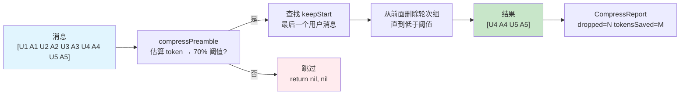
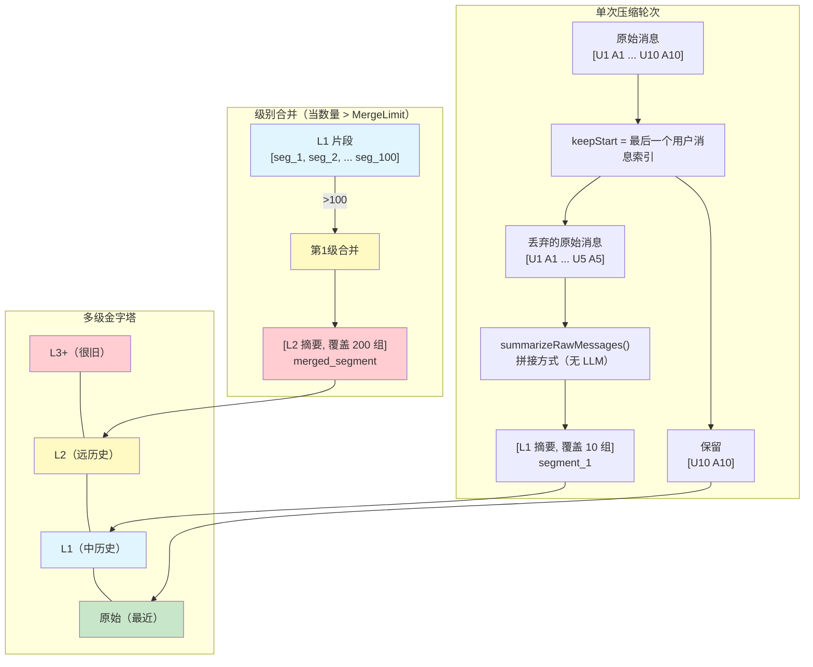
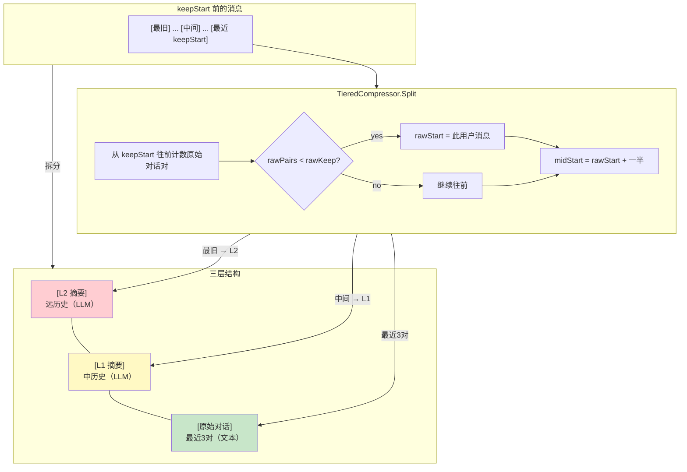
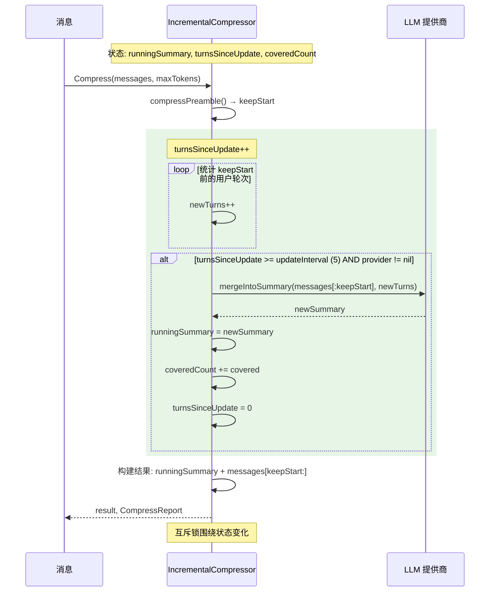
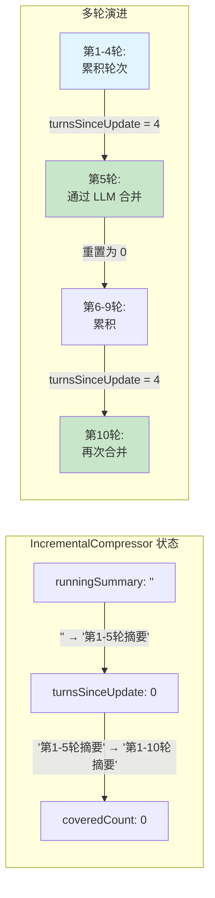
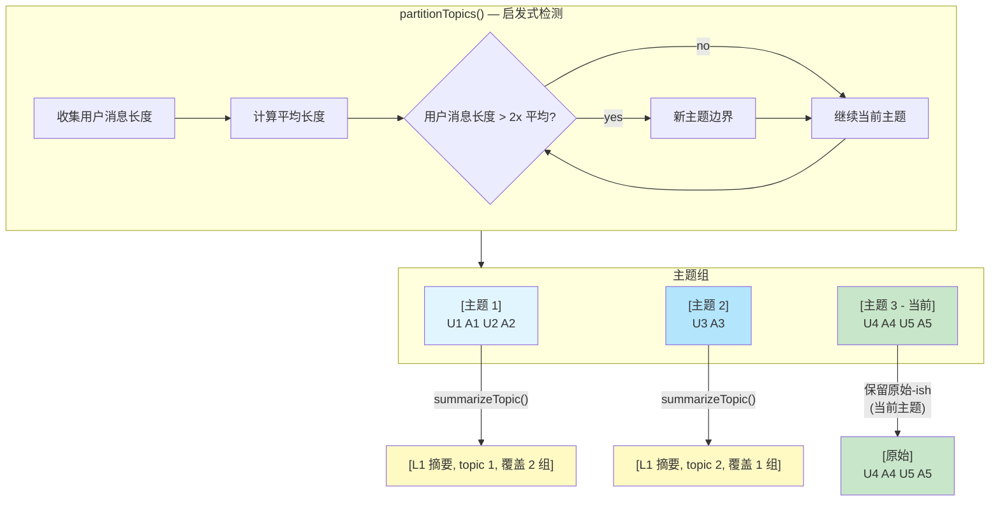
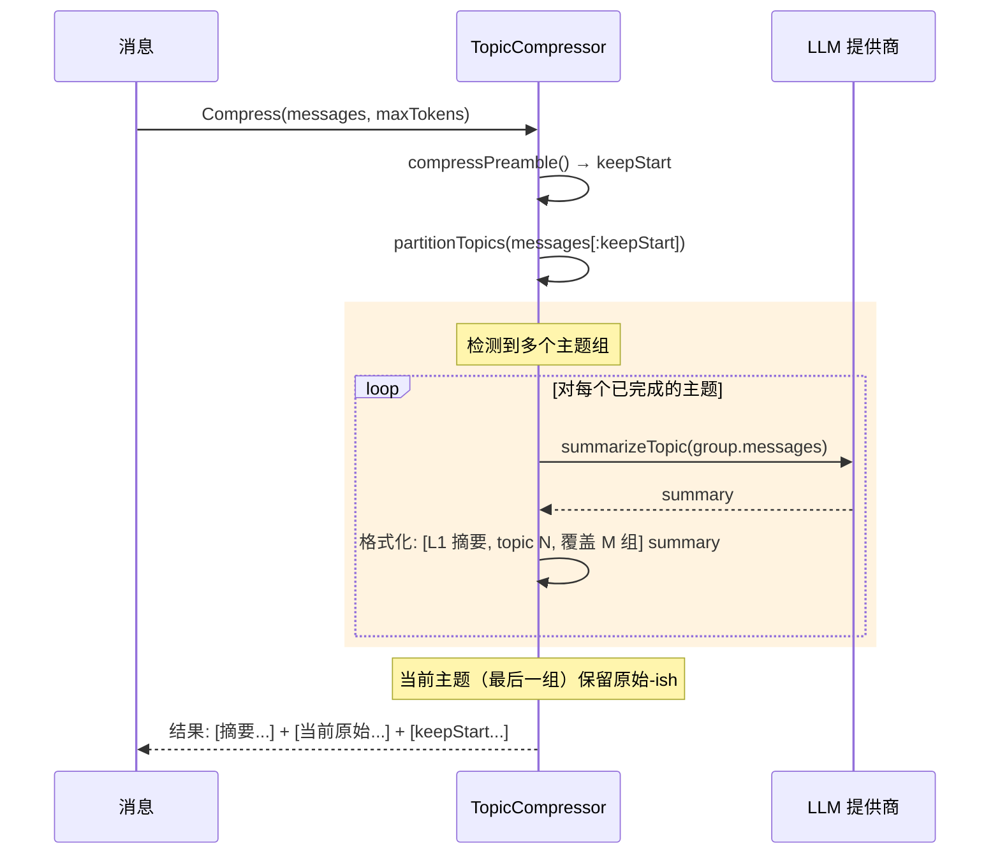

Dolphin 通过压缩长对话来自动管理上下文窗口。这确保 LLM 不会因 token 限制而拒绝请求。

## 工作原理

当对话接近 `max_context_tokens` 的 70% 时，Dolphin 使用以下策略之一压缩消息历史。

所有策略共享**通用前导逻辑**：
1. 估算总 token 数（中文感知：CJK 字符约 1 token/字，ASCII 字节/3.5）
2. 低于 70% 阈值 → 跳过压缩
3. 消息数 ≤6 → 跳过（太小不值得压缩）
4. 找到 `keepStart` — 最后一个用户消息及其后所有内容
5. 如果 `keepStart` 前没有消息 → 跳过

## 压缩策略

### drop（默认）

最简单的策略：从前面删除完整的用户+助手轮次组。

- 无摘要，无 LLM 调用
- 快速，零成本，零延迟
- 适用场景：短会话、交互式使用



### segment

创建多级金字塔摘要。每次压缩轮次从丢弃的消息生成 L1 片段。当任何级别的片段数超过 `segment_merge_limit`（默认 100）时，片段合并到下一级别。

- 使用拼接方式生成摘要（计划集成 LLM）
- 适用场景：非常长的会话，可预测的增长



### tiered

三层缓存结构：L2（远历史）→ L1（中历史）→ 原始（最近 N 对）。

- 保留最后 3 对用户+助手对话为原始文本
- 使用 LLM 为 L2 和 L1 生成摘要
- 适用场景：需要详细近期上下文但可以摘要旧历史的会话



### incremental

单一运行摘要，每 N 轮（默认 5）增量更新一次。

- 新消息通过 LLM 调用合并到现有摘要中
- 线程安全（互斥锁保护状态）
- 漂移风险：低质量摘要会随时间累积
- 适用场景：需要维护连贯运行叙事的会话





### topic

按主题边界对消息进行分区（用户消息长度 > 2x 平均值 → 新主题）。

- 每个已完成的主题组独立摘要
- 保留主题元数据：`[L1 摘要, topic N, 覆盖 M 组]`
- 适用场景：自然地在不同主题之间切换的会话





## 配置

通过 `config.yaml` 中的 `llm.compress_mode` 配置：

| 值 | 策略 |
|------|------|
| `drop`（默认） | DropCompressor — 最简单，无 LLM |
| `segment` | SegmentCompressor — 多级金字塔 |
| `tiered` | TieredCompressor — 三层缓存 |
| `incremental` | IncrementalCompressor — 运行摘要 |
| `topic` | TopicCompressor — 主题感知分割 |

对于 `segment` 模式，还可配置：
- `llm.segment_merge_limit` — 合并前的片段数量阈值（默认：100）
- `llm.compress_timeout_seconds` — LLM 调用超时（默认：15秒）

## 压缩报告

每次压缩返回 `CompressReport`：

| 字段 | 说明 |
|------|------|
| `dropped_count` | 删除的消息数 |
| `tokens_saved` | 估算释放的 token 数 |
| `new_level` | 生成的摘要级别（0 = 纯删除） |

查看压缩事件日志：
```
zap.Info("compression", zap.Int("dropped", r.DroppedCount), ...)
```