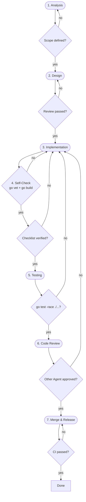

# Change Flow

每个变更依次通过以下关卡：

## Verification Gates

| Gate | Verification | Verifier |
|------|-------------|----------|
| Analysis → Design | Scope defined | Self-check |
| Design → Implementation | Design proposal reviewed | Reviewer |
| Implementation → Self-Check | `go vet ./...` + `go build ./...` | Self-check |
| Self-Check → Test | Checklist verified | Self-check |
| Test → Review | `go test -race ./...` | CI |
| Review → Merge | At least 1 approval | Other Agent |
| Merge → Release | CI passes | CI |

## Prohibitions

- No direct commits to `main` or `develop`
- No skipping code review
- No breaking changes without updating design docs
- No code commits without tests
