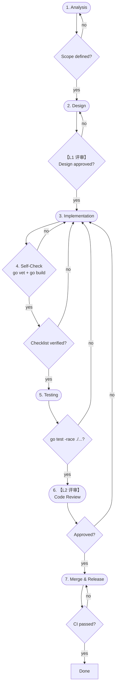

# Change Flow

**原则：设计先行，代码随设计走。** 必须先完成设计变更并获评审通过，才能进入代码实现阶段。

每个变更需通过两级评审方可合并：

## Two-Level Review

| Level | Gate | Scope | Verifier |
|-------|------|-------|----------|
| **L1** | Design → Implementation | 设计方案、架构影响、接口定义 | 架构师 / 资深开发者 |
| **L2** | Testing → Merge | 代码质量、安全性、测试覆盖 | 其他开发者 (≥ 1 人) |

L1 未通过不得进入实现阶段，L2 未通过不得合并。

## Verification Gates

| Gate | Verification | Verifier |
|------|-------------|----------|
| Analysis → Design | Scope defined | Self-check |
| Design → Implementation | **L1 评审**: 设计通过 | 架构师 |
| Implementation → Self-Check | `go vet ./...` + `go build ./...` | Self-check |
| Self-Check → Test | Checklist verified | Self-check |
| Test → Review | `go test -race ./...` | CI |
| Review → Merge | **L2 评审**: 代码通过 | 其他开发者 |
| Merge → Release | CI passes | CI |

## Prohibitions

- No direct commits to `main` or `develop`
- No skipping either level of review
- **No code changes before L1 design review is approved**
- No breaking changes without updating design docs
- No code commits without tests
